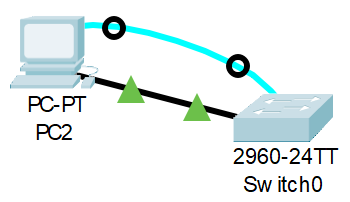
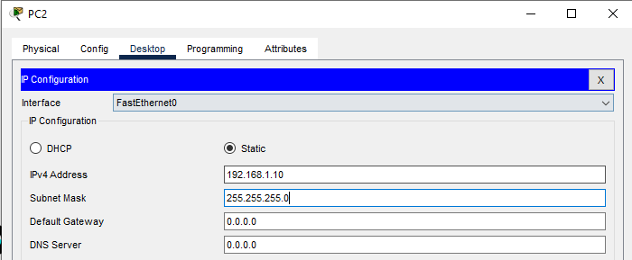
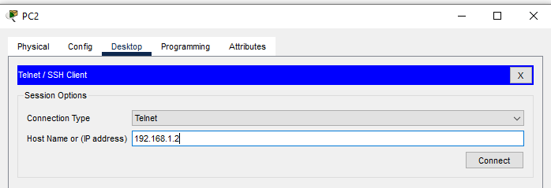
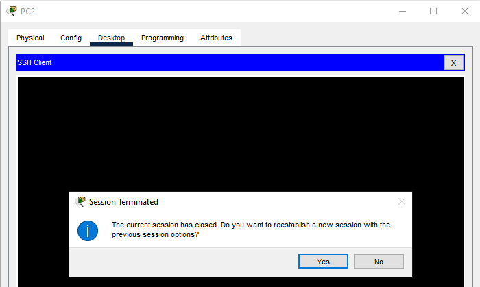

# Лабораторная работа. Базовая настройка коммутатора.
###  Топология


###  Таблица адресации
| Устройство | Интерфейс | IP-адрес / префикс |
|------------|-----------|--------------------|
| S1 | VLAN 1 | 192.168.1.2 /24 |
| R1 | NIC | 192.168.1.10 /24 |

###  Задание:
<ol>
  <li>Проверка конфигурации коммутатора по умолчанию</li>
  <li>Создание сети и настройка основных параметров устройства
      <ol>
      2.1. Настройте базовые параметры коммутатора.<br>
      2.2. Настройте IP-адрес для ПК.
      </ol>
    </li>
  <li>Проверка сетевых подключений
  <ol>
    3.1. Отобразите конфигурацию устройства.<br>
    3.2. Протестируйте сквозное соединение, отправив эхо-запрос.<br>
    3.3. Протестируйте возможности удаленного управления с помощью Telnet.<br>
  </ol>
  </li>
</ol>

###  Решение:

## Часть 1. Создание сети и проверка настроек коммутатора по умолчанию

### Шаг 1. Создание в Cisco Packet Tracer (далее CPT) сети, согласно топологии
Сеть состоит из Switch (Cisco IOS Software, C2960 Software (C2960-LANBASEK9-M), Version 15.0(2)SE4) и PC.
Устройства соединены консольным кабелем (Console; Switch [Console] --> PC [RS-232]) и кабелем Ethernet (Cooper Straight-Throught; Switch [FastEthernet0/5] --> PC [FastEthernet0).


### Шаг 2. Настройка коммутатора по умолчанию.

CPT --> PC --> вкладка Desctop --> Terminal

```
Switch>
```
#### a.
Вход в привелигированный режим EXEC
Ввод команды - Результат
```
Switch>enable
Switch#
```
Проверка файла конфигурации
Ввод команды - Результат
```
Switch#show running-config
```
<details>
  <summary>Результат команды show running-config</summary>
Building configuration...<br>
<br>
Current configuration : 1080 bytes<br>
!<br>
version 15.0<br>
no service timestamps log datetime msec<br>
no service timestamps debug datetime msec<br>
no service password-encryption<br>
!<br>
hostname Switch<br>
!<br>
!<br>
!<br>
!<br>
!<br>
!<br>
spanning-tree mode pvst<br>
spanning-tree extend system-id<br>
!<br>
interface FastEthernet0/1<br>
!<br>
interface FastEthernet0/2<br>
!<br>
interface FastEthernet0/3<br>
!<br>
interface FastEthernet0/4<br>
!<br>
interface FastEthernet0/5<br>
!<br>
interface FastEthernet0/6<br>
!<br>
interface FastEthernet0/7<br>
!<br>
interface FastEthernet0/8<br>
!<br>
interface FastEthernet0/9<br>
!<br>
interface FastEthernet0/10<br>
!<br>
interface FastEthernet0/11<br>
!<br>
interface FastEthernet0/12<br>
!<br>
interface FastEthernet0/13<br>
!<br>
interface FastEthernet0/14<br>
!<br>
interface FastEthernet0/15<br>
!<br>
interface FastEthernet0/16<br>
!<br>
interface FastEthernet0/17<br>
!<br>
interface FastEthernet0/18<br>
!<br>
interface FastEthernet0/19<br>
!<br>
interface FastEthernet0/20<br>
!<br>
interface FastEthernet0/21<br>
!<br>
interface FastEthernet0/22<br>
!<br>
interface FastEthernet0/23<br>
!<br>
interface FastEthernet0/24<br>
!<br>
interface GigabitEthernet0/1<br>
!<br>
interface GigabitEthernet0/2<br>
!<br>
interface Vlan1<br>
 no ip address<br>
 shutdown<br>
!<br>
!<br>
!<br>
!<br>
line con 0<br>
!<br>
line vty 0 4<br>
 login<br>
line vty 5 15<br>
 login<br>
!<br>
!<br>
!<br>
!<br>
end
</details>

#### b.
#### c.
#### d.
#### e.
#### f.
#### g.
#### h.
#### i.

## Часть 2. Настройка базовых параметров сетевых устройств

### Шаг 1. Настрока базовых параметров коммутатора.

#### a
Настойка даты и времени
```
S1#clock ?
  set  Set the time and date
S1#clock set ?
  hh:mm:ss  Current Time
S1#clock set 21:12:00 ?
  <1-31>  Day of the month
  MONTH   Month of the year
S1#clock set 21:12:00 13 apr 2026
S1#
```
Переход в режим конфигурации сетевого устройства
```
Switch#
Switch#conf t
```
Отключение функцию поиска по DNS<br>
Изменение имени с Swith на S1<br>
Включение шифрование паролей (визуальное отображение)<br>
Назначание на вход в привелигированный режим (enable) пароль "class". Пароль в show running-config будет отображаться не в открытом виде<br>
Назначение банера motd ("сообщение дня") с разделителем #. Текст "Unauthorized access is strictly prohibited."<br>
```
Switch>
Switch>enable
Switch#
Switch#conf t
Enter configuration commands, one per line.  End with CNTL/Z.
Switch(config)#
Switch(config)#no ip domain ?
  lookup  Enable IP Domain Name System hostname translation
  name    Define the default domain name
Switch(config)#no ip domain loo
Switch(config)#no ip domain lookup 
Switch(config)#
Switch(config)#hostn S`
S`(config)#hostn S1
S1(config)#
S1(config)#service pas
S1(config)#service password-encryption 
S1(config)#
S1(config)#enab
S1(config)#enable secret class
S1(config)#
S1(config)#
S1(config)#banner motd #
Enter TEXT message.  End with the character '#'.
Unauthorized access is stricly phohibited. #

S1(config)#
```
#### b.
Назначение IP-адрес интерфейсу SVI (switch virtual intarface) на коммутаторе. Благодаря этому получаем  возможность удаленного управления коммутатором.
```
S1(config)#
S1(config)#interface vlan1
S1(config-if)#?
Interface configuration commands:
  arp          Set arp type (arpa, probe, snap) or timeout
  description  Interface specific description
  exit         Exit from interface configuration mode
  ip           Interface Internet Protocol config commands
  no           Negate a command or set its defaults
  shutdown     Shutdown the selected interface
  standby      HSRP interface configuration commands
S1(config-if)#ip 192.168.1.2 ?
% Unrecognized command
S1(config-if)#ip?
ip  
S1(config-if)#ip ?
  address         Set the IP address of an interface
  helper-address  Specify a destination address for UDP broadcasts
S1(config-if)#ip address ?
  A.B.C.D  IP address
  dhcp     IP Address negotiated via DHCP
S1(config-if)#ip address 192.168.1.2 255.255.255.0
S1(config-if)#
```
Включение виртуальной сетевой карты SVI
```
S1(config)#int vlan 1
S1(config-if)#no sh
S1(config-if)#no shutdown 

S1(config-if)#
%LINK-5-CHANGED: Interface Vlan1, changed state to up

%LINEPROTO-5-UPDOWN: Line protocol on Interface Vlan1, changed state to up

S1(config-if)#
```
#### c
Вход на консольный порт<br>
Использование параметра logging synchronous, чтобы консольные сообщения не прерывали выполнение команд.<br>
Установка на линию консольного порта пароля "cisco" и включении приглашения для аутентификации командой "login"<br>
```
S1(config)#line console 0
S1(config-line)#
S1(config-line)#logging sunch
S1(config-line)#logging synch
S1(config-line)#logging synchronous 
S1(config-line)#
S1(config-line)#password cisco
S1(config-line)#
S1(config-line)#login
S1(config-line)#
```
#### d
Настройка каналов виртуального соединения для удаленного управления (vty), чтобы коммутатор разрешил доступ через Telnet. Если не настроить пароль VTY, будет невозможно подключиться к коммутатору по протоколу Telnet.
```
S1(config)#
S1(config)#line ?
  <0-16>   First Line number
  console  Primary terminal line
  vty      Virtual terminal
S1(config)#line vty 0 4
S1(config-line)#pass
S1(config-line)#password cisco
S1(config-line)#
S1(config-line)#exit
S1(config)#
S1(config)#line vty 5 15
S1(config-line)#pass
S1(config-line)#password cisco
S1(config-line)#login
S1(config-line)#
```

### Шаг 2. Настройка IP-адреса на компьютере PC-A.

Назначение компьютеру IP-адреса и маски подсети в соответствии с таблицей адресации.


## Часть 3. Проверка сетевых подключений

### Шаг 1. Отображение конфигурации комутатора.

Вход в консольнное подключение
```
Press RETURN to get started!


UnauUnauthorized access is stricly phohibited. 

User Access Verification

Password: 

S1>enable
Password: 
```
Отображение командой show run текущей конфигурации
```
S1#show run
```
<details>
  <summary>Результат команды show run</summary>
Building configuration...<br>
<br>
Current configuration : 1321 bytes<br>
!<br>
version 15.0<br>
no service timestamps log datetime msec<br>
no service timestamps debug datetime msec<br>
service password-encryption<br>
!<br>
hostname S1<br>
!<br>
enable secret 5 $1$mERr$9cTjUIEqNGurQiFU.ZeCi1<br>
!<br>
!<br>
!<br>
no ip domain-lookup<br>
!<br>
!<br>
!<br>
spanning-tree mode pvst<br>
spanning-tree extend system-id<br>
!<br>
interface FastEthernet0/1<br>
!<br>
interface FastEthernet0/2<br>
!<br>
interface FastEthernet0/3<br>
!<br>
interface FastEthernet0/4<br>
!<br>
interface FastEthernet0/5<br>
!<br>
interface FastEthernet0/6<br>
!<br>
interface FastEthernet0/7<br>
!<br>
interface FastEthernet0/8<br>
!<br>
interface FastEthernet0/9<br>
!<br>
interface FastEthernet0/10<br>
!<br>
interface FastEthernet0/11<br>
!<br>
interface FastEthernet0/12<br>
!<br>
interface FastEthernet0/13<br>
!<br>
interface FastEthernet0/14<br>
!<br>
interface FastEthernet0/15<br>
!<br>
interface FastEthernet0/16<br>
!<br>
interface FastEthernet0/17<br>
!<br>
interface FastEthernet0/18<br>
!<br>
interface FastEthernet0/19<br>
!<br>
interface FastEthernet0/20<br>
!<br>
interface FastEthernet0/21<br>
!<br>
interface FastEthernet0/22<br>
!<br>
interface FastEthernet0/23<br>
!<br>
interface FastEthernet0/24<br>
!<br>
interface GigabitEthernet0/1<br>
!<br>
interface GigabitEthernet0/2<br>
!<br>
interface Vlan1<br>
ip address 192.168.1.2 255.255.255.0<br>
!<br>
banner motd ^C<br>
UnauUnauthorized access is stricly phohibited. ^C<br>
!<br>
!<br>
!<br>
line con 0<br>
password 7 0822455D0A16<br>
logging synchronous<br>
login<br>
!<br>
line vty 0 4<br>
password 7 0822455D0A16<br>
login<br>
line vty 5 15<br>
password 7 0822455D0A16<br>
login<br>
!<br>
!<br>
!<br>
!<br>
end
</details>

### Шаг 2. Тестирование сквозного соединения, отправкой эхо-запроса

#### a
В командной строке компьютера PC-A с помощью утилиты ping проверка связи сначала с адресом PC-A
```
C:\>
C:\>ping 192.168.1.10

Pinging 192.168.1.10 with 32 bytes of data:

Reply from 192.168.1.10: bytes=32 time=4ms TTL=128
Reply from 192.168.1.10: bytes=32 time<1ms TTL=128
Reply from 192.168.1.10: bytes=32 time=2ms TTL=128
Reply from 192.168.1.10: bytes=32 time<1ms TTL=128

Ping statistics for 192.168.1.10:
    Packets: Sent = 4, Received = 4, Lost = 0 (0% loss),
Approximate round trip times in milli-seconds:
    Minimum = 0ms, Maximum = 4ms, Average = 1ms

C:\>
```

#### b
В командной строки компьютера PC-A отправка эхо-запрос на административный адрес интерфейса SVI коммутатора S1
```
C:\>ping 192.168.1.2

Pinging 192.168.1.2 with 32 bytes of data:

Request timed out.
Reply from 192.168.1.2: bytes=32 time<1ms TTL=255
Reply from 192.168.1.2: bytes=32 time<1ms TTL=255
Reply from 192.168.1.2: bytes=32 time<1ms TTL=255

Ping statistics for 192.168.1.2:
    Packets: Sent = 4, Received = 3, Lost = 1 (25% loss),
Approximate round trip times in milli-seconds:
    Minimum = 0ms, Maximum = 0ms, Average = 0ms

C:\>
```

### Шаг 3. Проверка удаленного управления коммутатором S1
#### a
Подключение к коммутатору S1 через Telnet c PC


#### b
Подключение через Telnet к коммутатору S1
```
Trying 192.168.1.2 ...Open
UnauUnauthorized access is stricly phohibited. 


User Access Verification

Password: 

S1>
```
#### c
Вход в исполнительский режим EXEC
```
Trying 192.168.1.2 ...Open
UnauUnauthorized access is stricly phohibited. 


User Access Verification

Password: 

S1>enable
Password: 
S1#
```
#### d
Сохранение текущей конфигурации настроек из действующего конфига в стартовый
```
S1(config-line)#^Z
S1#copy running-config startup-config
Destination filename [startup-config]? 
Building configuration...
[OK]
S1#
```
#### e
Завершение сеанса TElnet через команду exit
```
S1#exit
```
.

