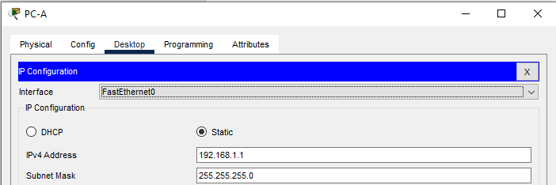
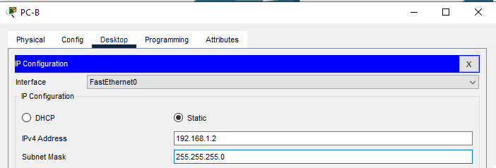

# Лабораторная работа. Просмотр таблицы MAC-адресов коммутатора.
###  Топология


###  Таблица адресации
| Устройство | Интерфейс | IP-адрес | Маска подсети | 
| - | - | - | - |
| S1 | VLAN 1 | 192.168.1.11 | 255.255.255.0 |
| S2 | VLAN 1 | 192.168.1.12 | 255.255.255.0 |
| PC-A | NIC | 192.168.1.1 | 255.255.255.0 |
| PC-B | NIC | 192.168.1.2 | 255.255.255.0 |

### Задание

Часть 1. Создание и настройка сети<br>
Часть 2. Изучение таблицы МАС-адресов коммутатора

### Решение

## Часть 1. Создание и настройка сети.

### Шаг 1. Создание в CPT сети, согласно топологии.

Сеть состоит из двух Switch (Cisco IOS Software, C2960 Software (C2960-LANBASEK9-M), Version 15.0(2)SE4) и двух PC.<br>
Устройства соединены кабелем Ethernet (Cooper Straight-Throught)<br>
  PC-A [FastEthernet0) --> S1 [FastEthernet0/6]<br>
  S1 [FastEthernet0/1] --> S2 [FastEthernet0/1]<br>
  S2 [FastEthernet0/18] --> PC-B [FastEthernet0)<br>
  


### Шаг 2. Настройка узлов ПК.
В соответствии с таблицей адресации:<br>



### Шаг 3. Выполнение инициализации и перезагрузки коммутаторов.
Поскольку работа происходит в виртуальной среде CPT, то шаг 3 не требует исполнения - настройки чистые.<br>
Если бы было реальное сетевое оборудование, то в терминале выполняем команды (аналогично на обоих коммутаторах S1 и S2)
```
Switch>enable
Switch#erase startup-config 
Erasing the nvram filesystem will remove all configuration files! Continue? [confirm]y[OK]
Erase of nvram: complete
%SYS-7-NV_BLOCK_INIT: Initialized the geometry of nvram
Switch#reload
Proceed with reload? [confirm]yC2960
```

### Шаг 4. Настройка базовых параметров каждого коммутатора.
Создание соединения консольным кабелем (Console; S1 [Console] --> PC-A [RS-232])<br>
CPT --> PC-A/PC-B --> вкладка Desktop --> Terminal<br>
Базовые настройки<br>
Отключение функции поиска по DNS<br>
Включение шифрование паролей (визуальное отображение)<br>
Назначение банера motd ("сообщение дня") с разделителем #. Текст "GO AWAY! Unauthorized access is strictly prohibited."<br>
```
Switch>enable
Switch#no ip dom
Switch#conf t
Enter configuration commands, one per line.  End with CNTL/Z.
Switch(config)#no ip domain-lookup
Switch(config)#service password-encryption 
Switch(config)#banner motd #
Enter TEXT message.  End with the character '#'.
GO AWAY! Unauthorized access is strictly prohibited.#

Switch(config)#exit
Switch#
%SYS-5-CONFIG_I: Configured from console by console

Switch#clock set 16:47:00 25 apr 2026
Switch#
```
Далее

#### a. Настройте имена устройств в соответствии с топологией.
Изменение имени с Swith на S1 и S2<br>

PC-A
```
Switch(config)#hostname S1
S1(config)#
```
PC-B
```
Switch(config)#host name S2
                         ^
% Invalid input detected at '^' marker.
	
Switch(config)#hostname S2
S2(config)#
```
#### b.	Настройте IP-адреса, как указано в таблице адресации.
Также после настройки IP адреса включаем виртуальную сетевую карту<br>

PC-A
```
S1(config)#
S1(config)#interface vlan 1
S1(config-if)#ip address 192.168.1.11 255.255.255.0
S1(config-if)#
S1(config-if)#no shutdown 

S1(config-if)#
%LINK-5-CHANGED: Interface Vlan1, changed state to up

%LINEPROTO-5-UPDOWN: Line protocol on Interface Vlan1, changed state to up
```
PC-B
```
S2(config)#interface vlan 1
S2(config-if)#ip address 192.168.1.12 255.255.255.0
S2(config-if)#no shutdown

S2(config-if)#
%LINK-5-CHANGED: Interface Vlan1, changed state to up

%LINEPROTO-5-UPDOWN: Line protocol on Interface Vlan1, changed state to up
```
#### c.	Назначьте cisco в качестве паролей консоли и VTY.
Настройка каналов виртуального соединения для удаленного управления (vty), чтобы коммутатор разрешил доступ через Telnet. Установка пароля "cisco" на консоль и линии vty с 0 по 15. Если не настроить пароль VTY, будет невозможно подключиться к коммутатору по протоколу Telnet.<br>

PC-A
```
S1(config-if)#
S1(config-if)#exit
S1(config)#line console 0
S1(config-line)#logging sync
S1(config-line)#logging synchronous 
S1(config-line)#pass
S1(config-line)#password cisco
S1(config-line)#
S1(config-line)#exit
S1(config)#line vty ?
  <0-15>  First Line number
S1(config)#line vty 0-15
                    ^
% Invalid input detected at '^' marker.
	
S1(config)#line vty 0 ?
  <1-15>  Last Line number
  <cr>
S1(config)#line vty 0 15
S1(config-line)#password cisco
S1(config-line)#
```
PC-B
```
S2(config-if)#
S2(config-if)#exit
S2(config)#line con 0
S2(config-line)#logg
S2(config-line)#logging sync
S2(config-line)#logging synchronous 
S2(config-line)#password cisco
S2(config-line)#exit
S2(config)#line vty 0 15
S2(config-line)#password cisco
S2(config-line)#
```
#### d.	Назначьте class в качестве пароля доступа к привилегированному режиму EXEC.

PC-A
```
S1(config)#enable secret class
```

PC-B
```
S2(config)#enable secret class
```
## Часть 2. Изучение таблицы МАС-адресов коммутатора.

### Шаг 1. Запишите МАС-адреса сетевых устройств.

#### a.	Откройте командную строку на PC-A и PC-B и введите команду ipconfig /all.
CPT --> PC-A/PC-B --> вкладка Desktop --> Command Promt<br>

PC-A
<details>
  <summary>Результат выполнения команды ipconfig /all в командной строке PC-A</summary>
C:\>ipconfig /all<br>
<br>
FastEthernet0 Connection:(default port)<br>
<br>
Connection-specific DNS Suffix..:<br>
Physical Address................: 0004.9AE9.C3AD<br>
Link-local IPv6 Address.........: FE80::204:9AFF:FEE9:C3AD<br>
IPv6 Address....................: ::<br>
IPv4 Address....................: 192.168.1.1<br>
Subnet Mask.....................: 255.255.255.0<br>
Default Gateway.................: ::<br>
0.0.0.0<br>
DHCP Servers....................: 0.0.0.0<br>
DHCPv6 IAID.....................:<br>
DHCPv6 Client DUID..............: 00-01-00-01-39-68-1D-BE-00-04-9A-E9-C3-AD<br>
DNS Servers.....................: ::<br>
0.0.0.0<br>
<br>
Bluetooth Connection:<br>
<br>
Connection-specific DNS Suffix..:<br>
Physical Address................: 0003.E44E.15CB<br>
Link-local IPv6 Address.........: ::<br>
IPv6 Address....................: ::<br>
IPv4 Address....................: 0.0.0.0<br>
Subnet Mask.....................: 0.0.0.0<br>
Default Gateway.................: ::<br>
0.0.0.0<br>
DHCP Servers....................: 0.0.0.0<br>
DHCPv6 IAID.....................:<br>
DHCPv6 Client DUID..............: 00-01-00-01-39-68-1D-BE-00-04-9A-E9-C3-AD<br>
DNS Servers.....................: ::<br>
0.0.0.0
</details>

PC-B
<details>
  <summary>Результат выполнения команды ipconfig /all в командной строке PC-B</summary>
C:\>ipconfig /all<br>
<br>
FastEthernet0 Connection:(default port)<br>
<br>
Connection-specific DNS Suffix..:<br>
Physical Address................: 0030.A3B1.07EE<br>
Link-local IPv6 Address.........: FE80::230:A3FF:FEB1:7EE<br>
IPv6 Address....................: ::<br>
IPv4 Address....................: 192.168.1.2<br>
Subnet Mask.....................: 255.255.255.0<br>
Default Gateway.................: ::<br>
0.0.0.0<br>
DHCP Servers....................: 0.0.0.0<br>
DHCPv6 IAID.....................:<br>
DHCPv6 Client DUID..............: 00-01-00-01-30-57-91-C1-00-30-A3-B1-07-EE<br>
DNS Servers.....................: ::<br>
0.0.0.0<br>
<br>
Bluetooth Connection:<br>
<br>
Connection-specific DNS Suffix..:<br>
Physical Address................: 0040.0B39.14C5<br>
Link-local IPv6 Address.........: ::<br>
IPv6 Address....................: ::<br>
IPv4 Address....................: 0.0.0.0<br>
Subnet Mask.....................: 0.0.0.0<br>
Default Gateway.................: ::<br>
0.0.0.0<br>
DHCP Servers....................: 0.0.0.0<br>
DHCPv6 IAID.....................:<br>
DHCPv6 Client DUID..............: 00-01-00-01-30-57-91-C1-00-30-A3-B1-07-EE<br>
DNS Servers.....................: ::<br>
0.0.0.0
</details>

Физический адрес адаптера Ethernet (то же что и MAC адрес):
PC-A - 0004.9AE9.C3AD
PC-B - 0030.A3B1.07EE

#### b.	Подключитесь к коммутаторам S1 и S2 через консоль и введите команду show interface F0/1 на каждом коммутаторе.
Закрываем командную сторку и заходим в консоль<br>
CPT --> PC-A/PC-B --> вкладка Desktop --> Command Promt<br>
Идет запрос пароля на вход в EXEC. Согласно методичке пароль "class"<br>

PC-A
```
GO AWAY! Unauthorized access is strictly prohibited.

S1>enable
Password: 
S1#show interface F0/1
FastEthernet0/1 is up, line protocol is up (connected)
  Hardware is Lance, address is 0002.4a0d.6901 (bia 0002.4a0d.6901)
```

PC-B
```
S2>enable
Password: 
S2#show interface F0/1
FastEthernet0/1 is up, line protocol is up (connected)
  Hardware is Lance, address is 00e0.f9c6.3101 (bia 00e0.f9c6.3101)
```

Значит адрес оборудования во второй строке выходных данных команды и зашитый адрес — bia:<br>
для PC-A МАС-адрес коммутатора S1 Fast Ethernet 0/1: 0002.4a0d.6901 (bia 0002.4a0d.6901)<br>
для PC-B МАС-адрес коммутатора S2 Fast Ethernet 0/1: 00e0.f9c6.3101 (bia 00e0.f9c6.3101)<br>


