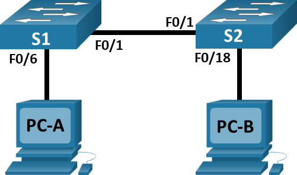
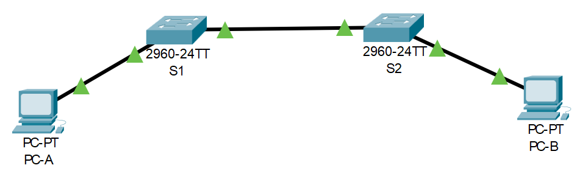

# Лабораторная работа. Просмотр таблицы MAC-адресов коммутатора.
###  Топология

###  Таблица адресации
| Устройство | Интерфейс | IP-адрес | Маска подсети | 
| - | - | - | - |
| S1 | VLAN 1 | 192.168.1.11 | 255.255.255.0 |
| S2 | VLAN 1 | 192.168.1.12 | 255.255.255.0 |
| PC-A | NIC | 192.168.1.1 | 255.255.255.0 |
| PC-B | NIC | 192.168.1.2 | 255.255.255.0 |

### Задание

Часть 1. Создание и настройка сети 
Часть 2. Изучение таблицы МАС-адресов коммутатора

### Решение

## Часть 1. Создание и настройка сети

### Шаг 1. Создание в CPT сети, согласно топологии

Сеть состоит из двух Switch (Cisco IOS Software, C2960 Software (C2960-LANBASEK9-M), Version 15.0(2)SE4) и двух PC. 
Устройства соединены: 
  кабелем Ethernet (Cooper Straight-Throught) 
  PC0 [FastEthernet0) --> Switch1 [FastEthernet0/6]
  Switch1 [FastEthernet0/1] --> Switch2 [FastEthernet0/1]
  Switch2 [FastEthernet0/18] --> PC0 [FastEthernet0)
 --> 

консольным кабелем (Console; Switch [Console] --> PC [RS-232]) и кабелем Ethernet (Cooper Straight-Throught; Switch [FastEthernet0/5] --> PC [FastEthernet0). 

