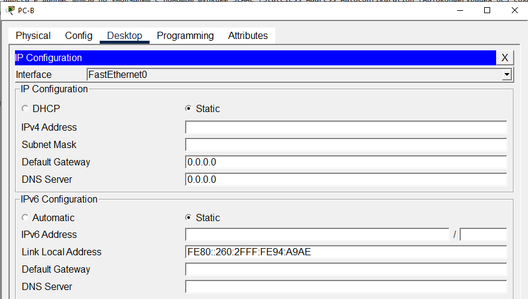
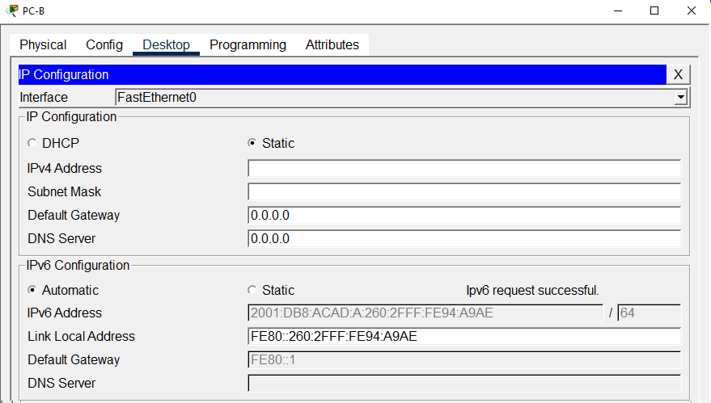
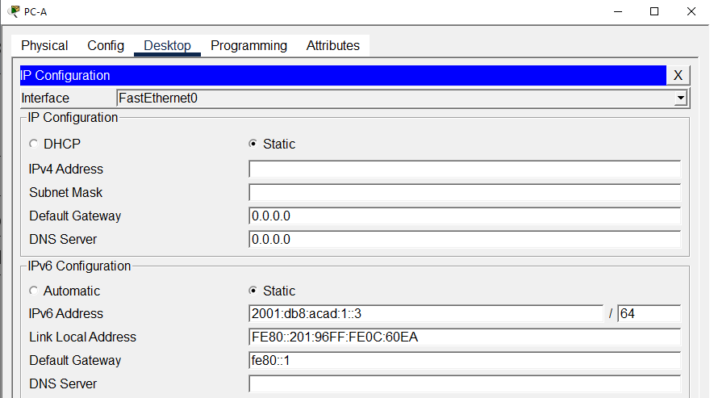
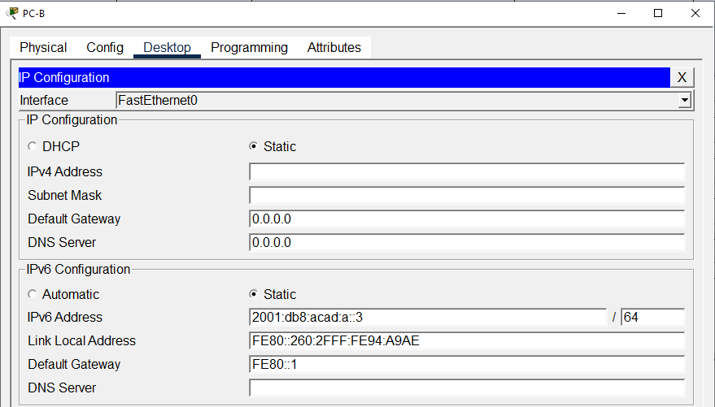

# Лабораторная работа. Настройка IPv6-адресов на сетевых устройствах.
###  Топология


###  Таблица адресации
| Устройство | Интерфейс | IPv6-адрес | Link local IPv6-адрес | Длина префикса | Шлюз по умолчанию |
| - | - | - | - | - | - |
| R1 | G0/0/0 | 2001:db8:acad:a::1 | fe80::1 | 64 | — |
| R1 | G0/0/1	| 2001:db8:acad:1::1 | fe80::1 | 64 | — |
| S1 | VLAN 1 | 2001:db8:acad:1::b | fe80::b | 64 |	— |
|PC-A	| NIC | 2001:db8:acad:1::3 | SLACC | 64 | fe80::1 |
|PC-B	| NIC | 2001:db8:acad:a::3 | SLACC | 64 | fe80::1 |

### Задание

Часть 1. Настройка топологии и конфигурация основных параметров маршрутизатора и коммутатора<br>
Часть 2. Ручная настройка IPv6-адресов<br>
Часть 3. Проверка сквозного соединения<br>

### Решение

Сеть состоит из Switch (C2960 Software (C2960-LANBASEK9-M), Version 15.0(2)SE4), Router (ISR Software (X86_64_LINUX_IOSD-UNIVERSALK9-M), Version 15.5(3)S5) и два компьютера PC-А и PC-B.<br>
Устройства соединены кабелем Ethernet (Cooper Straight-Throught) PC-А [FastEthernet0] --> [FastEthernet0/6] Switch [FastEthernet0/5] --> [GigabitEyhernet0/0/1] Router [GigabitEyhernet0/0/0] --> [FastEthernet0] PC-B<br>

## Часть 1. Настройка топологии и конфигурация основных параметров маршрутизатора и коммутатора.

#### Шаг 1. Настройте маршрутизатор.
Назначьте имя хоста и настройте основные параметры устройства.
```
Router>enable
Router#clock set 21:27:00 08 jun 2026
Router#conf t
Enter configuration commands, one per line.  End with CNTL/Z.
Router(config)#no ip domain-lookup 
Router(config)#hostname S1
S1(config)#service password-encryption 
S1(config)#enable secret class
S1(config)#banner motd #
Enter TEXT message.  End with the character '#'.
Unauthorized access is stricly phohibited. #
```
+
```
R1(config)#sdm prefer dual-ipv4-and-ipv6 default
Changes to the running SDM preferences have been stored, but cannot take effect until the next reload.
Use 'show sdm prefer' to see what SDM preference is currently active.
R1(config)#end
R1#
%SYS-5-CONFIG_I: Configured from console by console

R1#reload
System configuration has been modified. Save? [yes/no]:y
Building configuration...
[OK]
Proceed with reload? [confirm]
```
#### Шаг 2. Настройте коммутатор.
Назначьте имя хоста и настройте основные параметры устройства.
```
Switch>enable
Switch#clock set 21:25:00 08 jun 2026
Switch#conf t
Enter configuration commands, one per line.  End with CNTL/Z.
Switch(config)#no ip domain-lookup 
Switch(config)#hostname R1
R1(config)#service password-encryption 
R1(config)#enable secret class
R1(config)#banner motd #
Enter TEXT message.  End with the character '#'.
Unauthorized access is stricly phohibited. #
```
## Часть 2. Ручная настройка IPv6-адресов

#### Шаг 1. Назначьте IPv6-адреса интерфейсам Ethernet на R1.
##### a.	Назначьте глобальные индивидуальные IPv6-адреса, указанные в таблице адресации обоим интерфейсам Ethernet на R1.
```
S1(config)#int g0/0/0
S1(config-if)#piv6 address 2001:db8:acad:a::1 /64
               ^
% Invalid input detected at '^' marker.
	
S1(config-if)#ipv6 address 2001:db8:acad:a::1 /64
                                              ^
% Invalid input detected at '^' marker.
	
S1(config-if)#ipv6 address 2001:db8:acad:a::1 ?
  link-local  Use link-local address
S1(config-if)#ipv6 address 2001:db8:acad:a::1 
% Incomplete command.
S1(config-if)#ipv6 address 2001:db8:acad:a::1/64
S1(config-if)#
S1(config-if)#
S1(config-if)#int g0/0/1
S1(config-if)#ipv6 address 2001:db8:acad:1::1/64
S1(config-if)#
```
##### b.	Введите команду show ipv6 interface brief, чтобы проверить, назначен ли каждому интерфейсу корректный индивидуальный IPv6-адрес.
```
S1(config-if)#
S1#
%SYS-5-CONFIG_I: Configured from console by console

S1#show ipv6 interface brief
GigabitEthernet0/0/0       [administratively down/down]
    FE80::290:21FF:FEDE:A401
    2001:DB8:ACAD:A::1
GigabitEthernet0/0/1       [administratively down/down]
    FE80::290:21FF:FEDE:A402
    2001:DB8:ACAD:1::1
Vlan1                      [administratively down/down]
    unassigned
S1#
```
Примечание. Отображаемый локальный адрес канала основан на адресации EUI-64, которая автоматически использует MAC-адрес интерфейса для создания 128-битного локального IPv6-адреса канала.
##### c.	Чтобы обеспечить соответствие локальных адресов канала индивидуальному адресу, вручную введите локальные адреса канала на каждом интерфейсе Ethernet на R1.
```
S1(config)#int g0/0/0
S1(config-if)#ipv6 address fe::80
S1(config-if)#ipv6 address fe::80:1 link-local
% Invalid link-local address
S1(config-if)#ipv6 address fe80:1 link-local
                                  ^
% Invalid input detected at '^' marker.
	
S1(config-if)#ipv6 address fe80:1 ?
  X:X:X:X::X/<0-128>  IPv6 prefix
S1(config-if)#ipv6 address fe80:1/64 link-local
                                     ^
% Invalid input detected at '^' marker.
	
S1(config-if)#ipv6 address fe80:1/64 ?
  X:X:X:X::X/<0-128>  IPv6 prefix
S1(config-if)#ipv6 address fe80::1/64 link-local
                                      ^
% Invalid input detected at '^' marker.
	
S1(config-if)#ipv6 address fe80::1 link-local
S1(config-if)#
S1(config-if)#no sh
S1(config-if)#no shutdown 
```
```
S1(config-if)#int g0/0/1
S1(config-if)#ipv6 address fe80::1 link-local
S1(config-if)#no sh
S1(config-if)#no shutdown
```
Примечание. Каждый интерфейс маршрутизатора относится к отдельной сети. Пакеты с локальным адресом канала никогда не выходят за пределы локальной сети, а значит, для обоих интерфейсов можно указывать один и тот же локальный адрес канала.
##### d.	Используйте выбранную команду, чтобы убедиться, что локальный адрес связи изменен на fe80::1.  
```
S1(config-if)#
%LINK-5-CHANGED: Interface GigabitEthernet0/0/1, changed state to up

%LINEPROTO-5-UPDOWN: Line protocol on Interface GigabitEthernet0/0/1, changed state to up

S1(config-if)#
S1#
%SYS-5-CONFIG_I: Configured from console by console

S1#show ipv6 interface br
GigabitEthernet0/0/0       [up/up]
    FE80::1
    2001:DB8:ACAD:A::1
GigabitEthernet0/0/1       [up/up]
    FE80::1
    2001:DB8:ACAD:1::1
Vlan1                      [administratively down/down]
    unassigned
S1#
```
Закройте окно настройки.
Вопрос:
Какие группы многоадресной рассылки назначены интерфейсу G0/0?<br>
Joined group address(es):<br>
    FF02::1<br>
    FF02::1:FF00:1
<details>
  <summary>кат</summary>
	
```
S1(config)#int g0/0
%Invalid interface type and number
S1(config)#int g0/0/0
S1(config-if)#do sh ipv6 int
GigabitEthernet0/0/0 is up, line protocol is up
  IPv6 is enabled, link-local address is FE80::1
  No Virtual link-local address(es):
  Global unicast address(es):
    2001:DB8:ACAD:A::1, subnet is 2001:DB8:ACAD:A::/64
  Joined group address(es):
    FF02::1
    FF02::1:FF00:1
  MTU is 1500 bytes
  ICMP error messages limited to one every 100 milliseconds
  ICMP redirects are enabled
  ICMP unreachables are sent
  ND DAD is enabled, number of DAD attempts: 1
  ND reachable time is 30000 milliseconds
GigabitEthernet0/0/1 is up, line protocol is up
  IPv6 is enabled, link-local address is FE80::1
  No Virtual link-local address(es):
  Global unicast address(es):
    2001:DB8:ACAD:1::1, subnet is 2001:DB8:ACAD:1::/64
  Joined group address(es):
    FF02::1
    FF02::1:FF00:1
  MTU is 1500 bytes
  ICMP error messages limited to one every 100 milliseconds
  ICMP redirects are enabled
  ICMP unreachables are sent
  ND DAD is enabled, number of DAD attempts: 1
  ND reachable time is 30000 milliseconds
```
</details>

#### Шаг 2. Активируйте IPv6-маршрутизацию на R1.
##### a.	В командной строке на PC-B введите команду ipconfig, чтобы получить данные IPv6-адреса, назначенного интерфейсу ПК.
```
FastEthernet0 Connection:(default port)

   Connection-specific DNS Suffix..: 
   Link-local IPv6 Address.........: FE80::260:2FFF:FE94:A9AE
   IPv6 Address....................: ::
   IPv4 Address....................: 0.0.0.0
   Subnet Mask.....................: 0.0.0.0
   Default Gateway.................: ::
                                     0.0.0.0

Bluetooth Connection:

   Connection-specific DNS Suffix..: 
   Link-local IPv6 Address.........: ::
   IPv6 Address....................: ::
   IPv4 Address....................: 0.0.0.0
   Subnet Mask.....................: 0.0.0.0
   Default Gateway.................: ::
                                     0.0.0.0
```

Вопрос:
Назначен ли индивидуальный IPv6-адрес сетевой интерфейсной карте (NIC) на PC-B?<br>
Ответ:
Нет. В поле IPv6 Address стоит :: - адрес ipv6 не указан.

##### b.	Активируйте IPv6-маршрутизацию на R1 с помощью команды IPv6 unicast-routing.
```
S1(config)#
S1(config)#ipv6 un
S1(config)#ipv6 unicast-routing 
```
Примечание. Это позволит компьютерам получать IP-адреса и данные шлюза по умолчанию с помощью функции SLAAC (Stateless Address Autoconfiguration (Автоконфигурация без сохранения состояния адреса)).
##### c.	Теперь, когда R1 входит в группу многоадресной рассылки всех маршрутизаторов, еще раз введите команду ipconfig на PC-B. Проверьте данные IPv6-адреса.
```
C:\>ipconfig

FastEthernet0 Connection:(default port)

   Connection-specific DNS Suffix..: 
   Link-local IPv6 Address.........: FE80::260:2FFF:FE94:A9AE
   IPv6 Address....................: ::
   IPv4 Address....................: 0.0.0.0
   Subnet Mask.....................: 0.0.0.0
   Default Gateway.................: ::
                                     0.0.0.0

Bluetooth Connection:

   Connection-specific DNS Suffix..: 
   Link-local IPv6 Address.........: ::
   IPv6 Address....................: ::
   IPv4 Address....................: 0.0.0.0
   Subnet Mask.....................: 0.0.0.0
   Default Gateway.................: ::
                                     0.0.0.0
```
Вопрос:
Почему PC-B получил глобальный префикс маршрутизации и идентификатор подсети, которые вы настроили на R1?<br>
Ничего он не получил. Как я понял по дефолту в CPT cтоят статические настройки<br>
<br>

Меняем на динамику - тогда появляются настройки
<br>

#### Шаг 3. Назначьте IPv6-адреса интерфейсу управления (SVI) на S1.
##### a.	Назначьте адрес IPv6 для S1. Также назначьте этому интерфейсу локальный адрес канала fe80::b.
```
R1>en
Password: 
R1#conf t
Enter configuration commands, one per line.  End with CNTL/Z.
R1(config)#int vlan1
R1(config-if)#ipv6 address 2001:db8:acad:1::b/64
R1(config-if)#ipv6 address fe80::b link-local
R1(config-if)#
```
##### b.	Проверьте правильность назначения IPv6-адресов интерфейсу управления с помощью команды show ipv6 interface vlan1.
```
R1(config-if)#
R1#
%SYS-5-CONFIG_I: Configured from console by console

R1#
R1#show ipv6 int
R1#show ipv6 interface vlan1
                           ^
% Invalid input detected at '^' marker.
	
R1#show ipv6 interface vlan 1
Vlan1 is administratively down, line protocol is down
  IPv6 is tentative, link-local address is FE80::B [TEN]
  No Virtual link-local address(es):
  Global unicast address(es):
    2001:DB8:ACAD:1::B, subnet is 2001:DB8:ACAD:1::/64 [TEN]
  Joined group address(es):
    FF02::1
  MTU is 1500 bytes
  ICMP error messages limited to one every 100 milliseconds
  ICMP redirects are enabled
  ICMP unreachables are sent
  Output features: Check hwidb
  ND DAD is enabled, number of DAD attempts: 1
  ND reachable time is 30000 milliseconds
R1#
```
Закройте окно настройки.
#### Шаг 4. Назначьте компьютерам статические IPv6-адреса.
На PC-A уже статика по дефолту. На PC-B поменял.
##### a.	Откройте окно Свойства Ethernet для каждого ПК и назначьте адресацию IPv6.
Убедитесь, что оба компьютера имеют правильную информацию адреса IPv6
PC-A<br>


PC-B<br>

Примечание. При выполнении работы в среде Cisco Packet Tracer установите статический и SLACC адреса на компьютеры последовательно, отразив результаты в отчете

## Часть 3. Проверка сквозного подключения

С PC-A отправьте эхо-запрос на FE80::1. Это локальный адрес канала, назначенный G0/1 на R1.
Отправьте эхо-запрос на интерфейс управления S1 с PC-A.
Введите команду tracert на PC-A, чтобы проверить наличие сквозного подключения к PC-B.
С PC-B отправьте эхо-запрос на PC-A.
С PC-B отправьте эхо-запрос на локальный адрес канала G0/0 на R1.
Примечание.  В случае отсутствия сквозного подключения проверьте, правильно ли указаны IPv6-адреса на всех устройствах.

