# Лабораторная работа. Доступ к сетевым устройствам по протоколу SSH.
###  Топология


###  Таблица адресации
| Устройство | Интерфейс | IP-адрес | Маска подсети | Шлюз по умолчанию |
| - | - | - | - | - |
| R1 | G0/0/1 | 192.168.1.1 | 255.255.255.0 | — |
| S1 | VLAN 1 | 192.168.1.11 |  255.255.255.0 | 192.168.1.1 |
|PC-A	| NIC | 192.168.1.3 | 255.255.255.0 | 192.168.1.1 |

### Задание

Часть 1. Настройка основных параметров устройства<br>
Часть 2. Настройка маршрутизатора для доступа по протоколу SSH<br>
Часть 3. Настройка коммутатора для доступа по протоколу SSH<br>
Часть 4. SSH через интерфейс командной строки (CLI) коммутатора<br>

### Решение

Сеть состоит из Switch (C2960 Software (C2960-LANBASEK9-M), Version 15.0(2)SE4), Router (ISR Software (X86_64_LINUX_IOSD-UNIVERSALK9-M), Version 15.5(3)S5) и компьютера PC-А.<br>
Устройства соединены кабелем Ethernet (Cooper Straight-Throught) PC-А [FastEthernet0] --> [FastEthernet0/6] Switch [FastEthernet0/5] --> [GigabitEyhernet0/0/1] Router<br>

## Часть 1. Настройка основных параметров устройств.

` В части 1 потребуется настроить топологию сети и основные параметры, такие как IP-адреса интерфейсов, доступ к устройствам и пароли на маршрутизаторе.

### Шаг 1. Создайте сеть согласно топологии.
Создано<br>
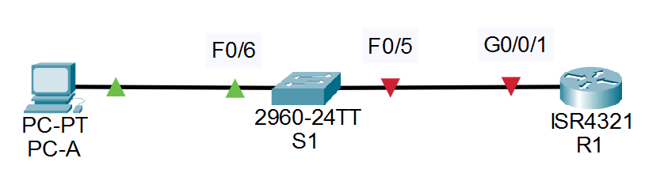

### Шаг 2. Выполните инициализацию и перезагрузку маршрутизатора и коммутатора.
На виртуальной машине не требуется. Настроим далее в других шагах<br>

### Шаг 3. Настройте маршрутизатор.
Откройте окно конфигурации
#### a.	Подключитесь к маршрутизатору с помощью консоли и активируйте привилегированный режим EXEC.
также установим время на устройстве
```
Router>enable
Router#clock set 22:22:00 09 jun 2026
```
#### b.	Войдите в режим конфигурации.
```
Router#conf t
Enter configuration commands, one per line.  End with CNTL/Z.
```
#### c.	Отключите поиск DNS, чтобы предотвратить попытки маршрутизатора неверно преобразовывать введенные команды таким образом, как будто они являются именами узлов.
Также назначаем имя устройства
```
Router(config)#no ip domain-lookup 
Router(config)#hostname R1
```
#### d.	Назначьте class в качестве зашифрованного пароля привилегированного режима EXEC.
```
R1(config)#enable secret class
```
#### e.	Назначьте cisco в качестве пароля консоли и включите вход в систему по паролю.
Использование параметра logging synchronous, позволяет сделать так, чтобы чтобы консольные сообщения не прерывали выполнение команд.
```
R1(config)#line console 0
R1(config-line)#logging synchronous
R1(config-line)#password cisco
R1(config-line)#login
```
#### f.	Назначьте cisco в качестве пароля VTY и включите вход в систему по паролю.
```
R1(config)#line vty 0 4
R1(config-line)#pass
R1(config-line)#password cisco
R1(config-line)#login
```
#### g.	Зашифруйте открытые пароли.
```
R1(config)#service password-encryption
```
#### h.	Создайте баннер, который предупреждает о запрете несанкционированного доступа.
```
R1(config)#banner motd #
Enter TEXT message.  End with the character '#'.
Unauthorized access is stricly phohibited. #

R1(config)#
```
#### i.	Настройте и активируйте на маршрутизаторе интерфейс G0/0/1, используя информацию, приведенную в таблице адресации.
```
R1(config)#int g0/0/1
R1(config-if)#ip address 192.168.1.1 255.255.255.0
R1(config-if)#no sh

R1(config-if)#
%LINK-5-CHANGED: Interface GigabitEthernet0/0/1, changed state to up

%LINEPROTO-5-UPDOWN: Line protocol on Interface GigabitEthernet0/0/1, changed state to up
```
#### j.	Сохраните текущую конфигурацию в файл загрузочной конфигурации.
```
R1#copy running-config startup-config 
Destination filename [startup-config]? 
Building configuration...
[OK]
R1#
```
или
```
R1#
R1#wr me
Building configuration...
[OK]
R1#
```

### Шаг 4. Настройте компьютер PC-A.
#### a.	Настройте для PC-A IP-адрес и маску подсети.
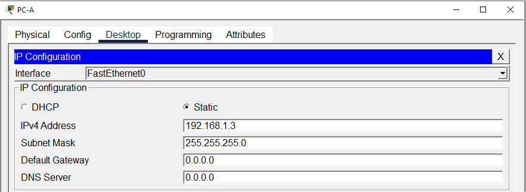
#### b.	Настройте для PC-A шлюз по умолчанию.
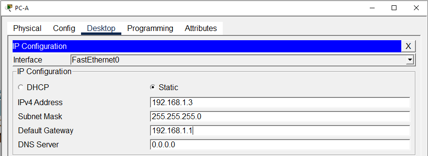

### Шаг 5. Проверьте подключение к сети.
Пошлите с PC-A команду Ping на маршрутизатор R1. Если эхо-запрос с помощью команды ping не проходит, найдите и устраните неполадки подключения.
```
C:\>ping 192.168.1.1

Pinging 192.168.1.1 with 32 bytes of data:

Reply from 192.168.1.1: bytes=32 time<1ms TTL=255
Reply from 192.168.1.1: bytes=32 time<1ms TTL=255
Reply from 192.168.1.1: bytes=32 time<1ms TTL=255
Reply from 192.168.1.1: bytes=32 time<1ms TTL=255

Ping statistics for 192.168.1.1:
    Packets: Sent = 4, Received = 4, Lost = 0 (0% loss),
Approximate round trip times in milli-seconds:
    Minimum = 0ms, Maximum = 0ms, Average = 0ms
```
Закройте окно настройки.

## Часть 2. Настройка маршрутизатора для доступа по протоколу SSH
Подключение к сетевым устройствам по протоколу Telnet сопряжено с риском для безопасности, поскольку вся информация передается в виде открытого текста. Протокол SSH шифрует данные сеанса и обеспечивает аутентификацию устройств, поэтому для удаленных подключений рекомендуется использовать именно этот протокол. В части 2 вам нужно настроить маршрутизатор для приема соединений SSH по линиям VTY.
### Шаг 1. Настройте аутентификацию устройств.
При генерации ключа шифрования в качестве его части используются имя устройства и домен. Поэтому эти имена необходимо указать перед вводом команды crypto key.
Откройте окно конфигурации
#### a.	Задайте имя устройства.
Сделаем вид, что именно на этом моменте, а не ранее рефлекторно на шаг 3 пункт С, я задал маршрутизатору имя R1
#### b.	Задайте домен для устройства.
```
R1(config)#ip domain-name rocket.ru
```
### Шаг 2. Создайте ключ шифрования с указанием его длины.
```
R1(config)#cr
R1(config)#crypto key
R1(config)#crypto key gener
R1(config)#crypto key generate rsa 
The name for the keys will be: R1.rocket.ru
Choose the size of the key modulus in the range of 360 to 4096 for your
  General Purpose Keys. Choosing a key modulus greater than 512 may take
  a few minutes.

How many bits in the modulus [512]: 2048
% Generating 2048 bit RSA keys, keys will be non-exportable...[OK]
R1(config)#ip ssh version 2
```
### Шаг 3. Создайте имя пользователя в локальной базе учетных записей.
Настройте имя пользователя, используя admin в качестве имени пользователя и Adm1nP @55 в качестве пароля.
```
R1(config)#username admin privilege 15 secret Adm1nP@55
```
### Шаг 4. Активируйте протокол SSH на линиях VTY.
#### a.	Активируйте протоколы Telnet и SSH на входящих линиях VTY с помощью команды transport input.
Команда login local для использования локальной базы пользователей на выбранной линии (в данном случае будут линии vty 0 4)
```
R1(config)#line vty 0 4
R1(config-line)#trns
R1(config-line)#transp
R1(config-line)#transport ssh
                          ^
% Invalid input detected at '^' marker.
	
R1(config-line)#transport inp
R1(config-line)#transport input ssh
R1(config-line)#
```
#### b.	Измените способ входа в систему таким образом, чтобы использовалась проверка пользователей по локальной базе учетных записей.
Команда login local для использования локальной базы пользователей на выбранной линии (в данном случае будут линии vty 0 4)
```
R1(config)#line vty 0 4
R1(config-line)#login local
```
### Шаг 5. Сохраните текущую конфигурацию в файл загрузочной конфигурации.
```
R1# copy running-config startup-config 
Destination filename [startup-config]? 
Building configuration...
[OK]
```
### Шаг 6. Установите соединение с маршрутизатором по протоколу SSH.
#### a.	Запустите Tera Term с PC-A.
Запустил
#### b.	Установите SSH-подключение к R1. Use the username admin and password Adm1nP@55. У вас должно получиться установить SSH-подключение к R1.
Странная история, но у меня не получается подключиться по заданному имени (rocket.ru), но по IP получается и все работает. Перезапуск CPT не помог<br>
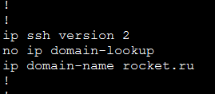
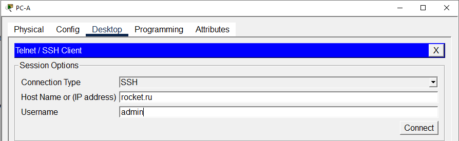
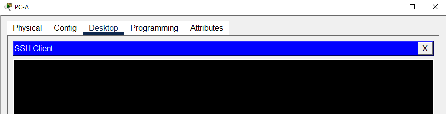
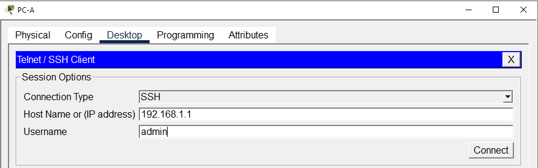
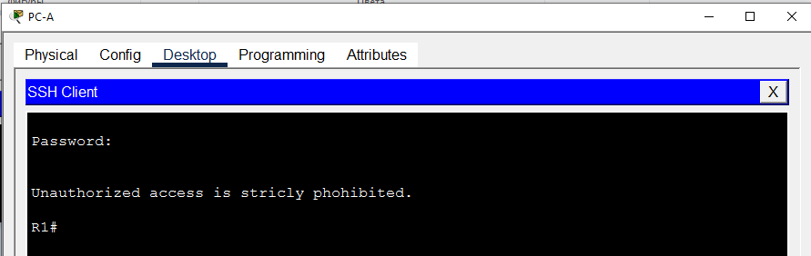

Закройте окно настройки.
## Часть 3. Настройка коммутатора для доступа по протоколу SSH
В части 3 вам предстоит настроить коммутатор для приема подключений по протоколу SSH, а затем установить SSH-подключение с помощью программы Tera Term.
### Шаг 1. Настройте основные параметры коммутатора.
Откройте окно конфигурации
#### a.	Подключитесь к коммутатору с помощью консольного подключения и активируйте привилегированный режим EXEC.
```
Switch>enable
```
#### b.	Войдите в режим конфигурации.
```
Switch#conf t
Enter configuration commands, one per line.  End with CNTL/Z.
```
#### c.	Отключите поиск DNS, чтобы предотвратить попытки маршрутизатора неверно преобразовывать введенные команды таким образом, как будто они являются именами узлов.
```
Switch(config)#no ip damain0look
Switch(config)#no ip damain
Switch(config)#no ip damain-
Switch(config)#no ip damain-l
Switch(config)#no ip damain-loo
Switch(config)#no ip domain-loo
Switch(config)#no ip domain-lookup
```
#### d.	Назначьте class в качестве зашифрованного пароля привилегированного режима EXEC.
```
Switch(config)#enable secret class
```
#### e.	Назначьте cisco в качестве пароля консоли и включите вход в систему по паролю.
```
Switch(config)#line console 0
Switch(config-line)# password cisco
Switch(config-line)#login
```
#### f.	Назначьте cisco в качестве пароля VTY и включите вход в систему по паролю.
```
Switch(config)#line vty 0 4
Switch(config-line)#?
Virtual Line configuration commands:
  access-class  Filter connections based on an IP access list
  accounting    Accounting parameters
  databits      Set number of data bits per character
  exec-timeout  Set the EXEC timeout
  exit          Exit from line configuration mode
  flowcontrol   Set the flow control
  history       Enable and control the command history function
  logging       Modify message logging facilities
  login         Enable password checking
  motd-banner   Enable the display of the MOTD banner
  no            Negate a command or set its defaults
  parity        Set terminal parity
  password      Set a password
  privilege     Change privilege level for line
  speed         Set the transmit and receive speeds
  stopbits      Set async line stop bits
  transport     Define transport protocols for line
Switch(config-line)#pass
Switch(config-line)#password ?
  7     Specifies a HIDDEN password will follow
  LINE  The UNENCRYPTED (cleartext) line password
Switch(config-line)#password cisco
Switch(config-line)#login
```
#### g.	Зашифруйте открытые пароли.
```
Switch#conf t
Enter configuration commands, one per line.  End with CNTL/Z.
Switch(config)#servi
Switch(config)#service pas
Switch(config)#service password-encryption 
```
#### h.	Создайте баннер, который предупреждает о запрете несанкционированного доступа.
```
Switch(config)#banner motd #
Enter TEXT message.  End with the character '#'.
Unauthorized access is stricly phohibited. #
```
#### i.	Настройте и активируйте на коммутаторе интерфейс VLAN 1, используя информацию, приведенную в таблице адресации.
```
Switch(config)#int vlan 1
Switch(config-if)#ip address 192.168.1.11 255.255.255.0
Switch(config-if)#ex
Switch(config)#ip ?
  access-list      Named access-list
  arp              IP ARP global configuration
  default-gateway  Specify default gateway (if not routing IP)
  dhcp             Configure DHCP server and relay parameters
  domain           IP DNS Resolver
  domain-lookup    Enable IP Domain Name System hostname translation
  domain-name      Define the default domain name
  ftp              FTP configuration commands
  host             Add an entry to the ip hostname table
  name-server      Specify address of name server to use
  scp              Scp commands
  ssh              Configure ssh options
Switch(config)#ip def
Switch(config)#ip default-gateway 192.168.1.1
```
#### j.	Сохраните текущую конфигурацию в файл загрузочной конфигурации.
```
Switch#copy running-config startup-config 
Destination filename [startup-config]? 
Building configuration...
[OK]
```
### Шаг 2. Настройте коммутатор для соединения по протоколу SSH.
Для настройки протокола SSH на коммутаторе используйте те же команды, которые применялись для аналогичной настройки маршрутизатора в части 2.
#### a.	Настройте имя устройства, как указано в таблице адресации.
```
Switch#conf t
Enter configuration commands, one per line.  End with CNTL/Z.
Switch(config)#hostname S1
S1(config)#
```
#### b.	Задайте домен для устройства.
```
S1(config)#ip domain-name air.ru
```
#### c.	Создайте ключ шифрования с указанием его длины.
```
S1(config)#crypto key generate rsa 
The name for the keys will be: S1.air.ru
Choose the size of the key modulus in the range of 360 to 4096 for your
  General Purpose Keys. Choosing a key modulus greater than 512 may take
  a few minutes.

How many bits in the modulus [512]: 2048
% Generating 2048 bit RSA keys, keys will be non-exportable...[OK]
```
#### d.	Создайте имя пользователя в локальной базе учетных записей.
в методичке не указано на необходимость выдать права админа или установить на учетку пароль
```
S1(config)#username PiloT
```

p.s.
после попытки подклчится по SSH, согласно шагу 3 (часть 2) пришло осознание, что без пароля, а похоже и админских прав, врядли получится подключиться по SSH. Поэтому возвращается и комбинируем прошлого юзера с текущим.
```
S1(config)#no username PiloT
S1(config)#username PiloT pr
S1(config)#username PiloT privilege 15
S1(config)#username PiloT privilege 15 ?
  password  Specify the password for the user
  secret    Specify the secret for the user
  <cr>
S1(config)#username PiloT privilege 15 secret
S1(config)#username PiloT privilege 15 secret Adm1nP@55
```
#### e.	Активируйте протоколы Telnet и SSH на линиях VTY.
```
S1(config)#line vty 0 4
S1(config-line)#trans
S1(config-line)#transport ?
  input   Define which protocols to use when connecting to the terminal server
  output  Define which protocols to use for outgoing connections
S1(config-line)#transport in
S1(config-line)#transport input ?
  all     All protocols
  none    No protocols
  ssh     TCP/IP SSH protocol
  telnet  TCP/IP Telnet protocol
S1(config-line)#transport input all
```
#### f.	Измените способ входа в систему таким образом, чтобы использовалась проверка пользователей по локальной базе учетных записей.
```
S1(config-line)#login local 
```
### Шаг 3. Установите соединение с коммутатором по протоколу SSH.
Запустите программу Tera Term на PC-A, затем установите подключение по протоколу SSH к интерфейсу SVI коммутатора S1.
Вопрос: Удалось ли вам установить SSH-соединение с коммутатором?<br>
Сперва нет, т.к. создавая учетку PiloT я не задал на нее уровень превилегий и пароль. Исправился.<br>
После этого, так же как на маршрутизаторе по имени подключиться не удалось.

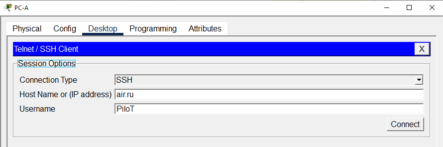
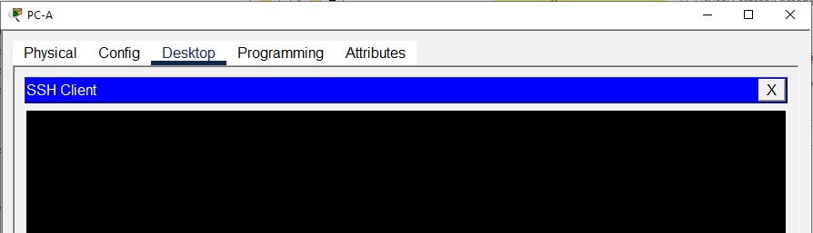

А вот по IP получилось, как и в случае с маршрутизатором.
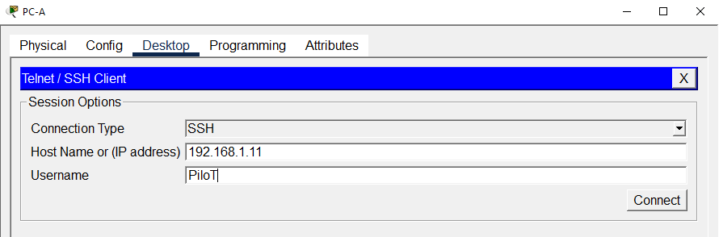
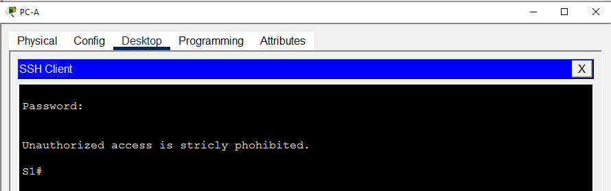

Закройте окно настройки.

## Часть 4. Настройка протокола SSH с использованием интерфейса командной строки (CLI) коммутатора
Клиент SSH встроен в операционную систему Cisco IOS и может запускаться из интерфейса командной строки. В части 4 вам предстоит установить соединение с маршрутизатором по протоколу SSH, используя интерфейс командной строки коммутатора.
### Шаг 1. Посмотрите доступные параметры для клиента SSH в Cisco IOS.
Откройте окно конфигурации
Используйте вопросительный знак (?), чтобы отобразить варианты параметров для команды ssh.
S1# ssh? 
  -c Select encryption algorithm
  -l Log in using this user name
  -m Select HMAC algorithm
  -o Specify options
  -p Connect to this port
  -v Specify SSH Protocol Version
  -vrf Specify vrf name
  WORD IP-адрес или имя хоста удаленной системы
### Шаг 2. Установите с коммутатора S1 соединение с маршрутизатором R1 по протоколу SSH.
#### a.	Чтобы подключиться к маршрутизатору R1 по протоколу SSH, введите команду –l admin. Это позволит вам войти в систему под именем admin. При появлении приглашения введите в качестве пароля Adm1nP@55
S1# ssh -l admin 192.168.1.1<br>
Password: <br>
Authorized Users Only!<br>
R1><br>
```
Press RETURN to get started!


Unauthorized access is stricly phohibited. 

User Access Verification
Password: 

S1>en
Password: 
S1#ssh ?
  -l  Log in using this user name
  -v  Specify SSH Protocol Version
S1#ssh -l admin
% Incomplete command.
S1#ssh -l admin ?
  -v    Specify SSH Protocol Version
  WORD  IP address or hostname of a remote system
S1#ssh -l admin rocket.ru
Translating "rocket.ru"
% Unknown command or computer name, or unable to find computer address

S1#ssh -l admin 192.168.1.1

Password: 


Unauthorized access is stricly phohibited. 

R1#
```

#### b.	Чтобы вернуться к коммутатору S1, не закрывая сеанс SSH с маршрутизатором R1, нажмите комбинацию клавиш Ctrl+Shift+6. Отпустите клавиши Ctrl+Shift+6 и нажмите x. Отображается приглашение привилегированного режима EXEC коммутатора.
R1><br>
S1#<br>
Верно. Сработало.
```
R1#
S1#
```
#### c.	Чтобы вернуться к сеансу SSH на R1, нажмите клавишу Enter в пустой строке интерфейса командной строки. Чтобы увидеть окно командной строки маршрутизатора, нажмите клавишу Enter еще раз.
S1#<br>
[Resuming connection 1 to 192.168.1.1 ... ]<br>
R1><br>
Верно. Сработало, только R1 в режиме EXEC
```
S1#
[Resuming connection 1 to 192.168.1.1 ... ]

R1#
```
#### d.	Чтобы завершить сеанс SSH на маршрутизаторе R1, введите в командной строке маршрутизатора команду exit.
R1# exit<br>
[Connection to 192.168.1.1 closed by foreign host]<br>
S1#<br>
```
R1#exit

[Connection to 192.168.1.1 closed by foreign host]
S1#
```

Вопрос:
Какие версии протокола SSH поддерживаются при использовании интерфейса командной строки?<br>


Закройте окно настройки.
	Вопрос для повторения
Как предоставить доступ к сетевому устройству нескольким пользователям, у каждого из которых есть собственное имя пользователя?

