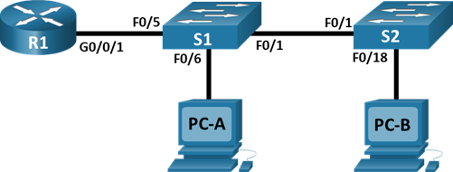
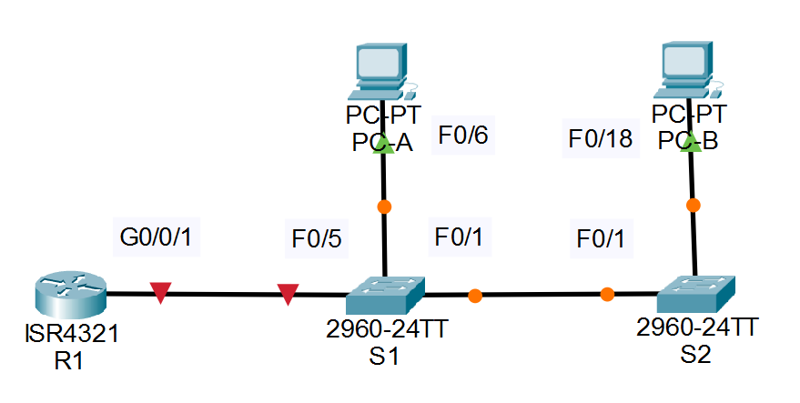
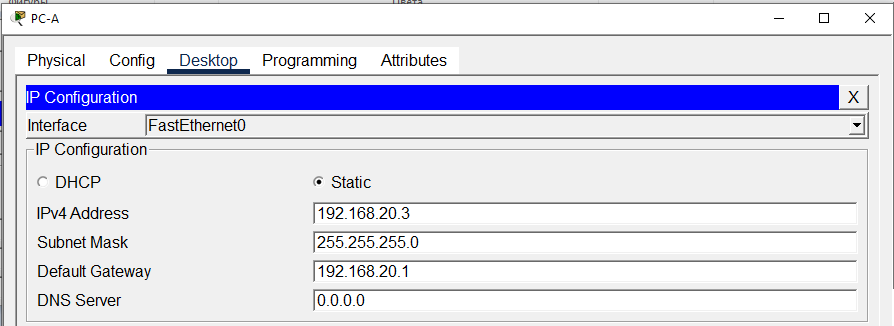
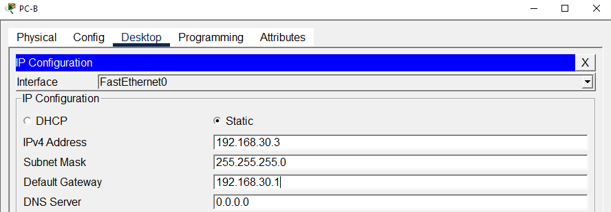

# Лабораторная работа - Внедрение маршрутизации между виртуальными локальными сетями.
###  Топология


###  Таблица адресации

|	Устройство	|	Интерфейс	|	IP-адрес	|	Маска подсети	|	Шлюз по умолчанию	|
|	-	|	-	|	-	|	-	|	-	|
|	R1	|	G0/0/1.10	|	192.168.10.1	|	255.255.255.0	|	—	|
|	R1	|	G0/0/1.20	|	192.168.20.1	|	255.255.255.0	|	—	|
|	R1	|	G0/0/1.30	|	192.168.30.1	|	255.255.255.0	|	—	|
|	R1	|	G0/0/1.1000	|	—	|	—	|	—	|
|	S1	|	VLAN 10	|	192.168.10.11	|	255.255.255.0	|	192.168.10.1	|
|	S2	|	VLAN 10	|	192.168.10.12	|	255.255.255.0	|	192.168.10.1	|
|	PC-A	|	NIC	|	192.168.20.3	|	255.255.255.0	|	192.168.20.1	|
|	PC-B	|	NIC	|	192.168.30.3	|	255.255.255.0	|	192.168.30.1	|

###  Таблица VLAN

|	VLAN	|	Имя	|	Назначенный интерфейс	|	
|-------|-----|-----------------------|
|	10	|	Управление	|	S1: VLAN 10	|	
|	10	|	Управление	|	S2: VLAN 10	|	
|	20	|	Sales	|	S1: F0/6	|	
|	30	|	Operations	|	S2: F0/18	|	
|	999	|	Parking_Lot	|	С1: F0/2-4, F0/7-24, G0/1-2	|	
|	999	|	Parking_Lot	|	С2: F0/2-17, F0/19-24, G0/1-2	|	

###  Задание:

Задачи
## Часть 1. Создание сети и настройка основных параметров устройства
## Часть 2. Создание сетей VLAN и назначение портов коммутатора
## Часть 3. Настройка транка 802.1Q между коммутаторами.
## Часть 4. Настройка маршрутизации между сетями VLAN
## Часть 5. Проверка, что маршрутизация между VLAN работает
Общие сведения/сценарий
В целях повышения производительности сети большие широковещательные домены 2-го уровня делят на домены меньшего размера. Для этого современные коммутаторы используют виртуальные локальные сети (VLAN). VLAN также можно использовать в качестве меры безопасности, отделяя конфиденциальный трафик данных от остальной части сети. Сети VLAN облегчают процесс проектирования сети, обеспечивающей помощь в достижении целей организации. Для связи между VLAN требуется устройство, работающее на уровне 3 модели OS#### i. Добавление маршрутизации между VLAN позволяет организации разделять и разделять широковещательные домены, одновременно позволяя им обмениваться данными друг с другом.<br>
Транковые каналы сети VLAN используются для распространения сетей VLAN по различным устройствам. Транковые каналы разрешают передачу трафика из множества сетей VLAN через один канал, не нанося вред идентификации и сегментации сети VLAN. Особый вид маршрутизации между VLAN, называемый «Router-on-a-Stick», использует магистраль от маршрутизатора к коммутатору, чтобы все VLAN могли переходить к маршрутизатору.<br>
В этой лабораторной работе вы создадите VLAN на обоих коммутаторах в топологии, назначите VLAN для коммутации портов доступа, убедитесь, что VLAN работают должным образом, создадите транки VLAN между двумя коммутаторами и между S1 и R1, и настройте маршрутизацию между VLAN на R1 для разрешения связи между хостами в разных VLAN независимо от подсети, в которой находится хост.<br>
Примечание: Маршрутизаторы, используемые в практических лабораторных работах CCNA, - это Cisco 4221 с Cisco IOS XE Release 16.9.4 (образ universalk9). В лабораторных работах используются коммутаторы Cisco Catalyst 2960 с Cisco IOS версии 15.2(2) (образ lanbasek9). Можно использовать другие маршрутизаторы, коммутаторы и версии Cisco IOS. В зависимости от модели устройства и версии Cisco IOS доступные команды и результаты их выполнения могут отличаться от тех, которые показаны в лабораторных работах. Правильные идентификаторы интерфейса см. в сводной таблице по интерфейсам маршрутизаторов в конце лабораторной работы.<br>
Примечание. Убедитесь, что у всех маршрутизаторов и коммутаторов была удалена начальная конфигурация. Если вы не уверены в этом, обратитесь к инструктору.<br>
Необходимые ресурсы<br>
•	1 Маршрутизатор (Cisco 4221 с универсальным образом Cisco IOS XE версии 16.9.4 или аналогичным)<br>
•	2 коммутатора (Cisco 2960 с операционной системой Cisco IOS 15.2(2) (образ lanbasek9) или аналогичная модель)<br>
•	2 ПК (ОС Windows с программой эмуляции терминалов, такой как Tera Term)<br>
•	Консольные кабели для настройки устройств Cisco IOS через консольные порты.<br>
•	Кабели Ethernet, расположенные в соответствии с топологией<br>

### Решение

## Часть 1. Создание сети и настройка основных параметров устройства
В первой части лабораторной работы вам предстоит создать топологию сети и настроить базовые параметры для узлов ПК и коммутаторов.
### Шаг 1. Создайте сеть согласно топологии.
Подключите устройства, как показано в топологии, и подсоедините необходимые кабели.

Сеть состоит из Router (ISR Software (X86_64_LINUX_IOSD-UNIVERSALK9-M), Version 15.5(3)S5), двух Switch (C2960 Software (C2960-LANBASEK9-M), Version 15.0(2)SE4) и двух компьютеров PC-А и PC-B.<br>
Устройства соединены кабелем Ethernet (Cooper Straight-Throught) Router [GigabitEyhernet0/0/1] -->  [FastEthernet0/5] Switch [FastEthernet0/6] --> [FastEthernet0] PC-A; [FastEthernet0/1] --> [FastEthernet0/1] Switch [FastEthernet0/18] --> [FastEthernet0] PC-B 


### Шаг 2. Настройте базовые параметры для маршрутизатора.
#### a.	Подключитесь к маршрутизатору с помощью консоли и активируйте привилегированный режим EXEC.
Откройте окно конфигурации
```
Router>enable
```
#### b.	Войдите в режим конфигурации.
```
Router#conf t
```
#### c.	Назначьте маршрутизатору имя устройства.
```
Router(config)#hostname R1
```
#### d.	Отключите поиск DNS, чтобы предотвратить попытки маршрутизатора неверно преобразовывать введенные команды таким образом, как будто они являются именами узлов.
```
R1(config)#no ip domain-lookup
```
#### e.	Назначьте class в качестве зашифрованного пароля привилегированного режима EXEC.
```
R1(config)#enable secret class
```
#### f.	Назначьте cisco в качестве пароля консоли и включите вход в систему по паролю.
Использование параметра logging synchronous, позволяет сделать так, чтобы чтобы консольные сообщения не прерывали выполнение команд.
```
R1(config)#line console 0
R1(config-line)#logging synchronous
R1(config-line)#password cisco
R1(config-line)#login
```
#### g.	Установите cisco в качестве пароля виртуального терминала и активируйте вход.
```
R1(config)#line vty 0 4
R1(config-line)#password cisco
R1(config-line)#login
```
#### h.	Зашифруйте открытые пароли.
```
R1(config)#service password-encryption
```
#### i.	Создайте баннер с предупреждением о запрете несанкционированного доступа к устройству.
```
R1(config)#banner motd #
Enter TEXT message.  End with the character '#'.
Unauthorized access is stricly phohibited. #
```
#### j.	Сохраните текущую конфигурацию в файл загрузочной конфигурации.
```
R1(config)#ex
R1#
%SYS-5-CONFIG_I: Configured from console by console

R1#copy run
R1#copy running-config sta
R1#copy running-config startup-config 
Destination filename [startup-config]? 
Building configuration...
[OK]
```
#### k.	Настройте на маршрутизаторе время.
```
R1#clock set 15:07:00 12 jun 2026
```
Закройте окно настройки.

### Шаг 3. Настройте базовые параметры каждого коммутатора.
#### a.	Присвойте коммутатору имя устройства.
Маршрутизатор S1
```
Switch>en
Switch#conf t
Enter configuration commands, one per line.  End with CNTL/Z.
Switch(config)#hostname S1
```
Маршрутизатор S2
```
Switch>en
Switch>enable 
Switch#conf t
Enter configuration commands, one per line.  End with CNTL/Z.
Switch(config)#hostname S2
```
#### b.	Отключите поиск DNS, чтобы предотвратить попытки маршрутизатора неверно преобразовывать введенные команды таким образом, как будто они являются именами узлов.
Маршрутизатор S1
```
S1(config)#no ip domain-lookup
```
Маршрутизатор S2
```
S2(config)#no ip damin-lookup
                  ^
% Invalid input detected at '^' marker.
	
S2(config)#no ip domain-lookup
```
#### c.	Назначьте class в качестве зашифрованного пароля привилегированного режима EXEC.
Маршрутизатор S1
```
S1(config)#enable secret class
```
Маршрутизатор S2
```
S2(config)#enable secret class
```
#### d.	Назначьте cisco в качестве пароля консоли и включите вход в систему по паролю.
Маршрутизатор S1
```
S1(config)#line console 0
S1(config-line)#password cisco
S1(config-line)#login
```
Маршрутизатор S2
```
S2(config)#libe console 0
             ^
% Invalid input detected at '^' marker.
	
S2(config)#line console 0
S2(config-line)#password cisco
S2(config-line)#login
```
#### e.	Установите cisco в качестве пароля виртуального терминала и активируйте вход.
Маршрутизатор S1
```
S1(config-line)#line vty 0 4
S1(config-line)#pas
S1(config-line)#password cisco
S1(config-line)#login
```
Маршрутизатор S2
```
S2(config-line)#line vty 0 4
S2(config-line)#password cisco
S2(config-line)#login
```
#### f.	Зашифруйте открытые пароли.
Маршрутизатор S1
```
S1(config-line)#exit
S1(config)#service password-encryption 
```
Маршрутизатор S2
```
S2(config-line)#exit
S2(config)#service pass
S2(config)#service password-encryption 
```
#### g.	Создайте баннер с предупреждением о запрете несанкционированного доступа к устройству.
Маршрутизатор S1
```
S1(config)#banner motd #
Enter TEXT message.  End with the character '#'.
Unauthorized access is stricly phohibited. #

S1(config)#exit
```
Маршрутизатор S2
```
S2(config)#banner motd #
Enter TEXT message.  End with the character '#'.
Unauthorized access is stricly phohibited. #
```
#### h.	Настройте на коммутаторах время.
Маршрутизатор S1
```
S1#clock set 15:14:00 12 jun 2026
```
Маршрутизатор S2
```
S2(config)#exit
S2#
%SYS-5-CONFIG_I: Configured from console by console

S2#clock set 15:26:00 12 jun 2026
```
#### i.	Сохранение текущей конфигурации в качестве начальной.
Маршрутизатор S1
```
S1#copy  running-config startup-config 
Destination filename [startup-config]? 
Building configuration...
[OK]
```
Маршрутизатор S2
```
S2#copy running-config startup-config 
Destination filename [startup-config]? 
Building configuration...
[OK]
```
Закройте окно настройки.

### Шаг 4. Настройте узлы ПК.
Адреса ПК можно посмотреть в таблице адресации.<br>
PC-A<br>


PC-B<br>


## Часть 2. Создание сетей VLAN и назначение портов коммутатора
Во второй части вы создадите VLAN, как указано в таблице выше, на обоих коммутаторах. Затем вы назначите VLAN соответствующему интерфейсу и проверите настройки конфигурации. Выполните следующие задачи на каждом коммутаторе.
### Шаг 1. Создайте сети VLAN на коммутаторах.
#### a.	Создайте и назовите необходимые VLAN на каждом коммутаторе из таблицы выше.
Откройте окно конфигурации
Маршрутизатор S1
```
S1(config)#vlan 10
S1(config-vlan)#name VLAN10
```
Маршрутизатор S2
```
S2(config)#vlan 10
S2(config-vlan)#name VLAN10
```
#### b.	Настройте интерфейс управления и шлюз по умолчанию на каждом коммутаторе, используя информацию об IP-адресе в таблице адресации. 
Маршрутизатор S1
```
S1(config-vlan)#exit
S1(config)#int vlan 1
S1(config-if)#ip address 192.168.10.11 255.255.255.0
S1(config-if)#exit
S1(config)#ip def
S1(config)#ip default-gateway 192.168.10.1
```
Маршрутизатор S2
```
S2(config-vlan)#exit
S2(config)#int vlan 1
S2(config-if)#ip address 192.168.10.12 255.255.255.0
S2(config-if)#exit
S2(config)#ip d
%CDP-4-NATIVE_VLAN_MISMATCH: Native VLAN mismatch discovered on FastEthernet0/1 (1), with S1 FastEthernet0/1 (1
S2(config)#ip def
S2(config)#ip default-gateway 192.168.10.1
```
#### c.	Назначьте все неиспользуемые порты коммутатора VLAN Parking_Lot, настройте их для статического режима доступа и административно деактивируйте их.
Примечание. Команда interface range полезна для выполнения этой задачи с минимальным количеством команд.
Маршрутизатор S1
```
S1(config)#vlan 99
S1(config-vlan)#name Parking_Lot
S1(config-vlan)#exit
S1(config)#int
S1(config)#interface fa0/2-4, fa0/7-24, g0/1-2
                         ^
% Invalid input detected at '^' marker.
	
S1(config)#interface fa0/2-4, fa0/7-24, g0/1-2
                         ^
% Invalid input detected at '^' marker.
	
S1(config)#interface range fa0/2-4, fa0/7-24, g0/1-2
S1(config-if-range)#swi
S1(config-if-range)#switchport mode
S1(config-if-range)#switchport mode access
S1(config-if-range)#switchport access vlan 99
S1(config-if-range)#end
S1#
%SYS-5-CONFIG_I: Configured from console by console

S1#conf t
Enter configuration commands, one per line.  End with CNTL/Z.
S1(config)#interface range fa0/2-4, fa0/7-24, g0/1-2
S1(config-if-range)#shutdown
```
<details>
  <summary>результат команды shutdown</summary>
%LINK-5-CHANGED: Interface FastEthernet0/2, changed state to administratively down

%LINK-5-CHANGED: Interface FastEthernet0/3, changed state to administratively down

%LINK-5-CHANGED: Interface FastEthernet0/4, changed state to administratively down

%LINK-5-CHANGED: Interface FastEthernet0/7, changed state to administratively down

%LINK-5-CHANGED: Interface FastEthernet0/8, changed state to administratively down

%LINK-5-CHANGED: Interface FastEthernet0/9, changed state to administratively down

%LINK-5-CHANGED: Interface FastEthernet0/10, changed state to administratively down

%LINK-5-CHANGED: Interface FastEthernet0/11, changed state to administratively down

%LINK-5-CHANGED: Interface FastEthernet0/12, changed state to administratively down

%LINK-5-CHANGED: Interface FastEthernet0/13, changed state to administratively down

%LINK-5-CHANGED: Interface FastEthernet0/14, changed state to administratively down

%LINK-5-CHANGED: Interface FastEthernet0/15, changed state to administratively down

%LINK-5-CHANGED: Interface FastEthernet0/16, changed state to administratively down

%LINK-5-CHANGED: Interface FastEthernet0/17, changed state to administratively down

%LINK-5-CHANGED: Interface FastEthernet0/18, changed state to administratively down

%LINK-5-CHANGED: Interface FastEthernet0/19, changed state to administratively down

%LINK-5-CHANGED: Interface FastEthernet0/20, changed state to administratively down

%LINK-5-CHANGED: Interface FastEthernet0/21, changed state to administratively down

%LINK-5-CHANGED: Interface FastEthernet0/22, changed state to administratively down

%LINK-5-CHANGED: Interface FastEthernet0/23, changed state to administratively down

%LINK-5-CHANGED: Interface FastEthernet0/24, changed state to administratively down

%LINK-5-CHANGED: Interface GigabitEthernet0/1, changed state to administratively down

%LINK-5-CHANGED: Interface GigabitEthernet0/2, changed state to administratively down
</details>

Маршрутизатор S2
```
S2(config)#vlan 99
S2(config-vlan)#na
%CDP-4-NATIVE_VLAN_MISMATCH: Native VLAN mismatch discovered on FastEthernet0/1 (1), with S1 FastEthernet0/1 (10).
% Ambiguous command: "n"
S2(config-vlan)#name Parking_Lot
S2(config-vlan)#int range fa0/2-17, fa0/19-24, g0/1-2
S2(config-if-range)#sw
S2(config-if-range)#switchport mode access
S2(config-if-range)#sw
S2(config-if-range)#switchport ass
S2(config-if-range)#switchport acc
S2(config-if-range)#switchport access vlan 99
S2(config-if-range)#sh
```
<details>
  <summary>результат команды shutdown</summary>
	%LINK-5-CHANGED: Interface FastEthernet0/2, changed state to administratively down

%LINK-5-CHANGED: Interface FastEthernet0/3, changed state to administratively down

%LINK-5-CHANGED: Interface FastEthernet0/4, changed state to administratively down

%LINK-5-CHANGED: Interface FastEthernet0/5, changed state to administratively down

%LINK-5-CHANGED: Interface FastEthernet0/6, changed state to administratively down

%LINK-5-CHANGED: Interface FastEthernet0/7, changed state to administratively down

%LINK-5-CHANGED: Interface FastEthernet0/8, changed state to administratively down

%LINK-5-CHANGED: Interface FastEthernet0/9, changed state to administratively down

%LINK-5-CHANGED: Interface FastEthernet0/10, changed state to administratively down

%LINK-5-CHANGED: Interface FastEthernet0/11, changed state to administratively down

%LINK-5-CHANGED: Interface FastEthernet0/12, changed state to administratively down

%LINK-5-CHANGED: Interface FastEthernet0/13, changed state to administratively down

%LINK-5-CHANGED: Interface FastEthernet0/14, changed state to administratively down

%LINK-5-CHANGED: Interface FastEthernet0/15, changed state to administratively down

%LINK-5-CHANGED: Interface FastEthernet0/16, changed state to administratively down

%LINK-5-CHANGED: Interface FastEthernet0/17, changed state to administratively down

%LINK-5-CHANGED: Interface FastEthernet0/19, changed state to administratively down

%LINK-5-CHANGED: Interface FastEthernet0/20, changed state to administratively down

%LINK-5-CHANGED: Interface FastEthernet0/21, changed state to administratively down

%LINK-5-CHANGED: Interface FastEthernet0/22, changed state to administratively down

%LINK-5-CHANGED: Interface FastEthernet0/23, changed state to administratively down

%LINK-5-CHANGED: Interface FastEthernet0/24, changed state to administratively down

%LINK-5-CHANGED: Interface GigabitEthernet0/1, changed state to administratively down

%LINK-5-CHANGED: Interface GigabitEthernet0/2, changed state to administratively down
</details>

### Шаг 2. Назначьте сети VLAN соответствующим интерфейсам коммутатора.
#### a.	Назначьте используемые порты соответствующей VLAN (указанной в таблице VLAN выше) и настройте их для режима статического доступа.
Маршрутизатор S1
```
S1#conf t
Enter configuration commands, one per line.  End with CNTL/Z.
S1(config)#int
S1(config)#interface ran
S1(config)#interface range fa0/1, fa0/5-6
S1(config-if-range)#sw
S1(config-if-range)#switchport mode access
S1(config-if-range)#sw
S1(config-if-range)#switchport access VLAN 10
S1(config-if-range)#no sh
```
Маршрутизатор S2
```
S2#conf t
Enter configuration commands, one per line.  End with CNTL/Z.
S2(config)#int
S2(config)#interface range fa0/1, fa0/18
S2(config-if-range)#sw
S2(config-if-range)#switchport ac
S2(config-if-range)#switchport mode acc
S2(config-if-range)#switchport mode access 
S2(config-if-range)#sw
S2(config-if-range)#switchport ac
S2(config-if-range)#switchport access vlan 10
S2(config-if-range)#no sh
```
#### b.	Убедитесь, что VLAN назначены на правильные интерфейсы.
Маршрутизатор S1
```
S1(config-if-range)#do sh vlan br

VLAN Name                             Status    Ports
---- -------------------------------- --------- -------------------------------
1    default                          active    
10   VLAN10                           active    Fa0/1, Fa0/5, Fa0/6
99   Parking_Lot                      active    Fa0/2, Fa0/3, Fa0/4, Fa0/7
                                                Fa0/8, Fa0/9, Fa0/10, Fa0/11
                                                Fa0/12, Fa0/13, Fa0/14, Fa0/15
                                                Fa0/16, Fa0/17, Fa0/18, Fa0/19
                                                Fa0/20, Fa0/21, Fa0/22, Fa0/23
                                                Fa0/24, Gig0/1, Gig0/2
1002 fddi-default                     active    
1003 token-ring-default               active    
1004 fddinet-default                  active    
1005 trnet-default                    active    
S1(config-if-range)#
%CDP-4-NATIVE_VLAN_MISMATCH: Native VLAN mismatch discovered on FastEthernet0/1 (10), with S2 FastEthernet0/1 (1).
S1(config-if-range)#do sh int stat
Port      Name               Status       Vlan       Duplex  Speed Type
Fa0/1                        connected    10         a-full  a-100 10/100BaseTX
Fa0/2                        disabled 99         auto    auto  10/100BaseTX
Fa0/3                        disabled 99         auto    auto  10/100BaseTX
Fa0/4                        disabled 99         auto    auto  10/100BaseTX
Fa0/5                        notconnect   10         auto    auto  10/100BaseTX
Fa0/6                        connected    10         a-full  a-100 10/100BaseTX
Fa0/7                        disabled 99         auto    auto  10/100BaseTX
Fa0/8                        disabled 99         auto    auto  10/100BaseTX
Fa0/9                        disabled 99         auto    auto  10/100BaseTX
Fa0/10                       disabled 99         auto    auto  10/100BaseTX
Fa0/11                       disabled 99         auto    auto  10/100BaseTX
Fa0/12                       disabled 99         auto    auto  10/100BaseTX
Fa0/13                       disabled 99         auto    auto  10/100BaseTX
Fa0/14                       disabled 99         auto    auto  10/100BaseTX
Fa0/15                       disabled 99         auto    auto  10/100BaseTX
Fa0/16                       disabled 99         auto    auto  10/100BaseTX
Fa0/17                       disabled 99         auto    auto  10/100BaseTX
Fa0/18                       disabled 99         auto    auto  10/100BaseTX
Fa0/19                       disabled 99         auto    auto  10/100BaseTX
Fa0/20                       disabled 99         auto    auto  10/100BaseTX
Fa0/21                       disabled 99         auto    auto  10/100BaseTX
Fa0/22                       disabled 99         auto    auto  10/100BaseTX
Fa0/23                       disabled 99         auto    auto  10/100BaseTX
Fa0/24                       disabled 99         auto    auto  10/100BaseTX
Gig0/1                       disabled 99         auto    auto  10/100/1000BaseTX
Gig0/2                       disabled 99         auto    auto  10/100/1000BaseTX

S1#
```
Маршрутизатор S2
```
S2(config-if-range)#do sh vlan br

VLAN Name                             Status    Ports
---- -------------------------------- --------- -------------------------------
1    default                          active    
10   VLAN10                           active    Fa0/1, Fa0/18
99   Parking_Lot                      active    Fa0/2, Fa0/3, Fa0/4, Fa0/5
                                                Fa0/6, Fa0/7, Fa0/8, Fa0/9
                                                Fa0/10, Fa0/11, Fa0/12, Fa0/13
                                                Fa0/14, Fa0/15, Fa0/16, Fa0/17
                                                Fa0/19, Fa0/20, Fa0/21, Fa0/22
                                                Fa0/23, Fa0/24, Gig0/1, Gig0/2
1002 fddi-default                     active    
1003 token-ring-default               active    
1004 fddinet-default                  active    
1005 trnet-default                    active
S2(config-if-range)#do sh int stat
Port      Name               Status       Vlan       Duplex  Speed Type
Fa0/1                        connected    10         a-full  a-100 10/100BaseTX
Fa0/2                        disabled 99         auto    auto  10/100BaseTX
Fa0/3                        disabled 99         auto    auto  10/100BaseTX
Fa0/4                        disabled 99         auto    auto  10/100BaseTX
Fa0/5                        disabled 99         auto    auto  10/100BaseTX
Fa0/6                        disabled 99         auto    auto  10/100BaseTX
Fa0/7                        disabled 99         auto    auto  10/100BaseTX
Fa0/8                        disabled 99         auto    auto  10/100BaseTX
Fa0/9                        disabled 99         auto    auto  10/100BaseTX
Fa0/10                       disabled 99         auto    auto  10/100BaseTX
Fa0/11                       disabled 99         auto    auto  10/100BaseTX
Fa0/12                       disabled 99         auto    auto  10/100BaseTX
Fa0/13                       disabled 99         auto    auto  10/100BaseTX
Fa0/14                       disabled 99         auto    auto  10/100BaseTX
Fa0/15                       disabled 99         auto    auto  10/100BaseTX
Fa0/16                       disabled 99         auto    auto  10/100BaseTX
Fa0/17                       disabled 99         auto    auto  10/100BaseTX
Fa0/18                       connected    10         a-full  a-100 10/100BaseTX
Fa0/19                       disabled 99         auto    auto  10/100BaseTX
Fa0/20                       disabled 99         auto    auto  10/100BaseTX
Fa0/21                       disabled 99         auto    auto  10/100BaseTX
Fa0/22                       disabled 99         auto    auto  10/100BaseTX
Fa0/23                       disabled 99         auto    auto  10/100BaseTX
Fa0/24                       disabled 99         auto    auto  10/100BaseTX
Gig0/1                       disabled 99         auto    auto  10/100/1000BaseTX
Gig0/2                       disabled 99         auto    auto  10/100/1000BaseTX
```
Закройте окно настройки.
## Часть 3. Конфигурация магистрального канала стандарта 802.1Q между коммутаторами
В части 3 вы вручную настроите интерфейс F0/1 как транк.
### Шаг 1. Вручную настройте магистральный интерфейс F0/1 на коммутаторах S1 и S2.
#### a.	Настройка статического транкинга на интерфейсе F0/1 для обоих коммутаторов.
Откройте окно конфигурации
Маршрутизатор S1
```
S1>en
S1>enable 
Password: 
S1#conf t
Enter configuration commands, one per line.  End with CNTL/Z.
S1(config)#int fa0/1
S1(config-if)#sw
S1(config-if)#switchport mode trunk

S1(config-if)#
%LINEPROTO-5-UPDOWN: Line protocol on Interface FastEthernet0/1, changed state to down

%LINEPROTO-5-UPDOWN: Line protocol on Interface FastEthernet0/1, changed state to up

%CDP-4-NATIVE_VLAN_MISMATCH: Native VLAN mismatch discovered on FastEthernet0/1 (1), with S2 FastEthernet0/1 (10).

S1(config-if)#
%CDP-4-NATIVE_VLAN_MISMATCH: Native VLAN mismatch discovered on FastEthernet0/1 (1), with S2 FastEthernet0/1 (10).

```
Маршрутизатор S2
```
User Access Verification

Password: 

S2>
S2>enable
Password: 
S2#conf t
Enter configuration commands, one per line.  End with CNTL/Z.
S2(config)#int fa0/1
S2(config-if)#sw
S2(config-if)#switchport mode
S2(config-if)#switchport mode trunk

S2(config-if)#
%LINEPROTO-5-UPDOWN: Line protocol on Interface FastEthernet0/1, changed state to down

%LINEPROTO-5-UPDOWN: Line protocol on Interface FastEthernet0/1, changed state to up

S2(config-if)#
%CDP-4-NATIVE_VLAN_MISMATCH: Native VLAN mismatch discovered on FastEthernet0/1 (1), with S1 FastEthernet0/1 (1000).
```
#### b.	Установите native VLAN 1000 на обоих коммутаторах.
Маршрутизатор S1
```
S1(config-if)#switchport trunk native vlan 1000
```
Маршрутизатор S2
```
S2(config-if)#switchport trunk native vlan 1000
```
#### c.	Укажите, что VLAN 10, 20, 30 и 1000 могут проходить по транку.
Маршрутизатор S1
```
S1(config-if)#switchport trunk allowed vlan 10,20,30,1000
```
Маршрутизатор S2
```
S2(config-if)#sw
S2(config-if)#switchport trunk
S2(config-if)#switchport trunk all
S2(config-if)#switchport trunk allowed vlan 10,20,30,1000
```
#### d.	Проверьте транки, native VLAN и разрешенные VLAN через транк.
Маршрутизатор S1
```
S1#show interfaces fa0/1 switchport 
Name: Fa0/1
Switchport: Enabled
Administrative Mode: trunk
Operational Mode: trunk
Administrative Trunking Encapsulation: dot1q
Operational Trunking Encapsulation: dot1q
Negotiation of Trunking: On
Access Mode VLAN: 10 (VLAN10)
Trunking Native Mode VLAN: 1000 (Inactive)
Voice VLAN: none
Administrative private-vlan host-association: none
Administrative private-vlan mapping: none
Administrative private-vlan trunk native VLAN: none
Administrative private-vlan trunk encapsulation: dot1q
Administrative private-vlan trunk normal VLANs: none
Administrative private-vlan trunk private VLANs: none
Operational private-vlan: none
Trunking VLANs Enabled: 10,20,30,1000
Pruning VLANs Enabled: 2-1001
Capture Mode Disabled
Capture VLANs Allowed: ALL
Protected: false
Unknown unicast blocked: disabled
Unknown multicast blocked: disabled
Appliance trust: none
```
Маршрутизатор S2
```
S2(config-if)#do sh int fa0/1 sw
Name: Fa0/1
Switchport: Enabled
Administrative Mode: trunk
Operational Mode: trunk
Administrative Trunking Encapsulation: dot1q
Operational Trunking Encapsulation: dot1q
Negotiation of Trunking: On
Access Mode VLAN: 10 (VLAN10)
Trunking Native Mode VLAN: 1000 (Inactive)
Voice VLAN: none
Administrative private-vlan host-association: none
Administrative private-vlan mapping: none
Administrative private-vlan trunk native VLAN: none
Administrative private-vlan trunk encapsulation: dot1q
Administrative private-vlan trunk normal VLANs: none
Administrative private-vlan trunk private VLANs: none
Operational private-vlan: none
Trunking VLANs Enabled: 10,20,30,1000
Pruning VLANs Enabled: 2-1001
Capture Mode Disabled
Capture VLANs Allowed: ALL
Protected: false
Unknown unicast blocked: disabled
Unknown multicast blocked: disabled
Appliance trust: none
```
### Шаг 2. Вручную настройте магистральный интерфейс F0/5 на коммутаторе S1.
#### a.	Настройте интерфейс S1 F0/5 с теми же параметрами транка, что и F0/1. Это транк до маршрутизатора.
Маршрутизатор S1
```
S1(config)#int fa0/5
S1(config-if)#sw
S1(config-if)#switchport mode
S1(config-if)#switchport mode trunk
S1(config-if)#sw
S1(config-if)#switchport trunk
S1(config-if)#switchport trunk acc
S1(config-if)#switchport trunk ?
  allowed  Set allowed VLAN characteristics when interface is in trunking mode
  native   Set trunking native characteristics when interface is in trunking
           mode
S1(config-if)#switchport trunk all
S1(config-if)#switchport trunk allowed vlan 10,20,30,1000
```
#### b.	Сохраните текущую конфигурацию в файл загрузочной конфигурации.
Маршрутизатор S1
```
S1(config-if)#do wr me
Building configuration...
[OK]
```
#### c.	Проверка транкинга.
Маршрутизатор S1
```
S1#sh int fa0/5 sw
Name: Fa0/5
Switchport: Enabled
Administrative Mode: trunk
Operational Mode: down
Administrative Trunking Encapsulation: dot1q
Operational Trunking Encapsulation: dot1q
Negotiation of Trunking: On
Access Mode VLAN: 10 (VLAN10)
Trunking Native Mode VLAN: 1 (default)
Voice VLAN: none
Administrative private-vlan host-association: none
Administrative private-vlan mapping: none
Administrative private-vlan trunk native VLAN: none
Administrative private-vlan trunk encapsulation: dot1q
Administrative private-vlan trunk normal VLANs: none
Administrative private-vlan trunk private VLANs: none
Operational private-vlan: none
Trunking VLANs Enabled: 10,20,30,1000
Pruning VLANs Enabled: 2-1001
Capture Mode Disabled
Capture VLANs Allowed: ALL
Protected: false
Unknown unicast blocked: disabled
Unknown multicast blocked: disabled
Appliance trust: none
```

Вопрос:
Что произойдет, если G0/0/1 на R1 будет отключен?<br>
Не будет связанности между WLAN, т.к. маршрутизатор на trunk-линии позволяет создать связь между WLAN (схема роутер на палочке RoS) посредством настроенных сабинтерфейсов.

Закройте окно настройки.
## Часть 4. Настройка маршрутизации между сетями VLAN
### Шаг 1. Настройте маршрутизатор.
Откройте окно конфигурации
#### a.	При необходимости активируйте интерфейс G0/0/1 на маршрутизаторе.
Уже включен.
#### b.	Настройте подинтерфейсы для каждой VLAN, как указано в таблице IP-адресации. Все подинтерфейсы используют инкапсуляцию 802.1Q. Убедитесь, что подинтерфейсу для native VLAN не назначен IP-адрес. Включите описание для каждого подинтерфейса.
```
R1(config-if)#int g0/0/1.10
R1(config-subif)#en
R1(config-subif)#encapsulation d
R1(config-subif)#encapsulation dot1Q 10
R1(config-subif)#ip address 192.168.10.1 255.255.255.0
R1(config-subif)#
R1(config-subif)#int g0/0/1.20
R1(config-subif)#en
R1(config-subif)#encapsulation d
R1(config-subif)#encapsulation dot1Q 20
R1(config-subif)#ip address 192.168.20.1 255.255.255.0
R1(config-subif)#
R1(config-subif)#int g0/0/1.30
R1(config-subif)#en
R1(config-subif)#encapsulation d
R1(config-subif)#encapsulation dot1Q 30
R1(config-subif)#ip address 192.168.30.1 255.255.255.0
R1(config-subif)#
R1(config-subif)#int
R1(config-subif)#int g0/0/1.1000
R1(config-subif)#en
R1(config-subif)#encapsulation d
R1(config-subif)#encapsulation dot1Q 1000 native
R1(config-subif)#
```
```
R1(config-subif)#ex
R1(config)#do sh run
Building configuration...
...
!
interface GigabitEthernet0/0/1.1000
 encapsulation dot1Q 1000 native
 no ip address
!
```
```
R1(config-subif)#int g0/0/1.10
R1(config-subif)#des
R1(config-subif)#description ?
  LINE  Up to 240 characters describing this interface
R1(config-subif)#description Default Gateway for VLAN 10
R1(config-subif)#int g0/0/1.20
R1(config-subif)#description Default Gateway for VLAN 20
R1(config-subif)#int g0/0/1.30
R1(config-subif)#description Default Gateway for VLAN 30
```
#### c.	Убедитесь, что вспомогательные интерфейсы работают


Закройте окно настройки.
## Часть 5. Проверьте, работает ли маршрутизация между VLAN


### ### Шаг 1. Выполните следующие тесты с PC-#### a. Все должно быть успешно.
Примечание. Возможно, вам придется отключить брандмауэр ПК для работы ping
#### a.	Отправьте эхо-запрос с PC-A на шлюз по умолчанию.


#### b.	Отправьте эхо-запрос с PC-A на PC-#### b.


#### c.	Отправьте команду ping с компьютера PC-A на коммутатор S2.


### ### Шаг 2. Пройдите следующий тест с PC-B
В окне командной строки на PC-B выполните команду tracert на адрес PC-#### a.
Вопрос:
Какие промежуточные IP-адреса отображаются в результатах?
