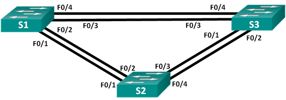
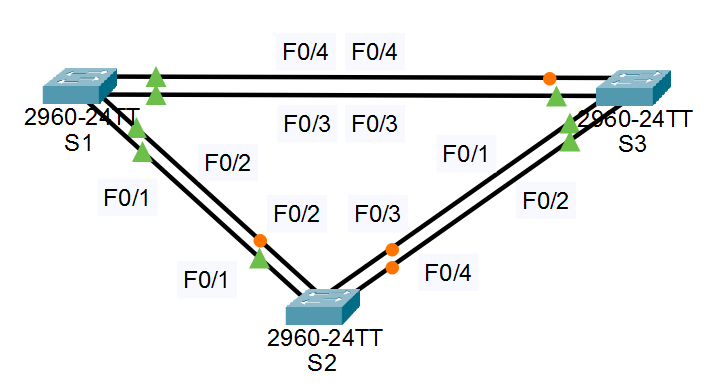
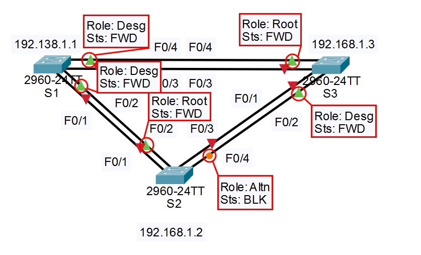

# Лабораторная работа. Развертывание коммутируемой сети с резервными каналами.
###  Топология

	
###  Таблица адресации
|	Устройство	|	Интерфейс	|	IP-адрес	|	Маска подсети	|
|---------------|---------------|---------------|-------------------|
|	S1	|	VLAN 1	|	192.168.1.1	|	255.255.255.0	|
|	S2	|	VLAN 1	|	192.168.1.2	|	255.255.255.0	|
|	S3	|	VLAN 1	|	192.168.1.3	|	255.255.255.0	|

###  Задание:

## ## Часть 1. Создание сети и настройка основных параметров устройства
## ## Часть 2. Выбор корневого моста
## ## Часть 3. Наблюдение за процессом выбора протоколом STP порта, исходя из стоимости портов
## ## Часть 4. Наблюдение за процессом выбора протоколом STP порта, исходя из приоритета портов

Общие сведения/сценарий
Избыточность позволяет увеличить доступность устройств в топологии сети за счёт устранения единой точки отказа. Избыточность в коммутируемой сети обеспечивается посредством использования нескольких коммутаторов или нескольких каналов между коммутаторами. Когда в проекте сети используется физическая избыточность, возможно возникновение петель и дублирование кадров.<br>
Протокол spanning-tree (STP) был разработан как механизм предотвращения возникновения петель на 2-м уровне для избыточных каналов коммутируемой сети. Протокол STP обеспечивает наличие только одного логического пути между всеми узлами назначения в сети путем намеренного блокирования резервных путей, которые могли бы вызвать петлю.<br>
В этой лабораторной работе команда show spanning-tree используется для наблюдения за процессом выбора протоколом STP корневого моста. Также вы будете наблюдать за процессом выбора портов с учетом стоимости и приоритета.<br>
Примечание. Используются коммутаторы Cisco Catalyst 2960s с Cisco IOS версии 15.0(2) (образ lanbasek9). Допускается использование других моделей коммутаторов и других версий Cisco IOS. В зависимости от модели устройства и версии Cisco IOS доступные команды и результаты их выполнения могут отличаться от тех, которые показаны в лабораторных работах.<br>
Примечание. Убедитесь, что все настройки коммутатора удалены и загрузочная конфигурация отсутствует. Если вы не уверены, обратитесь к инструктору.<br>
	Необходимые ресурсы<br>
•	3 коммутатора (Cisco 2960 с операционной системой Cisco IOS 15.0(2) (образ lanbasek9) или аналогичная модель)<br>
•	Консольные кабели для настройки устройств Cisco IOS через консольные порты<br>
•	Кабели Ethernet, расположенные в соответствии с топологией<br>

### Решение

## ## Часть 1:	Создание сети и настройка основных параметров устройства
В части 1 вам предстоит настроить топологию сети и основные параметры маршрутизаторов.

### ### Шаг 1:	Создайте сеть согласно топологии.
Подключите устройства, как показано в топологии, и подсоедините необходимые кабели.

Сеть состоит из трех Switch (C2960 Software (C2960-LANBASEK9-M), Version 15.0(2)SE4).<br>
Устройства соединены кабелем Ethernet (Cooper Straight-Throught) Switch 1 [FastEthernet0/1]/[FastEthernet0/2] --> Switch 2 [FastEthernet0/1]/[FastEthernet0/2] / Switch 2 [FastEthernet0/3]/[FastEthernet0/4]--> Switch 3 [FastEthernet0/1]/[FastEthernet0/2] / Switch 3 [FastEthernet0/4]/[FastEthernet0/3] --> Switch 1 [FastEthernet0/4]/[FastEthernet0/3].


### Шаг 2:	Выполните инициализацию и перезагрузку коммутаторов.
### Шаг 3:	Настройте базовые параметры каждого коммутатора.
Введенные команды аналогичны для Маршрутизаторов S2 и S3
#### a.	Отключите поиск DNS.
```
Switch#conf t
Enter configuration commands, one per line.  End with CNTL/Z.
Switch(config)#no ip domain0lookup
                       ^
% Invalid input detected at '^' marker.
	
Switch(config)#no ip domain-lookup
```
#### b.	Присвойте имена устройствам в соответствии с топологией.
```
Switch(config)#host S1
```
#### c.	Назначьте class в качестве зашифрованного пароля доступа к привилегированному режиму.
```
S1(config)#enable secret class
```
#### d.	Назначьте cisco в качестве паролей консоли и VTY и активируйте вход для консоли и VTY каналов.
```
S1(config)#line vty 0 4
S1(config-line)#pas
S1(config-line)#password cisco
S1(config-line)#login
S1(config-line)#line console 0
S1(config-line)#pas
S1(config-line)#password cisco
S1(config-line)#login
S1(config-line)#
```
#### e.	Настройте logging synchronous для консольного канала.
Использование параметра logging synchronous, позволяет сделать так, чтобы чтобы консольные сообщения не прерывали выполнение команд.
```
S1(config-line)#logg
S1(config-line)#logging s
S1(config-line)#logging synchronous 
```
#### f.	Настройте баннерное сообщение дня (MOTD) для предупреждения пользователей о запрете несанкционированного доступа.
```
S1(config)#banner motd #
Enter TEXT message.  End with the character '#'.
Unauthorized access is stricly phohibited. #
```
#### g.	Задайте IP-адрес, указанный в таблице адресации для VLAN 1 на всех коммутаторах.
```
S1(config)#int vlan 1
S1(config-if)#ip address 192.168.1.1 255.255.255.0
S1(config-if)#no sh

S1(config-if)#
%LINK-3-UPDOWN: Interface Vlan1, changed state to down

%LINEPROTO-5-UPDOWN: Line protocol on Interface Vlan1, changed state to up
```
#### h.	Скопируйте текущую конфигурацию в файл загрузочной конфигурации.
```
S1(config-if)#
S1#
%SYS-5-CONFIG_I: Configured from console by console

S1#copy run
S1#copy running-config st
S1#copy running-config startup-config 
Destination filename [startup-config]? 
Building configuration...
[OK]
S1#
```
### Шаг 4:	Проверьте связь.
Проверьте способность компьютеров обмениваться эхо-запросами.<br>
Успешно ли выполняется эхо-запрос от коммутатора S1 на коммутатор S2?<br>
Да, если не забыть включить интерфейс, когда настроиваем IP<br>
```
S1#
S1#ping 192.168.1.2

Type escape sequence to abort.
Sending 5, 100-byte ICMP Echos to 192.168.1.2, timeout is 2 seconds:
..!!!
Success rate is 60 percent (3/5), round-trip min/avg/max = 0/0/0 ms
```
Успешно ли выполняется эхо-запрос от коммутатора S1 на коммутатор S3?<br>
Да, если не забыть включить интерфейс, когда настроиваем IP<br>
```
S1#ping 192.168.1.3

Type escape sequence to abort.
Sending 5, 100-byte ICMP Echos to 192.168.1.3, timeout is 2 seconds:
..!!!
Success rate is 60 percent (3/5), round-trip min/avg/max = 0/0/0 ms
```
Успешно ли выполняется эхо-запрос от коммутатора S2 на коммутатор S3?<br>
Да, если не забыть включить интерфейс, когда настроиваем IP<br>
```
S2#ping 192.168.1.3

Type escape sequence to abort.
Sending 5, 100-byte ICMP Echos to 192.168.1.3, timeout is 2 seconds:
..!!!
Success rate is 60 percent (3/5), round-trip min/avg/max = 0/0/0 ms
```

Выполняйте отладку до тех пор, пока ответы на все вопросы не будут положительными.

## Часть 2:	Определение корневого моста
Для каждого экземпляра протокола spanning-tree (коммутируемая сеть LAN или широковещательный домен) существует коммутатор, выделенный в качестве корневого моста. Корневой мост служит точкой привязки для всех расчётов протокола spanning-tree, позволяя определить избыточные пути, которые следует заблокировать.<br>
Процесс выбора определяет, какой из коммутаторов станет корневым мостом. Коммутатор с наименьшим значением идентификатора моста (BID) становится корневым мостом. Идентификатор BID состоит из значения приоритета моста, расширенного идентификатора системы и MAC-адреса коммутатора. Значение приоритета может находиться в диапазоне от 0 до 65535 с шагом 4096. По умолчанию используется значение 32768.
### Шаг 1:	Отключите все порты на коммутаторах.
<details>
  <summary>S1</summary>
S1#conf t

Enter configuration commands, one per line.  End with CNTL/Z.
	
S1(config)#int range f0/1-4
	
S1(config-if-range)#shutdown

S1(config-if-range)#

%LINK-5-CHANGED: Interface FastEthernet0/1, changed state to administratively down

%LINEPROTO-5-UPDOWN: Line protocol on Interface FastEthernet0/1, changed state to down

%LINK-5-CHANGED: Interface FastEthernet0/2, changed state to administratively down

%LINEPROTO-5-UPDOWN: Line protocol on Interface FastEthernet0/2, changed state to down

%LINK-5-CHANGED: Interface FastEthernet0/3, changed state to administratively down

%LINEPROTO-5-UPDOWN: Line protocol on Interface FastEthernet0/3, changed state to down

%LINK-5-CHANGED: Interface FastEthernet0/4, changed state to administratively down

%LINEPROTO-5-UPDOWN: Line protocol on Interface FastEthernet0/4, changed state to down

%LINEPROTO-5-UPDOWN: Line protocol on Interface Vlan1, changed state to down

S1(config-if-range)#
</details>
<details>
  <summary>S2</summary>
S2#conf t

Enter configuration commands, one per line.  End with CNTL/Z.

S2(config)#int range f0/1-4

S2(config-if-range)#shutdown

%LINK-5-CHANGED: Interface FastEthernet0/1, changed state to administratively down

%LINK-5-CHANGED: Interface FastEthernet0/2, changed state to administratively down

S2(config-if-range)#
%LINK-5-CHANGED: Interface FastEthernet0/3, changed state to administratively down

%LINEPROTO-5-UPDOWN: Line protocol on Interface FastEthernet0/3, changed state to down

%LINK-5-CHANGED: Interface FastEthernet0/4, changed state to administratively down

%LINEPROTO-5-UPDOWN: Line protocol on Interface FastEthernet0/4, changed state to down

%LINEPROTO-5-UPDOWN: Line protocol on Interface Vlan1, changed state to down

S2(config-if-range)#
</details>
<details>
  <summary>S3</summary>
S3#conf t
	
Enter configuration commands, one per line.  End with CNTL/Z.

S3(config)#int range f0/1-4

S3(config-if-range)#shutdown

%LINK-5-CHANGED: Interface FastEthernet0/1, changed state to administratively down

%LINK-5-CHANGED: Interface FastEthernet0/2, changed state to administratively down

%LINK-5-CHANGED: Interface FastEthernet0/3, changed state to administratively down

%LINK-5-CHANGED: Interface FastEthernet0/4, changed state to administratively down
S3(config-if-range)#
</details>

### Шаг 2:	Настройте подключенные порты в качестве транковых.
Введенные команды аналогичны для Маршрутизаторов S2 и S3
```
S1#conf t
Enter configuration commands, one per line.  End with CNTL/Z.
S1(config)#int range f0/1-4
S1(config-if-range)#sw
S1(config-if-range)#switchport mode
S1(config-if-range)#switchport mode trunk
S1(config-if-range)#switchport mode trunk 
S1(config-if-range)#sw
S1(config-if-range)#switchport non
S1(config-if-range)#switchport nonegotiate 
```
### Шаг 3:	Включите порты F0/2 и F0/4 на всех коммутаторах.
```
S1#conf t
Enter configuration commands, one per line.  End with CNTL/Z.
S1(config)#int range f0/2, f0/4
S1(config-if-range)#no shutdown

%LINK-5-CHANGED: Interface FastEthernet0/2, changed state to down

%LINK-5-CHANGED: Interface FastEthernet0/4, changed state to down
S1(config-if-range)#
```
### Шаг 4:	Отобразите данные протокола spanning-tree.
Введите команду show spanning-tree на всех трех коммутаторах. Приоритет идентификатора моста рассчитывается путем сложения значений приоритета и расширенного идентификатора системы. Расширенным идентификатором системы всегда является номер сети VLAN. В примере ниже все три коммутатора имеют равные значения приоритета идентификатора моста (32769 = 32768 + 1, где приоритет по умолчанию = 32768, номер сети VLAN = 1); следовательно, коммутатор с самым низким значением MAC-адреса становится корневым мостом (в примере — S2).
```
S1#show spanning-tree
VLAN0001
  Spanning tree enabled protocol ieee
  Root ID    Priority    32769
             Address     0000.0C32.9046
             This bridge is the root
             Hello Time  2 sec  Max Age 20 sec  Forward Delay 15 sec

  Bridge ID  Priority    32769  (priority 32768 sys-id-ext 1)
             Address     0000.0C32.9046
             Hello Time  2 sec  Max Age 20 sec  Forward Delay 15 sec
             Aging Time  20

Interface        Role Sts Cost      Prio.Nbr Type
---------------- ---- --- --------- -------- --------------------------------
Fa0/2            Desg FWD 19        128.2    P2p
Fa0/4            Desg FWD 19        128.4    P2p
```

```
S2#show spanning-tree
VLAN0001
  Spanning tree enabled protocol ieee
  Root ID    Priority    32769
             Address     0000.0C32.9046
             Cost        19
             Port        2(FastEthernet0/2)
             Hello Time  2 sec  Max Age 20 sec  Forward Delay 15 sec

  Bridge ID  Priority    32769  (priority 32768 sys-id-ext 1)
             Address     0090.2BC5.17EA
             Hello Time  2 sec  Max Age 20 sec  Forward Delay 15 sec
             Aging Time  20

Interface        Role Sts Cost      Prio.Nbr Type
---------------- ---- --- --------- -------- --------------------------------
Fa0/2            Root FWD 19        128.2    P2p
Fa0/4            Altn BLK 19        128.4    P2p
```

```
S3#show spanning-tree
VLAN0001
  Spanning tree enabled protocol ieee
  Root ID    Priority    32769
             Address     0000.0C32.9046
             Cost        19
             Port        4(FastEthernet0/4)
             Hello Time  2 sec  Max Age 20 sec  Forward Delay 15 sec

  Bridge ID  Priority    32769  (priority 32768 sys-id-ext 1)
             Address     0090.0C2D.6457
             Hello Time  2 sec  Max Age 20 sec  Forward Delay 15 sec
             Aging Time  20

Interface        Role Sts Cost      Prio.Nbr Type
---------------- ---- --- --------- -------- --------------------------------
Fa0/2            Desg FWD 19        128.2    P2p
Fa0/4            Root FWD 19        128.4    P2p
```

Примечание. Режим STP по умолчанию на коммутаторе 2960 — протокол STP для каждой сети VLAN (PVST).<br>
В схему ниже запишите роль и состояние (Sts) активных портов на каждом коммутаторе в топологии.<br>



С учетом выходных данных, поступающих с коммутаторов, ответьте на следующие вопросы.<br>
Какой коммутатор является корневым мостом?<br>
**S1**<br>
Почему этот коммутатор был выбран протоколом spanning-tree в качестве корневого моста?<br>
***Если у коммутаторов приоритеты (Priority) одинаковые (у меня 32769 [priority 32768 sys-id-ext 1]), то протокол STP смотрит на MAC-адреса (Address). Тот коммутатор, чей MAC-адрес численно меньше (произведенный первым), станет корнем.<br>
У S1 MAC-адрес - 0000.0C32.9046<br>
У S2 MAC-адрес - 0090.2BC5.17EA<br>
У S3 MAC-адрес - 0090.0C2D.6457<br>
У S1 ***0000*** против ***0090***, поэтому он выбран протоколом STP как root***<br>
Какие порты на коммутаторе являются корневыми портами? **На коммутаторе S2 корневой порт F0/2, а на S3 корневой порт F0/4**<br>
Какие порты на коммутаторе являются назначенными портами? **На коммутаторе S1 назначенным портом (Designated Port - Desg) выступают оба порта F0/2 и F0/4. На коммутаторе S2 назначенных портов нет. На коммутаторе S3 назначенным портом выступает F0/2**<br>
Какой порт отображается в качестве альтернативного и в настоящее время заблокирован? **На коммутаторе S2 в качетсве альтентивного порта (Alternate - Altn) выступает порт F0/4**<br>
Почему протокол spanning-tree выбрал этот порт в качестве невыделенного (заблокированного) порта?<br>
**Spanning Tree (STP) выбирает заблокированный порт (Alternate - Altn) по иерархии критериев:<br>**
**1. Наименьшая стоимость пути к корневому мосту (Root Path Cost) — порты с большей стоимостью становятся альтернативными. У нас в схеме все FastEthernet и стоимость (Cost) у них одинаковая - 19 (у всех FastEthernet стоимость равна 19)<br>
2. Наименьший Bridge ID соседнего коммутатора — если стоимости равны, выигрывает порт, ведущий к коммутатору с меньшим Bridge ID. У нас в схеме все Bridge ID равен 32769.<br>
3. Наименьший Port ID — при совпадении первых двух параметров решающим становится идентификатор порта (приоритет + номер порта). Получается у него самый "дорогой" путь к руту (32769 + 4 = 32773).**

## Часть 3:	Наблюдение за процессом выбора протоколом STP порта, исходя из стоимости портов
Алгоритм протокола spanning-tree (STA) использует корневой мост как точку привязки, после чего определяет, какие порты будут заблокированы, исходя из стоимости пути. Порт с более низкой стоимостью пути является предпочтительным. Если стоимости портов равны, процесс сравнивает BID. Если BID равны, для определения корневого моста используются приоритеты портов. Наиболее низкие значения являются предпочтительными. В части 3 вам предстоит изменить стоимость порта, чтобы определить, какой порт будет заблокирован протоколом spanning-tree.
### Шаг 1:	Определите коммутатор с заблокированным портом.
При текущей конфигурации только один коммутатор может содержать заблокированный протоколом STP порт. Выполните команду show spanning-tree на обоих коммутаторах некорневого моста.
Коммутатор 2
```
S2#show spanning-tree
VLAN0001
  Spanning tree enabled protocol ieee
  Root ID    Priority    32769
             Address     0000.0C32.9046
             Cost        19
             Port        2(FastEthernet0/2)
             Hello Time  2 sec  Max Age 20 sec  Forward Delay 15 sec

  Bridge ID  Priority    32769  (priority 32768 sys-id-ext 1)
             Address     0090.2BC5.17EA
             Hello Time  2 sec  Max Age 20 sec  Forward Delay 15 sec
             Aging Time  20

Interface        Role Sts Cost      Prio.Nbr Type
---------------- ---- --- --------- -------- --------------------------------
Fa0/2            Root FWD 19        128.2    P2p
Fa0/4            Altn BLK 19        128.4    P2p
```
Коммутатор 3
```
S3#show spanning-tree
VLAN0001
  Spanning tree enabled protocol ieee
  Root ID    Priority    32769
             Address     0000.0C32.9046
             Cost        19
             Port        4(FastEthernet0/4)
             Hello Time  2 sec  Max Age 20 sec  Forward Delay 15 sec

  Bridge ID  Priority    32769  (priority 32768 sys-id-ext 1)
             Address     0090.0C2D.6457
             Hello Time  2 sec  Max Age 20 sec  Forward Delay 15 sec
             Aging Time  20

Interface        Role Sts Cost      Prio.Nbr Type
---------------- ---- --- --------- -------- --------------------------------
Fa0/2            Desg FWD 19        128.2    P2p
Fa0/4            Root FWD 19        128.4    P2p
```

### Шаг 2:	Измените стоимость порта.
Помимо заблокированного порта, единственным активным портом на этом коммутаторе является порт, выделенный в качестве порта корневого моста. Уменьшите стоимость этого порта корневого моста до 18, выполнив команду spanning-tree vlan 1 cost 18 режима конфигурации интерфейса.
```
S2(config)#int f0/2
S2(config-if)#spanning-tree vlan 1 cost 18
```
### Шаг 3:	Просмотрите изменения протокола spanning-tree.
Повторно выполните команду show spanning-tree на обоих коммутаторах некорневого моста. Обратите внимание, что ранее заблокированный порт (S1 – F0/4) теперь является назначенным портом, и протокол spanning-tree теперь блокирует порт на другом коммутаторе некорневого моста (S3 – F0/4).<br>
Коммутатор S2
```
S2(config-if)#do sh span
VLAN0001
  Spanning tree enabled protocol ieee
  Root ID    Priority    32769
             Address     0000.0C32.9046
             Cost        18
             Port        2(FastEthernet0/2)
             Hello Time  2 sec  Max Age 20 sec  Forward Delay 15 sec

  Bridge ID  Priority    32769  (priority 32768 sys-id-ext 1)
             Address     0090.2BC5.17EA
             Hello Time  2 sec  Max Age 20 sec  Forward Delay 15 sec
             Aging Time  20

Interface        Role Sts Cost      Prio.Nbr Type
---------------- ---- --- --------- -------- --------------------------------
Fa0/2            Root FWD 18        128.2    P2p
Fa0/4            Desg FWD 19        128.4    P2p
```
Коммутатор S3
```
S3#sh spa
VLAN0001
  Spanning tree enabled protocol ieee
  Root ID    Priority    32769
             Address     0000.0C32.9046
             Cost        19
             Port        4(FastEthernet0/4)
             Hello Time  2 sec  Max Age 20 sec  Forward Delay 15 sec

  Bridge ID  Priority    32769  (priority 32768 sys-id-ext 1)
             Address     0090.0C2D.6457
             Hello Time  2 sec  Max Age 20 sec  Forward Delay 15 sec
             Aging Time  20

Interface        Role Sts Cost      Prio.Nbr Type
---------------- ---- --- --------- -------- --------------------------------
Fa0/2            Altn BLK 19        128.2    P2p
Fa0/4            Root FWD 19        128.4    P2p
```
Почему протокол spanning-tree заменяет ранее заблокированный порт на назначенный порт и блокирует порт, который был назначенным портом на другом коммутаторе?<br>
**Поменялась стоимость. Раньше была одинаковая стоимость (19) и альтернативный выбирался по длине пути. Теперь на S2 мы задали cost 18, он стал приоритнее по сравнению с S3. Теперь на S3 порт F0/2 стал дальним с самой дорогой стоимостью.** 

### Шаг 4:	Удалите изменения стоимости порта.
#### a.	Выполните команду no spanning-tree vlan 1 cost 18 режима конфигурации интерфейса, чтобы удалить запись стоимости, созданную ранее.
```
S2(config-if)#no spanning-tree vlan 1 cost 18
```
#### b.	Повторно выполните команду show spanning-tree, чтобы подтвердить, что протокол STP сбросил порт на коммутаторе некорневого моста, вернув исходные настройки порта. Протоколу STP требуется примерно 30 секунд, чтобы завершить процесс перевода порта.
```
S2(config-if)#do sh span
VLAN0001
  Spanning tree enabled protocol ieee
  Root ID    Priority    32769
             Address     0000.0C32.9046
             Cost        19
             Port        2(FastEthernet0/2)
             Hello Time  2 sec  Max Age 20 sec  Forward Delay 15 sec

  Bridge ID  Priority    32769  (priority 32768 sys-id-ext 1)
             Address     0090.2BC5.17EA
             Hello Time  2 sec  Max Age 20 sec  Forward Delay 15 sec
             Aging Time  20

Interface        Role Sts Cost      Prio.Nbr Type
---------------- ---- --- --------- -------- --------------------------------
Fa0/2            Root FWD 19        128.2    P2p
Fa0/4            Altn BLK 19        128.4    P2p
```
## Часть 4:	Наблюдение за процессом выбора протоколом STP порта, исходя из приоритета портов
Если стоимости портов равны, процесс сравнивает BID. Если BID равны, для определения корневого моста используются приоритеты портов. Значение приоритета по умолчанию — 128. STP объединяет приоритет порта с номером порта, чтобы разорвать связи. Наиболее низкие значения являются предпочтительными. В части 4 вам предстоит активировать избыточные пути до каждого из коммутаторов, чтобы просмотреть, каким образом протокол STP выбирает порт с учетом приоритета портов.
#### a.	Включите порты F0/1 и F0/3 на всех коммутаторах.

```

```
#### b.	Подождите 30 секунд, чтобы протокол STP завершил процесс перевода порта, после чего выполните команду show spanning-tree на коммутаторах некорневого моста. Обратите внимание, что порт корневого моста переместился на порт с меньшим номером, связанный с коммутатором корневого моста, и заблокировал предыдущий порт корневого моста.
S1# show spanning-tree

VLAN0001
  Spanning tree enabled protocol ieee
  Root ID    Priority    32769
             Address     0cd9.96d2.4000
             Cost        19
             Port        1 (FastEthernet0/1)
             Hello Time   2 sec  Max Age 20 sec  Forward Delay 15 sec

  Bridge ID  Priority    32769  (priority 32768 sys-id-ext 1)
             Address     0cd9.96e8.8a00
             Hello Time   2 sec  Max Age 20 sec  Forward Delay 15 sec
             Aging Time  15  sec

Interface           Role Sts Cost      Prio.Nbr Type
------------------- ---- --- --------- -------- --------------------------------
Fa0/1               Root FWD 19        128.1    P2p 
Fa0/2               Altn BLK 19        128.2    P2p 
Fa0/3               Altn BLK 19        128.3    P2p 
Fa0/4               Altn BLK 19        128.4    P2p

S3# show spanning-tree

VLAN0001
  Spanning tree enabled protocol ieee
  Root ID    Priority    32769
             Address     0cd9.96d2.4000
             Cost        19
             Port        1 (FastEthernet0/1)
             Hello Time   2 sec  Max Age 20 sec  Forward Delay 15 sec

  Bridge ID  Priority    32769  (priority 32768 sys-id-ext 1)
             Address     0cd9.96e8.7400
             Hello Time   2 sec  Max Age 20 sec  Forward Delay 15 sec
             Aging Time  15  sec

Interface           Role Sts Cost      Prio.Nbr Type
------------------- ---- --- --------- -------- --------------------------------
Fa0/1               Root FWD 19        128.1    P2p 
Fa0/2               Altn BLK 19        128.2    P2p 
Fa0/3               Desg FWD 19        128.3    P2p 
Fa0/4               Desg FWD 19        128.4    P2p
Какой порт выбран протоколом STP в качестве порта корневого моста на каждом коммутаторе некорневого моста? _________________________________<br>
Почему протокол STP выбрал эти порты в качестве портов корневого моста на этих коммутаторах?<br>
_______________________________________________________________________________________<br>
_______________________________________________________________________________________
	Вопросы для повторения
1.	Какое значение протокол STP использует первым после выбора корневого моста, чтобы определить выбор порта?<br>
_______________________________________________________________________________________<br>
2.	Если первое значение на двух портах одинаково, какое следующее значение будет использовать протокол STP при выборе порта?<br>
_______________________________________________________________________________________<br>
3.	Если оба значения на двух портах равны, каким будет следующее значение, которое использует протокол STP при выборе порта?<br>

