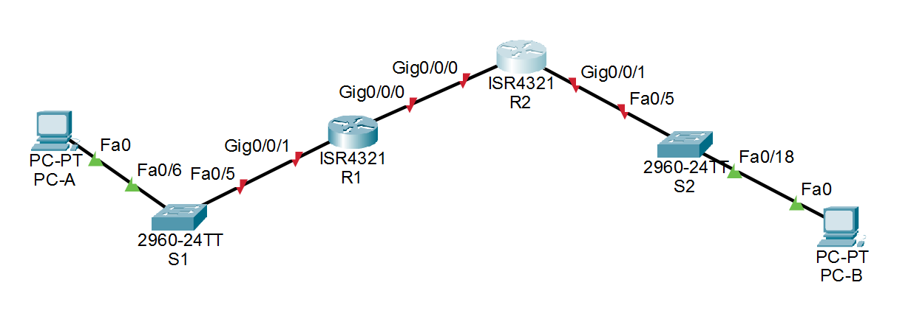

# Лабораторная работа - Реализация DHCPv4 

### Топология


### Таблица адресации

|	Устройство	|	Интерфейс	|	IP-адрес	|	Маска подсети	|	Шлюз по умолчанию	|
|---------------|---------------|---------------|-------------------|-----------------------|
|	R1	|	G0/0/0	|	10.0.0.1	|	255.255.255.252	|	—	|
|	R1	|	G0/0/1	|	—	|	—	|		|
|	R1	|	G0/0/1.100	|	192.168.1.1	|	255.255.255.192	|		|
|	R1	|	G0/0/1.200	|		|		|		|
|	R1	|	G0/0/1.1000	|	—	|	—	|		|
|	R2	|	G0/0	|	10.0.0.2	|	255.255.255.252	|	—	|
|	R2	|	G0/0/1	|	192.168.1.1	|	255.255.255.240	|		|
|	S1	|	VLAN 200	|	192.168.1.2	|	255.255.255.224	|	192.168.1.1	|
|	S2	|	VLAN 1	|		|		|		|
|	PC-A	|	NIC	|	DHCP	|	DHCP	|	DHCP	|
|	PC-B	|	NIC	|	DHCP	|	DHCP	|	DHCP	|

### Таблица VLAN

|	VLAN	|	Имя	|	Назначенный интерфейс	|
|-----------|-------|---------------------------|
|	1	|Нет	|S2: F0/18		|
|	100	|Клиенты	|S1: F0/6 		|
|	200	|Управление	|S1: VLAN 200  		|
|	999	|Parking_Lot	|S1: F0/1-4, F0/7-24, G0/1-2		|
|	1000	|Собственная	|	—		|

###  3.	Задачи
## Часть 1. Создание сети и настройка основных параметров устройства
## Часть 2. Настройка и проверка двух серверов DHCPv4 на R1
## Часть 3. Настройка и проверка DHCP-ретрансляции на R2

	Общие сведения/сценарий
Протокол динамической конфигурации сетевого узла (DHCP) — сетевой протокол, позволяющий сетевым администраторам управлять и автоматизировать назначение IP-адресов. Без использования DHCP  для IPv4 администратору необходимо вручную назначать и настраивать IP-адреса, предпочтительные DNS-серверы и шлюзы по умолчанию. По мере увеличения сети и перемещении устройств из одной внутренней сети в другую это становится административной проблемой.<br>
В предложенном сценарии размеры компании увеличились, и сетевые администраторы больше не имеют возможности назначать IP-адреса для устройств вручную. Ваша задача заключается в настройке маршрутизатора R1 для назначения IPv4-адресов в двух разных подсетях.<br>
Примечание: Маршрутизаторы, используемые в практических лабораторных работах CCNA, - это Cisco 4221 с Cisco IOS XE Release 16.9.4 (образ universalk9). В лабораторных работах используются коммутаторы Cisco Catalyst 2960 с Cisco IOS версии 15.2(2) (образ lanbasek9). Можно использовать другие маршрутизаторы, коммутаторы и версии Cisco IOS.

	Необходимые ресурсы
●	2 маршрутизатора (Cisco 4221 с универсальным образом Cisco IOS XE версии 16.9.4 или аналогичным)
●	2 коммутатора (Cisco 2960 с операционной системой Cisco IOS 15.2(2) (образ lanbasek9) или аналогичная модель)
●	2 ПК (ОС Windows с программой эмуляции терминалов, такой как Tera Term)
●	Консольные кабели для настройки устройств Cisco IOS через консольные порты.
●	Кабели Ethernet, расположенные в соответствии с топологией

### Решение

## Часть 1.	Создание сети и настройка основных параметров устройства
В первой части лабораторной работы вам предстоит создать топологию сети и настроить базовые параметры для узлов ПК и коммутаторов.

### Шаг 1.	Создание схемы адресации
Подсеть сети 192.168.1.0/24 в соответствии со следующими требованиями:
#### a.	Одна подсеть «Подсеть A», поддерживающая 58 хостов (клиентская VLAN на R1).
Подсеть A:<br>
Запишите первый IP-адрес в таблице адресации для R1 G0/0/1.100<br>
Количество узлов в подсети считается по формуле 2^n-2. Значит чтобы в этой подсети было возможно 58 хостов n должно быть равно 6 (количество бит для хостов в подсети).<br>
2^6-2=64-2=62 хоста.<br>
Значит количество бит подсети будет равно 32-6=26 бит (префикс /26).<br>
/26 просчитывая по ряду |128|64|32|16|8|4|2|1| дает нам 128+64=192<br>
Маска подсети будет равно 255.255.255.192<br>

**Первый IP** подсети 192.168.1.0 + 1 = **192.168.1.1**
Диапазон адресов будет от 192.168.1.0 (сетевой адрес) до 192.168.1.63 (широковещательный адрес broadcast). Итого 64 шт.

#### b.	Одна подсеть «Подсеть B», поддерживающая 28 хостов (управляющая VLAN на R1). 
Подсеть B:<br>
Запишите первый IP-адрес в таблице адресации для R1 G0/0/1.200. Запишите второй IP-адрес в таблице адресов для S1 VLAN 200 и введите соответствующий шлюз по умолчанию.<br>
Количество узлов в подсети считается по формуле 2^n-2. Значит чтобы в этой подсети было возможно 28 хостов n должно быть равно 5 (количество бит для хостов в подсети).<br>
2^5-2=32-2=30 хоста.<br>
Значит количество бит подсети будет равно 32-5=27 бит (префикс /27).<br>
/27 просчитывая по ряду |128|64|32|16|8|4|2|1| дает нам 128+64+32=224<br>
Маска подсети будет равно 255.255.255.224<br>

Следующую подсеть B можно начинась со следующего свободного адреса IP 192.168.1.64<br>
**Второй IP** подсети 192.168.1.64 + 2 = **192.168.1.66**<br>
**Шлюз по умолчанию**, как правило, первый хостовый адрес подсети, значит будет **192.168.1.65**<br>
Диапазон адресов будет от 192.168.1.64 (сетевой адрес) до 192.168.1.95 (широковещательный адрес broadcast). Итого 32 шт.

#### c.	Одна подсеть «Подсеть C», поддерживающая 12 узлов (клиентская сеть на R2).
Подсеть C:
Запишите первый IP-адрес в таблице адресации для R2 G0/0/1.
Количество узлов в подсети считается по формуле 2^n-2. Значит чтобы в этой подсети было возможно 12 хостов n должно быть равно 4 (количество бит для хостов в подсети).<br>
2^4-2=16-2=14 хоста.<br>
Значит количество бит подсети будет равно 32-4=28 бит (префикс /28).<br>
/28 просчитывая по ряду |128|64|32|16|8|4|2|1| дает нам 128+64+32+16=240<br>
Маска подсети будет равно 255.255.255.240<br>

Следующую подсеть B можно начинась со следующего свободного адреса IP 192.168.1.96<br>
**Первый IP** подсети 192.168.1.96 + 1 = **192.168.1.97**<br>
Диапазон адресов будет от 192.168.1.96 (сетевой адрес) до 192.168.1.111 (широковещательный адрес broadcast). Итого 16 шт.

### Шаг 2.	Создайте сеть согласно топологии.
Подключите устройства, как показано в топологии, и подсоедините необходимые кабели.


### Шаг 3.	Произведите базовую настройку маршрутизаторов.
Настройка R2 будет произведена по аналогии с R1

#### a.	Назначьте маршрутизатору имя устройства.
Откройте окно конфигурации
```
Router>en
Router#conf t
Enter configuration commands, one per line.  End with CNTL/Z.
Router(config)#hostname R1
R1(config)#
```

#### b.	Отключите поиск DNS, чтобы предотвратить попытки маршрутизатора неверно преобразовывать введенные команды таким образом, как будто они являются именами узлов.
```
R1(config)#no ip domain-lookup
```

#### c.	Назначьте class в качестве зашифрованного пароля привилегированного режима EXEC.
```
R1(config)#enable secret class
```

#### d.	Назначьте cisco в качестве пароля консоли и включите вход в систему по паролю.
```
R1(config)#line console 0
R1(config-line)#pas
R1(config-line)#password cisco
R1(config-line)#login
```

#### e.	Назначьте cisco в качестве пароля VTY и включите вход в систему по паролю.
```
R1(config)#line vty 0 4
R1(config-line)#pas
R1(config-line)#password cisco
R1(config-line)#login
```

#### f.	Зашифруйте открытые пароли.
```
R1(config-line)#
R1(config-line)#exit
R1(config)#serv
R1(config)#service pas
R1(config)#service password-encryption 
R1(config)#
```

#### g.	Создайте баннер с предупреждением о запрете несанкционированного доступа к устройству.
```
R1(config)#banner motd #
Enter TEXT message.  End with the character '#'.
Unauthorized access is stricly phohibited. #
```

#### h.	Сохраните текущую конфигурацию в файл загрузочной конфигурации.
```
R1#wr
Building configuration...
[OK]
R1#
```
#### i.	Установите часы на маршрутизаторе на сегодняшнее время и дату.
Примечание. Вопросительный знак (?) позволяет открыть справку с правильной последовательностью параметров, необходимых для выполнения этой команды.
```
R1#clock set 22:09:26 10 aug 2026
```

### Шаг 4.	Настройка маршрутизации между сетями VLAN на маршрутизаторе R1
#### a.	Активируйте интерфейс G0/0/1 на маршрутизаторе.
```
R1(config)#int g0/0/1
R1(config-if)#no sh

R1(config-if)#
%LINK-5-CHANGED: Interface GigabitEthernet0/0/1, changed state to up

%LINEPROTO-5-UPDOWN: Line protocol on Interface GigabitEthernet0/0/1, changed state to up
```

#### b.	Настройте подинтерфейсы для каждой VLAN в соответствии с требованиями таблицы IP-адресации. Все субинтерфейсы используют инкапсуляцию 802.1Q и назначаются первый полезный адрес из вычисленного пула IP-адресов. Убедитесь, что подинтерфейсу для native VLAN не назначен IP-адрес. Включите описание для каждого подинтерфейса.
```


#### c.	Убедитесь, что вспомогательные интерфейсы работают.
### Шаг 5.	Настройте G0/1 на R2, затем G0/0/0 и статическую маршрутизацию для обоих маршрутизаторов
#### a.	Настройте G0/0/1 на R2 с первым IP-адресом подсети C, рассчитанным ранее.
#### b.	Настройте интерфейс G0/0/0 для каждого маршрутизатора на основе приведенной выше таблицы IP-адресации.
#### c.	Настройте маршрут по умолчанию на каждом маршрутизаторе, указываемом на IP-адрес G0/0/0 на другом маршрутизаторе.
#### d.	Убедитесь, что статическая маршрутизация работает с помощью пинга до адреса G0/0/1 R2 от R1.
#### e.	Сохраните текущую конфигурацию в файл загрузочной конфигурации.
### Шаг 6.	Настройте базовые параметры каждого коммутатора.
#### a.	Присвойте коммутатору имя устройства.
Откройте окно конфигурации
#### b.	Отключите поиск DNS, чтобы предотвратить попытки маршрутизатора неверно преобразовывать введенные команды таким образом, как будто они являются именами узлов.
#### c.	Назначьте class в качестве зашифрованного пароля привилегированного режима EXEC.
#### d.	Назначьте cisco в качестве пароля консоли и включите вход в систему по паролю.
#### e.	Назначьте cisco в качестве пароля VTY и включите вход в систему по паролю.
#### f.	Зашифруйте открытые пароли.
#### g.	Создайте баннер с предупреждением о запрете несанкционированного доступа к устройству.
#### h.	Сохраните текущую конфигурацию в файл загрузочной конфигурации.
#### i.	Установите часы на маршрутизаторе на сегодняшнее время и дату.
Примечание. Вопросительный знак (?) позволяет открыть справку с правильной последовательностью параметров, необходимых для выполнения этой команды.
#### j.	Скопируйте текущую конфигурацию в файл загрузочной конфигурации.
### Шаг 7.	Создайте сети VLAN на коммутаторе S1.
Примечание. S2 настроен только с базовыми настройками. 
#### a.	Создайте необходимые VLAN на коммутаторе 1 и присвойте им имена из приведенной выше таблицы.
#### b.	Настройте и активируйте интерфейс управления на S1 (VLAN 200), используя второй IP-адрес из подсети, рассчитанный ранее. Кроме того установите шлюз по умолчанию на S1.
#### c.	Настройте и активируйте интерфейс управления на S2 (VLAN 1), используя второй IP-адрес из подсети, рассчитанный ранее. Кроме того, установите шлюз по умолчанию на S2
#### d.	Назначьте все неиспользуемые порты S1 VLAN Parking_Lot, настройте их для статического режима доступа и административно деактивируйте их. На S2 административно деактивируйте все неиспользуемые порты.
Примечание. Команда interface range полезна для выполнения этой задачи с минимальным количеством команд.
Закройте окно настройки.
### Шаг 8.	Назначьте сети VLAN соответствующим интерфейсам коммутатора.
#### a.	Назначьте используемые порты соответствующей VLAN (указанной в таблице VLAN выше) и настройте их для режима статического доступа.
Откройте окно конфигурации
#### b.	Убедитесь, что VLAN назначены на правильные интерфейсы.
Вопрос:
Почему интерфейс F0/5 указан в VLAN 1?
### Шаг 9.	Вручную настройте интерфейс S1 F0/5 в качестве транка 802.1Q.
#### a.	Измените режим порта коммутатора, чтобы принудительно создать магистральный канал.
#### b.	В рамках конфигурации транка  установите для native  VLAN значение 1000.
#### c.	В качестве другой части конфигурации магистрали укажите, что VLAN 100, 200 и 1000 могут проходить по транку.
#### d.	Сохраните текущую конфигурацию в файл загрузочной конфигурации.
#### e.	Проверьте состояние транка.
Вопрос:
Какой IP-адрес был бы у ПК, если бы он был подключен к сети с помощью DHCP?
Закройте окно настройки.
## Часть 2.	Настройка и проверка двух серверов DHCPv4 на R1
В части 2 необходимо настроить и проверить сервер DHCPv4 на R1. Сервер DHCPv4 будет обслуживать две подсети, подсеть A и подсеть C.
### Шаг 1.	Настройте R1 с пулами DHCPv4 для двух поддерживаемых подсетей. Ниже приведен только пул DHCP для подсети A
#### a.	Исключите первые пять используемых адресов из каждого пула адресов.
Откройте окно конфигурации
#### b.	Создайте пул DHCP (используйте уникальное имя для каждого пула).
#### c.	Укажите сеть, поддерживающую этот DHCP-сервер.
#### d.	В качестве имени домена укажите CCNA-lab.com.
#### e.	Настройте соответствующий шлюз по умолчанию для каждого пула DHCP.
#### f.	Настройте время аренды на 2 дня 12 часов и 30 минут.
#### g.	Затем настройте второй пул DHCPv4, используя имя пула R2_Client_LAN и вычислите сеть, маршрутизатор по умолчанию, и используйте то же имя домена и время аренды, что и предыдущий пул DHCP.
### Шаг 2.	Сохраните конфигурацию.
Сохраните текущую конфигурацию в файл загрузочной конфигурации.
Закройте окно настройки.
### Шаг 3.	Проверка конфигурации сервера DHCPv4
#### a.	Чтобы просмотреть сведения о пуле, выполните команду show ip dhcp pool .
#### b.	Выполните команду show ip dhcp bindings для проверки установленных назначений адресов DHCP.
#### c.	Выполните команду show ip dhcp server statistics для проверки сообщений DHCP.
### Шаг 4.	Попытка получить IP-адрес от DHCP на PC-A
#### a.	Из командной строки компьютера PC-A выполните команду ipconfig /all.
#### b.	После завершения процесса обновления выполните команду ipconfig для просмотра новой информации об IP-адресе.
#### c.	Проверьте подключение с помощью пинга IP-адреса интерфейса R0 G0/0/1.
## Часть 3.	Настройка и проверка DHCP-ретрансляции на R2
В части 3 настраивается R2 для ретрансляции DHCP-запросов из локальной сети на интерфейсе G0/0/1 на DHCP-сервер (R1). 
### Шаг 1.	Настройка R2 в качестве агента DHCP-ретрансляции для локальной сети на G0/0/1
#### a.	Настройте команду ip helper-address на G0/0/1, указав IP-адрес G0/0/0 R1.
Откройте окно конфигурации
#### b.	Сохраните конфигурацию.
### Шаг 2.	Попытка получить IP-адрес от DHCP на PC-B
#### a.	Из командной строки компьютера PC-B выполните команду ipconfig /all.
#### b.	После завершения процесса обновления выполните команду ipconfig для просмотра новой информации об IP-адресе.
#### c.	Проверьте подключение с помощью пинга IP-адреса интерфейса R1 G0/0/1.
#### d.	Выполните show ip dhcp binding для R1 для проверки назначений адресов в DHCP.
#### e.	Выполните команду show ip dhcp server statistics для проверки сообщений DHCP.

