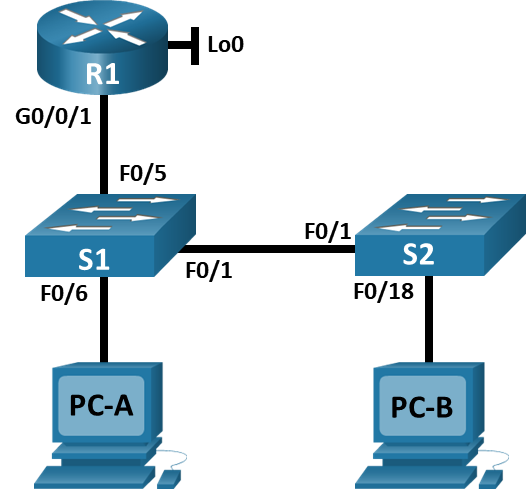
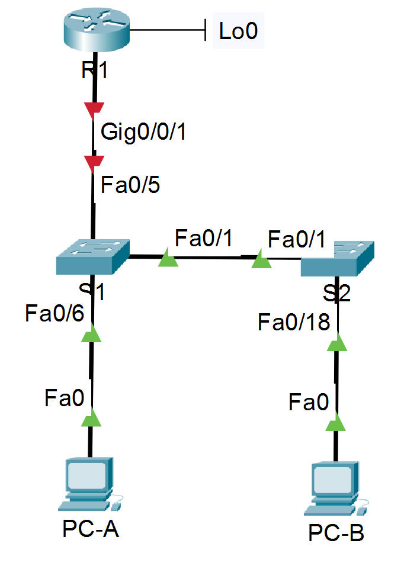

# Лабораторная работа - Конфигурация безопасности коммутатора

### Топология


### Таблица адресации
|		Устройство		|		interface/vlan		|		IP-адрес		|	Маска подсети		|
|---|---|---|---|
|	R1	|	G0/0/1	|	192.168.10.1	|	255.255.255.0	|
|	R1	|	Loopback 0	|	10.10.1.1	|	255.255.255.0	|
|	S1	|	VLAN 10	|	192.168.10.201	|	255.255.255.0	|
|	S2	|	VLAN 10	|	192.168.10.202	|	255.255.255.0	|
|	PC A  |	NIC	|	DHCP	|	255.255.255.0	|
|	PC B	|	NIC	|	DHCP	|	255.255.255.0	|

Цели
## Часть 1. Настройка основного сетевого устройства
•	Создайте сеть.
•	Настройте маршрутизатор R1.
•	Настройка и проверка основных параметров коммутатора
## Часть 2. Настройка сетей VLAN
•	Сконфигруриуйте VLAN 10.
•	Сконфигруриуйте SVI для VLAN 10.
•	Настройте VLAN 333 с именем Native на S1 и S2.
•	Настройте VLAN 999 с именем ParkingLot на S1 и S2.
## Часть 3: Настройки безопасности коммутатора.
•	Реализация магистральных соединений 802.1Q.
•	Настройка портов доступа
•	Безопасность неиспользуемых портов коммутатора
•	Документирование и реализация функций безопасности порта.
•	Реализовать безопасность DHCP snooping .
•	Реализация PortFast и BPDU Guard
•	Проверка сквозной связанности.
Общие сведения и сценарий
Это комплексная лабораторная работа, нацеленная на повторение ранее изученных функций безопасности уровня 2.
Примечание: Маршрутизаторы, используемые в практических лабораторных работах CCNA, - это Cisco 4221 с Cisco IOS XE Release 16.9.3 (образ universalk9). В лабораторных работах используются коммутаторы Cisco Catalyst 2960 с Cisco IOS версии 15.0(2) (образ lanbasek9). Можно использовать другие маршрутизаторы, коммутаторы и версии Cisco IOS. В зависимости от модели устройства и версии Cisco IOS доступные команды и результаты их выполнения могут отличаться от тех, которые показаны в лабораторных работах. Правильные идентификаторы интерфейса см. в сводной таблице по интерфейсам маршрутизаторов в конце лабораторной работы.
Примечание: Убедитесь, что все настройки коммутатора удалены и загрузочная конфигурация отсутствует. Если вы не уверены, обратитесь к инструктору.
Необходимые ресурсы
•	1 Маршрутизатор (Cisco 4221 с универсальным образом Cisco IOS XE версии 16.9.3 или аналогичным)
•	2 коммутатора (Cisco 2960 с операционной системой Cisco IOS 15.0(2) (образ lanbasek9) или аналогичная модель)
•	2 ПК (ОС Windows с программой эмуляции терминалов, такой как Tera Term)
•	Консольные кабели для настройки устройств Cisco IOS через консольные порты.
•	Кабели Ethernet, расположенные в соответствии с топологией

Инструкции

## Часть 1. Настройка основного сетевого устройства

## Шаг 1. Создайте сеть.
#### a. Создайте сеть согласно топологии.

#### b. Инициализация устройств

## Шаг 2. Настройте маршрутизатор R1.
#### a. Загрузите следующий конфигурационный скрипт на R1.
```
Router>en
Router#conf t
Enter configuration commands, one per line.  End with CNTL/Z.
Router(config)#hostname R1
R1(config)#no ip domain-lookup
R1(config)#ip dhcp excluded-address 192.168.10.1 192.168.10.9
R1(config)#ip dhcp excluded-address 192.168.10.201 192.168.10.202
R1(config)#ip dhcp relay information trust-all
R1(config)#ip dhcp pool Students
R1(dhcp-config)#network 192.168.10.0 255.255.255.0
R1(dhcp-config)#default-router 192.168.10.1
R1(dhcp-config)#domain-name CCNA2.Lab-11.6.1
R1(dhcp-config)#interface Loopback0

R1(config-if)#
%LINK-3-UPDOWN: Interface Loopback0, changed state to down

%LINEPROTO-5-UPDOWN: Line protocol on Interface Loopback0, changed state to up

R1(config-if)#ip address 10.10.1.1 255.255.255.0
R1(config-if)#interface GigabitEthernet0/0/1
R1(config-if)#description Link to S1
R1(config-if)#ip address 192.168.10.1 255.255.255.0
R1(config-if)#no shutdown

R1(config-if)#
%LINK-5-CHANGED: Interface GigabitEthernet0/0/1, changed state to up

%LINEPROTO-5-UPDOWN: Line protocol on Interface GigabitEthernet0/0/1, changed state to up

R1(config-if)#line console 0
R1(config-line)#logging synchronous
R1(config-line)#exec-timeout 0 0
```
#### b. Проверьте текущую конфигурацию на R1, используя следующую команду:
```
R1#sh ip int brief
Interface              IP-Address      OK? Method Status                Protocol 
GigabitEthernet0/0/0   unassigned      YES unset  administratively down down 
GigabitEthernet0/0/1   192.168.10.1    YES manual up                    up 
Loopback0              10.10.1.1       YES manual up                    up 
Vlan1                  unassigned      YES unset  administratively down down
```
#### c. Убедитесь, что IP-адресация и интерфейсы находятся в состоянии up / up (при необходимости устраните неполадки).

## Шаг 3. Настройка и проверка основных параметров коммутатора
На S2 настройка по аналогии
#### a. Настройте имя хоста для коммутаторов S1 и S2.
```
Switch>en
Switch#conf t
Enter configuration commands, one per line.  End with CNTL/Z.
Switch(config)#hostn S1
```
#### b. Запретите нежелательный поиск в DNS.
```
S1(config)#no ip domain-lookup
```
#### c. Настройте описания интерфейса для портов, которые используются в S1 и S2.
S1
```
S1(config)#int fa0/5
S1(config-if)#description connection to R1 g0/0/1
S1(config-if)#int fa0/1
S1(config-if)#description connection to S2 fa0/1
S1(config-if)#int fa0/6
S1(config-if)#description connection to PC-A
```
S2
```
S2(config)#int fa0/1
S2(config-if)#description connection to S1 fa0/1
S2(config-if)#int fa0/18
S2(config-if)#description connection to PC-B
```
#### d. Установите для шлюза по умолчанию для VLAN управления значение 192.168.10.1 на обоих коммутаторах.
На S2 настройка по аналогии
```
S1#conf t
Enter configuration commands, one per line.  End with CNTL/Z.
S1(config)#ip def
S1(config)#ip default-gateway 192.168.10.1
```

## Часть 2. Настройка сетей VLAN на коммутаторах.
## Шаг 1. Сконфигруриуйте VLAN 10.
Добавьте VLAN 10 на S1 и S2 и назовите VLAN - Management.
```
S1(config)#vlan 10
S1(config-vlan)#name Management
```
## Шаг 2. Сконфигруриуйте SVI для VLAN 10.
Настройте IP-адрес в соответствии с таблицей адресации для SVI для VLAN 10 на S1 и S2. Включите интерфейсы SVI и предоставьте описание для интерфейса.
S1
```
S1(config)#int vlan 10
S1(config-if)#
%LINK-5-CHANGED: Interface Vlan10, changed state to up
S1(config-if)#ip address 192.168.10.201 255.255.255.0
S1(config-if)#description it's vlan 10 on S1
S1(config-if)#no shutdown
```
S2
```
S2(config)#int vlan 10
S2(config-if)#
%LINK-5-CHANGED: Interface Vlan10, changed state to up
S2(config-if)#ip address 192.168.10.202 255.255.255.0
S2(config-if)#no shutdown
S2(config-if)#description it's vlan 10 on S2
```
## Шаг 3. Настройте VLAN 333 с именем Native на S1 и S2.
На S2 настройка по аналогии
```
S1(config)#vlan 333
S1(config-vlan)#name Native
```
## Шаг 4. Настройте VLAN 999 с именем ParkingLot на S1 и S2.
На S2 настройка по аналогии
```
S1(config-vlan)#vlan 999
S1(config-vlan)#name ParkingLot
```

## Часть 3. Настройки безопасности коммутатора.
## Шаг 1. Реализация магистральных соединений 802.1Q.
#### a. Настройте все магистральные порты Fa0/1 на обоих коммутаторах для использования VLAN 333 в качестве native VLAN.
```
S1(config)#int f0/1
S1(config-if)#switchport mode trunk
S1(config-if)#switchport trunk native vlan 333
```
#### b. Убедитесь, что режим транкинга успешно настроен на всех коммутаторах.
S1
```
S1#sh int trunk
Port        Mode         Encapsulation  Status        Native vlan
Fa0/1       on           802.1q         trunking      333

Port        Vlans allowed on trunk
Fa0/1       1-1005

Port        Vlans allowed and active in management domain
Fa0/1       1,10,333,999

Port        Vlans in spanning tree forwarding state and not pruned
Fa0/1       1,10,333,999
```
S2
```
S2#sh int trunk
Port        Mode         Encapsulation  Status        Native vlan
Fa0/1       on           802.1q         trunking      333

Port        Vlans allowed on trunk
Fa0/1       1-1005

Port        Vlans allowed and active in management domain
Fa0/1       1,10,333,999

Port        Vlans in spanning tree forwarding state and not pruned
Fa0/1       1,10,333,999
```
#### c. Отключить согласование DTP F0/1 на S1 и S2. 
На S2 настройка по аналогии
```
S1(config)#int f0/1
S1(config-if)#switchport nonegotiate
```
#### d. Проверьте с помощью команды show interfaces.
S1
```
S1#sh int f0/1 switchport | include Negotiation
Negotiation of Trunking: Off
```
S2
```
S2#sh int f0/1 switchport | include Negotiation
Negotiation of Trunking: Off
```
## Шаг 2. Настройка портов доступа
#### a. На S1 настройте F0/5 и F0/6 в качестве портов доступа и свяжите их с VLAN 10.
```
S1(config)#int range f0/5-6
S1(config-if-range)#switchport mode access 
S1(config-if-range)#switchport access vlan 10
```
#### b. На S2 настройте порт доступа Fa0/18 и свяжите его с VLAN 10.
```
S2(config)#int f0/18
S2(config-if)#switchport mode access 
S2(config-if)#switchport access vlan 10
```
## Шаг 3. Безопасность неиспользуемых портов коммутатора
#### a. На S1 и S2 переместите неиспользуемые порты из VLAN 1 в VLAN 999 и отключите неиспользуемые порты.
S1
```
S1(config)#int range f0/2-4,f0/7-24,g0/1-2
S1(config-if-range)#switchport mode access 
S1(config-if-range)#switchport access vlan 999
S1(config-if-range)#shutdown
```
S2
```
S2(config)#int range f0/2-17,f0/19-24,g0/1-2
S2(config-if-range)#switchport mode access 
S2(config-if-range)#switchport access vlan 999
S2(config-if-range)#shutdown
```
#### b. Убедитесь, что неиспользуемые порты отключены и связаны с VLAN 999, введя команду  show.
S1
```
S1#sh int status
Port      Name               Status       Vlan       Duplex  Speed Type
Fa0/1     connection to S2 f connected    trunk      a-full  a-100 10/100BaseTX
Fa0/2                        disabled 999        auto    auto  10/100BaseTX
Fa0/3                        disabled 999        auto    auto  10/100BaseTX
Fa0/4                        disabled 999        auto    auto  10/100BaseTX
Fa0/5     connection to R1 g connected    10         a-full  a-100 10/100BaseTX
Fa0/6     connection to PC-A connected    10         a-full  a-100 10/100BaseTX
Fa0/7                        disabled 999        auto    auto  10/100BaseTX
Fa0/8                        disabled 999        auto    auto  10/100BaseTX
Fa0/9                        disabled 999        auto    auto  10/100BaseTX
Fa0/10                       disabled 999        auto    auto  10/100BaseTX
Fa0/11                       disabled 999        auto    auto  10/100BaseTX
Fa0/12                       disabled 999        auto    auto  10/100BaseTX
Fa0/13                       disabled 999        auto    auto  10/100BaseTX
Fa0/14                       disabled 999        auto    auto  10/100BaseTX
Fa0/15                       disabled 999        auto    auto  10/100BaseTX
Fa0/16                       disabled 999        auto    auto  10/100BaseTX
Fa0/17                       disabled 999        auto    auto  10/100BaseTX
Fa0/18                       disabled 999        auto    auto  10/100BaseTX
Fa0/19                       disabled 999        auto    auto  10/100BaseTX
Fa0/20                       disabled 999        auto    auto  10/100BaseTX
Fa0/21                       disabled 999        auto    auto  10/100BaseTX
Fa0/22                       disabled 999        auto    auto  10/100BaseTX
Fa0/23                       disabled 999        auto    auto  10/100BaseTX
Fa0/24                       disabled 999        auto    auto  10/100BaseTX
Gig0/1                       disabled 999        auto    auto  10/100/1000BaseTX
Gig0/2                       disabled 999        auto    auto  10/100/1000BaseTX
```
S2
```
S2#sh int status
Port      Name               Status       Vlan       Duplex  Speed Type
Fa0/1     connection to S1 f connected    trunk      a-full  a-100 10/100BaseTX
Fa0/2                        disabled 999        auto    auto  10/100BaseTX
Fa0/3                        disabled 999        auto    auto  10/100BaseTX
Fa0/4                        disabled 999        auto    auto  10/100BaseTX
Fa0/5                        disabled 999        auto    auto  10/100BaseTX
Fa0/6                        disabled 999        auto    auto  10/100BaseTX
Fa0/7                        disabled 999        auto    auto  10/100BaseTX
Fa0/8                        disabled 999        auto    auto  10/100BaseTX
Fa0/9                        disabled 999        auto    auto  10/100BaseTX
Fa0/10                       disabled 999        auto    auto  10/100BaseTX
Fa0/11                       disabled 999        auto    auto  10/100BaseTX
Fa0/12                       disabled 999        auto    auto  10/100BaseTX
Fa0/13                       disabled 999        auto    auto  10/100BaseTX
Fa0/14                       disabled 999        auto    auto  10/100BaseTX
Fa0/15                       disabled 999        auto    auto  10/100BaseTX
Fa0/16                       disabled 999        auto    auto  10/100BaseTX
Fa0/17                       disabled 999        auto    auto  10/100BaseTX
Fa0/18    connection to PC-B connected    10         a-full  a-100 10/100BaseTX
Fa0/19                       disabled 999        auto    auto  10/100BaseTX
Fa0/20                       disabled 999        auto    auto  10/100BaseTX
Fa0/21                       disabled 999        auto    auto  10/100BaseTX
Fa0/22                       disabled 999        auto    auto  10/100BaseTX
Fa0/23                       disabled 999        auto    auto  10/100BaseTX
Fa0/24                       disabled 999        auto    auto  10/100BaseTX
Gig0/1                       disabled 999        auto    auto  10/100/1000BaseTX
Gig0/2                       disabled 999        auto    auto  10/100/1000BaseTX
```

## Шаг 4. Документирование и реализация функций безопасности порта.
Интерфейсы F0/6 на S1 и F0/18 на S2 настроены как порты доступа. На этом ## Шаге вы также настроите безопасность портов на этих двух портах доступа.
#### a. На S1, введите команду show port-security interface f0/6  для отображения настроек по умолчанию безопасности порта для интерфейса F0/6. Запишите свои ответы ниже.
```
S1#show port-security interface f0/6
Port Security              : Disabled
Port Status                : Secure-down
Violation Mode             : Shutdown
Aging Time                 : 0 mins
Aging Type                 : Absolute
SecureStatic Address Aging : Disabled
Maximum MAC Addresses      : 1
Total MAC Addresses        : 0
Configured MAC Addresses   : 0
Sticky MAC Addresses       : 0
Last Source Address:Vlan   : 0000.0000.0000:0
Security Violation Count   : 0
```
Конфигурация безопасности порта по умолчанию
|  Функция  |  Настройка по умолчанию  |
|---|---|
|	Защита портов	|	Disabled |
|	Максимальное количество записей MAC-адресов	|	1	|
|	Режим проверки на нарушение безопасности	|	Violation Mode - Shutdown	|
|	Aging Time	|	0	|
|	Aging Type  |	Absolute	|
|	Secure Static Address Aging	|	Disabled	|
|	Sticky MAC Address	|	0	|
#### b. На S1 включите защиту порта на F0 / 6 со следующими настройками:
o	Максимальное количество записей MAC-адресов: 3<br>
o	Режим безопасности: restrict<br>
o	Aging time: 60 мин.<br>
o	Aging type: неактивный<br>
```
S1(config)#int f0/6
S1(config-if)#switchport port-security
S1(config-if)#switchport port-security maximum 3
S1(config-if)#switchport port-security violation restrict 
S1(config-if)#switchport port-security aging time ?
  <1-1440>  Aging time in minutes. Enter a value between 1 and 1440
S1(config-if)#switchport port-security aging time 60
S1(config-if)#switchport port-security aging ty
S1(config-if)#switchport port-security aging ?
  time  Port-security aging time
```
Судя по отсутствию вариант на выбор задать aging type в CPT версии 9.0.0.0810 не получится.
#### c. Verify port security on S1 F0/6.
Чтобы фокус сработал надо на PC-A включить на IPv4 DHCP (в методичке не сказано об этом). Иначе Total MAC Addresses будет 0 и Last Source Address:Vlan пустой (0000.0000.0000:0). Собственно они так и были, пока не включил DHCP.
```
S1#sh port-security int f0/6
Port Security              : Enabled
Port Status                : Secure-up
Violation Mode             : Restrict
Aging Time                 : 60 mins
Aging Type                 : Absolute
SecureStatic Address Aging : Disabled
Maximum MAC Addresses      : 3
Total MAC Addresses        : 1
Configured MAC Addresses   : 0
Sticky MAC Addresses       : 0
Last Source Address:Vlan   : 00D0.BA74.E361:10
Security Violation Count   : 0
```
```
S1#sh port-security address
               Secure Mac Address Table
-----------------------------------------------------------------------------
Vlan    Mac Address       Type                          Ports   Remaining Age
                                                                   (mins)
----    -----------       ----                          -----   -------------
10	00D0.BA74.E361	DynamicConfigured	FastEthernet0/6		-
-----------------------------------------------------------------------------
Total Addresses in System (excluding one mac per port)     : 0
Max Addresses limit in System (excluding one mac per port) : 1024
```
#### d. Включите безопасность порта для F0 / 18 на S2. Настройте каждый активный порт доступа таким образом, чтобы он автоматически добавлял адреса МАС, изученные на этом порту, в текущую конфигурацию.
```
S2(config)#int f0/18
S2(config-if)#switchport port-security 
S2(config-if)#switchport port-security mac-address sticky 
```
#### e.	Настройте следующие параметры безопасности порта на S2 F / 18:
o	Максимальное количество записей MAC-адресов: 2<br>
o	Тип безопасности: Protect<br>
o	Aging time: 60 мин.<br>
```
S2(config-if)#switchport port-security maximum 2
S2(config-if)#switchport port-security violation protect 
S2(config-if)#switchport port-security aging time 60
```
#### f.	Проверка функции безопасности портов на S2 F0/18.
Чтобы фокус сработал надо на PC-B включить на IPv4 DHCP (в методичке не сказано об этом). Иначе Total MAC Addresses будет 0 и Last Source Address:Vlan пустой (0000.0000.0000:0)
```
S2#sh port-security int f0/18
Port Security              : Enabled
Port Status                : Secure-up
Violation Mode             : Protect
Aging Time                 : 60 mins
Aging Type                 : Absolute
SecureStatic Address Aging : Disabled
Maximum MAC Addresses      : 2
Total MAC Addresses        : 1
Configured MAC Addresses   : 0
Sticky MAC Addresses       : 1
Last Source Address:Vlan   : 0002.4ACB.E20C:10
Security Violation Count   : 0
```
```
S2#sh port-security address
               Secure Mac Address Table
-----------------------------------------------------------------------------
Vlan    Mac Address       Type                          Ports   Remaining Age
                                                                   (mins)
----    -----------       ----                          -----   -------------
  10    0002.4ACB.E20C    SecureSticky                  Fa0/18       -
-----------------------------------------------------------------------------
Total Addresses in System (excluding one mac per port)     : 0
Max Addresses limit in System (excluding one mac per port) : 1024
```

## Шаг 5. Реализовать безопасность DHCP snooping.
#### a. На S2 включите DHCP snooping и настройте DHCP snooping во VLAN 10.

#### b. Настройте магистральные порты на S2 как доверенные порты.
#### c. Ограничьте ненадежный порт Fa0/18 на S2 пятью DHCP-пакетами в секунду.
#### d. Проверка DHCP Snooping на S2.
S2# show ip dhcp snooping
Switch DHCP snooping is enabled
DHCP snooping is configured on following VLANs:
10
DHCP snooping is operational on following VLANs:
10
DHCP snooping is configured on the following L3 Interfaces:
Insertion of option 82 is enabled
   circuit-id default format: vlan-mod-port
   remote-id: 0cd9.96d2.3f80 (MAC)
Option 82 on untrusted port is not allowed
Verification of hwaddr field is enabled
Verification of giaddr field is enabled
DHCP snooping trust/rate is configured on the following Interfaces:

Interface Trusted Allow option Rate limit (pps)
----------------------- ------- ------------ ----------------
FastEthernet0/1 yes yes unlimited
  Custom circuit-ids:
FastEthernet0/18 no no 5
  Custom circuit-ids:
#### e.	В командной строке на PC-B освободите, а затем обновите IP-адрес.
C:\Users\Student> ipconfig /release
C:\Users\Student> ipconfig /renew
#### f.	Проверьте привязку отслеживания DHCP с помощью команды show ip dhcp snooping binding.
S2# show ip dhcp snooping binding 
MacIp адресAddress Lease(sec) Type VLAN Interface
------------------ --------------- ---------- ------------- ---- --------------------
00:50:56:90:D0:8E 192.168.10.11 86213 dhcp-snooping 10 FastEthernet0/18
Total number of bindings: 1

## Шаг 6. Реализация PortFast и BPDU Guard
#### a. Настройте PortFast на всех портах доступа, которые используются на обоих коммутаторах.
#### b. Включите защиту BPDU на портах доступа VLAN 10 S1 и S2, подключенных к PC-A и PC-B.
#### c. Убедитесь, что защита BPDU и PortFast включены на соответствующих портах.
S1# show spanning-tree interface f0/6 detail
 Port 8 (FastEthernet0/6) of VLAN0010 is designated forwarding
   Port path cost 19, Port priority 128, Port Identifier 128.6.
   <output omitted for brevity>
   Number of transitions to forwarding state: 1
   The port is in the portfast mode
   Link type is point-to-point by default
   Bpdu guard is enabled
   BPDU: sent 128, received 0

## Шаг 7. Проверьте наличие сквозного подключения.
Проверьте PING свзяь между всеми устройствами в таблице IP-адресации. В случае сбоя проверки связи может потребоваться отключить брандмауэр на хостах.
Закройте окно настройки.
Вопросы для повторения
1.	С точки зрения безопасности порта на S2, почему нет значения таймера для оставшегося возраста в минутах, когда было сконфигурировано динамическое обучение - sticky?
2.	Что касается безопасности порта на S2, если вы загружаете скрипт текущей конфигурации на S2, почему порту 18 на PC-B никогда не получит IP-адрес через DHCP?
3.	Что касается безопасности порта, в чем разница между типом абсолютного устаревания и типом устаревание по неактивности?
