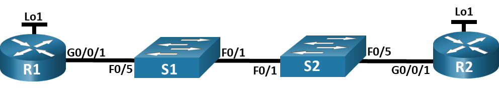
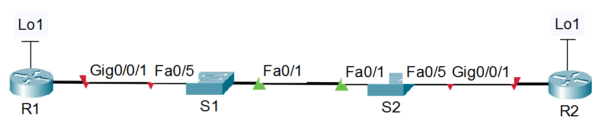

# Лабораторная работа. Настройка протокола OSPFv2 для одной области

### Топология


### Таблица адресации

|	Устройство	|	Интерфейс	|	IP-адрес	|	Маска подсети |
|  ---  |  ---  |  ---  |  ---  |
|	R1	|	G0/0/1	|	10.53.0.1	|	255.255.255.0	|
|	R1	|	Loopback1	|	172.16.1.1	|	255.255.255.0	|
|	R2	|	G0/0/1	|	10.53.0.2	|	255.255.255.0	|
|	R2	|	Loopback1	|	192.168.1.1	|	255.255.255.0	|

Цели
## Часть 1. Создание сети и настройка основных параметров устройства
## Часть 2. Настройка и проверка базовой работы протокола  OSPFv2 для одной области
## Часть 3. Оптимизация и проверка конфигурации OSPFv2 для одной области
Общие сведения и сценарий
Вам было поручено настроить сеть небольшой компании с помощью OSPFv2. R1 будет размещать интернет-соединение (имитируемое интерфейсом Loopback 1) и делиться информацией о маршруте по умолчанию до  R2. После первоначальной настройки организация попросила оптимизировать конфигурацию, чтобы уменьшить трафик протокола и гарантировать, что R1 продолжает контролировать маршрутизацию.
Примечание. Статическая маршрутизация, используемая в данной лаборатории, заключается в оценке возможности настройки и настройки OSPFv2 в конфигурации для одной области. Этот подход, используемый в данной лаборатории, может не отражать рекомендации по работе с сетевыми сетями. 
Примечание: Маршрутизаторы, используемые в практических лабораторных работах CCNA, - это Cisco 4221 с Cisco IOS XE Release 16.9.4 (образ universalk9). В лабораторных работах используются коммутаторы Cisco Catalyst 2960 с Cisco IOS версии 15.2(2) (образ lanbasek9). Можно использовать другие маршрутизаторы, коммутаторы и версии Cisco IOS. В зависимости от модели устройства и версии Cisco IOS доступные команды и результаты их выполнения могут отличаться от тех, которые показаны в лабораторных работах. Правильные идентификаторы интерфейса см. в сводной таблице по интерфейсам маршрутизаторов в конце лабораторной работы.
Примечание. Убедитесь, что у всех маршрутизаторов и коммутаторов была удалена начальная конфигурация. Если вы не уверены в этом, обратитесь к инструктору.
Необходимые ресурсы
•	2 маршрутизатора (Cisco 4221 с универсальным образом Cisco IOS XE версии 16.9.4 или аналогичным)
•	2 коммутатора (Cisco 2960 с операционной системой Cisco IOS 15.2(2) (образ lanbasek9) или аналогичная модель)
•	1 ПК (под управлением Windows с программой эмуляции терминала, например, Tera Term)
•	Консольные кабели для настройки устройств Cisco IOS через консольные порты.
•	Кабели Ethernet, расположенные в соответствии с топологией

Инструкции

## Часть 1. Создание сети и настройка основных параметров устройства
### Шаг 1. Создайте сеть согласно топологии.


### Шаг 2. Произведите базовую настройку маршрутизаторов.
Откройте окно конфигурации
#### a.	Назначьте маршрутизатору имя устройства.
Настройка R2 по аналогии
```
Router>en
Router#conf t
Enter configuration commands, one per line.  End with CNTL/Z.
Router(config)#hostn R1
```
#### b.	Отключите поиск DNS, чтобы предотвратить попытки маршрутизатора неверно преобразовывать введенные команды таким образом, как будто они являются именами узлов.
Настройка R2 по аналогии
```
R1(config)#no ip domain-lookup
```
#### c.	Назначьте class в качестве зашифрованного пароля привилегированного режима EXEC.
Настройка R2 по аналогии
```

```
#### d.	Назначьте cisco в качестве пароля консоли и включите вход в систему по паролю.
Настройка R2 по аналогии
```

```
#### e.	Назначьте cisco в качестве пароля VTY и включите вход в систему по паролю.
Настройка R2 по аналогии
```

```
#### f.	Зашифруйте открытые пароли.
Настройка R2 по аналогии
```

```
#### g.	Создайте баннер с предупреждением о запрете несанкционированного доступа к устройству.
Настройка R2 по аналогии
```

```
#### h.	Сохраните текущую конфигурацию в файл загрузочной конфигурации.

### Шаг 3. Настройте базовые параметры каждого коммутатора.
#### a.	Назначьте коммутатору имя устройства.
Настройка S2 по аналогии
```
Switch#en
Switch#conf t
Enter configuration commands, one per line.  End with CNTL/Z.
Switch(config)#hostn S1
```
#### b.	Отключите поиск DNS, чтобы предотвратить попытки маршрутизатора неверно преобразовывать введенные команды таким образом, как будто они являются именами узлов.
Настройка S2 по аналогии
```
S1(config)#no ip domain-lookup
```
#### c.	Назначьте class в качестве зашифрованного пароля привилегированного режима EXEC.
Настройка S2 по аналогии
```

```
#### d.	Назначьте cisco в качестве пароля консоли и включите вход в систему по паролю.
Настройка S2 по аналогии
```

```
#### e.	Назначьте cisco в качестве пароля VTY и включите вход в систему по паролю.Настройка S2 по аналогии
```

```
#### f.	Зашифруйте открытые пароли.
Настройка S2 по аналогии
```

```
#### g.	Создайте баннер с предупреждением о запрете несанкционированного доступа к устройству.
Настройка S2 по аналогии
```

```
#### h.	Сохраните текущую конфигурацию в файл загрузочной конфигурации.

## Часть 2. Настройка и проверка базовой работы протокола OSPFv2 для одной области
### Шаг 1. Настройте адреса интерфейса и базового OSPFv2 на каждом маршрутизаторе.
#### a.	Настройте адреса интерфейсов на каждом маршрутизаторе, как показано в таблице адресации выше.
R1
```
R1(config)#int g0/0/1
R1(config-if)#ip address 10.53.0.1 255.255.255.0
R1(config)#int loopback 1
%LINK-3-UPDOWN: Interface Loopback1, changed state to down

%LINEPROTO-5-UPDOWN: Line protocol on Interface Loopback1, changed state to up

R1(config-if)#ip address 172.16.1.1 255.255.255.0
```
R2
```
R2(config)#int g0/0/1
R2(config-if)#ip address 10.53.0.2 255.255.255.0
R2(config)#int loopback 1
%LINK-3-UPDOWN: Interface Loopback1, changed state to down

%LINEPROTO-5-UPDOWN: Line protocol on Interface Loopback1, changed state to up

R2(config-if)#ip address 192.168.1.1 255.255.255.0
```
#### b.	Перейдите в режим конфигурации маршрутизатора OSPF, используя идентификатор процесса 56.
Настройка R2 по аналогии
```
R1#conf t
Enter configuration commands, one per line.  End with CNTL/Z.
R1(config)#router ospf 56
OSPF process 56 cannot start. There must be at least one "up" IP interface
R1(config-router)#exit
R1(config)#int g0/0/1
R1(config-if)#no shutdown
```
#### c.	Настройте статический идентификатор маршрутизатора для каждого маршрутизатора (1.1.1.1 для R1, 2.2.2.2 для R2).
R1
```
R1(config-router)#router-id 1.1.1.1
```
R2
```
R2(config-router)#router-id 2.2.2.2
```
#### d.	Настройте инструкцию сети для сети между R1 и R2, поместив ее в область 0.
Настройка R2 по аналогии
```
R1(config-router)#network 10.53.0.0 0.0.0.255 area 0
```
#### e.	Только на R2 добавьте конфигурацию, необходимую для объявления сети Loopback 1 в область OSPF 0.
```
R2(config-router)#network 192.168.1.0 0.0.0.255 area 0
```
#### f.	Убедитесь, что OSPFv2 работает между маршрутизаторами. Выполните команду, чтобы убедиться, что R1 и R2 сформировали смежность.
R1
```
R1#sh ip ospf neighbor 


Neighbor ID     Pri   State           Dead Time   Address         Interface
2.2.2.2           1   FULL/DR         00:00:34    10.53.0.2       GigabitEthernet0/0/1
```
R2
```
R2#sh ip ospf neighbor 


Neighbor ID     Pri   State           Dead Time   Address         Interface
1.1.1.1           1   FULL/BDR        00:00:39    10.53.0.1       GigabitEthernet0/0/1
```
Вопрос:
Какой маршрутизатор является DR? Какой маршрутизатор является BDR? Каковы критерии отбора?
**DR выбран R2. BDR стал R1. DR становится тот, у кого больше идентификатор или больше приоритет. Идентификатор 2.2.2.2 больше 1.1.1.1, а приоритеты R1 и R2 равны, т.к. мы их вручную не задавали.**
#### g.	На R1 выполните команду show ip route ospf, чтобы убедиться, что сеть R2 Loopback1 присутствует в таблице маршрутизации. Обратите внимание, что поведение OSPF по умолчанию заключается в объявлении интерфейса обратной связи в качестве маршрута узла с использованием 32-битной маски.
```
R1#show ip route ospf
     192.168.1.0/32 is subnetted, 1 subnets
O       192.168.1.1 [110/2] via 10.53.0.2, 00:01:56, GigabitEthernet0/0/1
```
#### h.	Запустите Ping до  адреса интерфейса R2 Loopback 1 из R1. Выполнение команды ping должно быть успешным.
```
R1#ping 192.168.1.1

Type escape sequence to abort.
Sending 5, 100-byte ICMP Echos to 192.168.1.1, timeout is 2 seconds:
!!!!!
Success rate is 100 percent (5/5), round-trip min/avg/max = 0/0/0 ms
```

## Часть 3. Оптимизация и проверка конфигурации OSPFv2 для одной области
### Шаг 1. Реализация различных оптимизаций на каждом маршрутизаторе.
#### a.	На R1 настройте приоритет OSPF интерфейса G0/0/1 на 50, чтобы убедиться, что R1 является назначенным маршрутизатором.
```
R1(config)#int g0/0/1
R1(config-if)#ip ospf pr
R1(config-if)#ip ospf priority 50
R1#clear ip ospf process 
Reset ALL OSPF processes? [no]: y

R1#
00:48:16: %OSPF-5-ADJCHG: Process 56, Nbr 2.2.2.2 on GigabitEthernet0/0/1 from FULL to DOWN, Neighbor Down: Adjacency forced to reset

00:48:16: %OSPF-5-ADJCHG: Process 56, Nbr 2.2.2.2 on GigabitEthernet0/0/1 from FULL to DOWN, Neighbor Down: Interface down or detached

00:48:18: %OSPF-5-ADJCHG: Process 56, Nbr 2.2.2.2 on GigabitEthernet0/0/1 from LOADING to FULL, Loading Done

R1#sh ip ospf int
R1#sh ip ospf interface g0/0/1

GigabitEthernet0/0/1 is up, line protocol is up
  Internet address is 10.53.0.1/24, Area 0
  Process ID 56, Router ID 1.1.1.1, Network Type BROADCAST, Cost: 1
  Transmit Delay is 1 sec, State DR, Priority 50
  Designated Router (ID) 1.1.1.1, Interface address 10.53.0.1
  Backup Designated Router (ID) 2.2.2.2, Interface address 10.53.0.2
  Timer intervals configured, Hello 10, Dead 40, Wait 40, Retransmit 5
    Hello due in 00:00:02
  Index 1/1, flood queue length 0
  Next 0x0(0)/0x0(0)
  Last flood scan length is 1, maximum is 1
  Last flood scan time is 0 msec, maximum is 0 msec
  Neighbor Count is 1, Adjacent neighbor count is 1
    Adjacent with neighbor 2.2.2.2  (Backup Designated Router)
  Suppress hello for 0 neighbor(s)
```
#### b.	Настройте таймеры OSPF на G0/0/1 каждого маршрутизатора для таймера приветствия, составляющего 30 секунд.
Настройка R2 по аналогии
```
R1(config)#int g0/0/1
R1(config-if)#ip ospf hello-interval 30
```
#### c.	На R1 настройте статический маршрут по умолчанию, который использует интерфейс Loopback 1 в качестве интерфейса выхода. Затем распространите маршрут по умолчанию в OSPF. Обратите внимание на сообщение консоли после установки маршрута по умолчанию.
```
R1(config)#ip route 0.0.0.0 0.0.0.0 lo
R1(config)#ip route 0.0.0.0 0.0.0.0 loopback 1
%Default route without gateway, if not a point-to-point interface, may impact performance
R1(config)#router ospf 56
R1(config-router)#default-information originate 
```
#### d.	добавьте конфигурацию, необходимую для OSPF для обработки R2 Loopback 1 как сети точка-точка. Это приводит к тому, что OSPF объявляет Loopback 1 использует маску подсети интерфейса.
```
R2(config)#int loopback 1
R2(config-if)#ip ospf network point-to-point 
```
#### e.	Только на R2 добавьте конфигурацию, необходимую для предотвращения отправки объявлений OSPF в сеть Loopback 1.
```
R2(config)#router ospf 56
R2(config-router)#passive-interface loopback 1
```
#### f.	Измените базовую пропускную способность для маршрутизаторов. После этой настройки перезапустите OSPF с помощью команды clear ip ospf process . Обратите внимание на сообщение консоли после установки новой опорной полосы пропускания.
R1<br>
Настройка R2 по аналогии<br>
Сообщение оповещения после ввода команды напоминает установить reference bandwidth для всехз роутеров.
```
R1(config)#router ospf 56
R1(config-router)#auto-cost reference-bandwidth 1000
% OSPF: Reference bandwidth is changed.
        Please ensure reference bandwidth is consistent across all routers.
```

### Шаг 2. Убедитесь, что оптимизация OSPFv2 реализовалась.
#### a.	Выполните команду show ip ospf interface g0/0/1 на R1 и убедитесь, что приоритет интерфейса установлен равным 50, а временные интервалы — Hello 30, Dead 120, а тип сети по умолчанию — Broadcast
Приоритет - Priority 50, интервал приветствия - Hello 30, тип сети - Network Type BROADCAST, а вот интервал простоя (dead) не менялся - в методичке не было указания менять его.
```
R1#show ip ospf interface g0/0/1

GigabitEthernet0/0/1 is up, line protocol is up
  Internet address is 10.53.0.1/24, Area 0
  Process ID 56, Router ID 1.1.1.1, Network Type BROADCAST, Cost: 10
  Transmit Delay is 1 sec, State DR, Priority 50
  Designated Router (ID) 1.1.1.1, Interface address 10.53.0.1
  Backup Designated Router (ID) 2.2.2.2, Interface address 10.53.0.2
  Timer intervals configured, Hello 30, Dead 40, Wait 40, Retransmit 5
    Hello due in 00:00:04
  Index 1/1, flood queue length 0
  Next 0x0(0)/0x0(0)
  Last flood scan length is 1, maximum is 1
  Last flood scan time is 0 msec, maximum is 0 msec
  Neighbor Count is 1, Adjacent neighbor count is 1
    Adjacent with neighbor 2.2.2.2  (Backup Designated Router)
  Suppress hello for 0 neighbor(s)
```
#### b.	На R1 выполните команду show ip route ospf, чтобы убедиться, что сеть R2 Loopback1 присутствует в таблице маршрутизации. Обратите внимание на разницу в метрике между этим выходным и предыдущим выходным. Также обратите внимание, что маска теперь составляет 24 бита, в отличие от 32 битов, ранее объявленных.
```
R1#show ip route ospf 
O    192.168.1.0 [110/10] via 10.53.0.2, 00:07:11, GigabitEthernet0/0/1
```
#### c.	Введите команду show ip route ospf на маршрутизаторе R2. Единственная информация о маршруте OSPF должна быть распространяемый по умолчанию маршрут R1.
```
R2#show ip route ospf
O*E2 0.0.0.0/0 [110/1] via 10.53.0.1, 00:01:46, GigabitEthernet0/0/1
```
#### d.	Запустите Ping до адреса интерфейса R1 Loopback 1 из R2. Выполнение команды ping должно быть успешным.
Вопрос:
Почему стоимость OSPF для маршрута по умолчанию отличается от стоимости OSPF в R1 для сети 192.168.1.0/24?
Закройте окно настройки.
Сводная таблица по интерфейсам маршрутизаторов
Модель маршрутизатора	Интерфейс Ethernet № 1	Интерфейс Ethernet № 2	Последовательный интерфейс № 1	Последовательный интерфейс № 2
1 800	Fast Ethernet 0/0 (F0/0)	Fast Ethernet 0/1 (F0/1)	Serial 0/0/0 (S0/0/0)	Serial 0/0/1 (S0/0/1)
1900	Gigabit Ethernet 0/0 (G0/0)	Gigabit Ethernet 0/1 (G0/1)	Serial 0/0/0 (S0/0/0)	Serial 0/0/1 (S0/0/1)
2801	Fast Ethernet 0/0 (F0/0)	Fast Ethernet 0/1 (F0/1)	Serial 0/1/0 (S0/1/0)	Serial 0/1/1 (S0/1/1)
2811	Fast Ethernet 0/0 (F0/0)	Fast Ethernet 0/1 (F0/1)	Serial 0/0/0 (S0/0/0)	Serial 0/0/1 (S0/0/1)
2900	Gigabit Ethernet 0/0 (G0/0)	Gigabit Ethernet 0/1 (G0/1)	Serial 0/0/0 (S0/0/0)	Serial 0/0/1 (S0/0/1)
4221	Gigabit Ethernet 0/0/0 (G0/0/0)	Gigabit Ethernet 0/0/1 (G0/0/1)	Serial 0/1/0 (S0/1/0)	Serial 0/1/1 (S0/1/1)
4300 	Gigabit Ethernet 0/0/0 (G0/0/0)	Gigabit Ethernet 0/0/1 (G0/0/1)	Serial 0/1/0 (S0/1/0)	Serial 0/1/1 (S0/1/1)
Примечание. Чтобы определить конфигурацию маршрутизатора, можно посмотреть на интерфейсы и установить тип маршрутизатора и количество его интерфейсов. Перечислить все комбинации конфигураций для каждого класса маршрутизаторов невозможно. Эта таблица содержит идентификаторы для возможных комбинаций интерфейсов Ethernet и последовательных интерфейсов на устройстве. Другие типы интерфейсов в таблице не представлены, хотя они могут присутствовать в данном конкретном маршрутизаторе. В качестве примера можно привести интерфейс ISDN BRI. Строка в скобках — это официальное сокращение, которое можно использовать в командах Cisco IOS для обозначения интерфейса.
Конец документа
