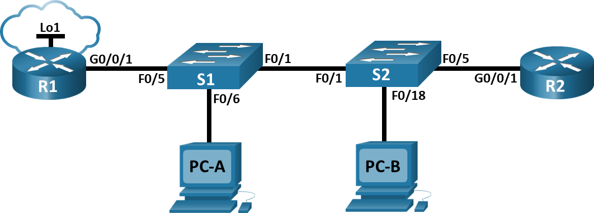
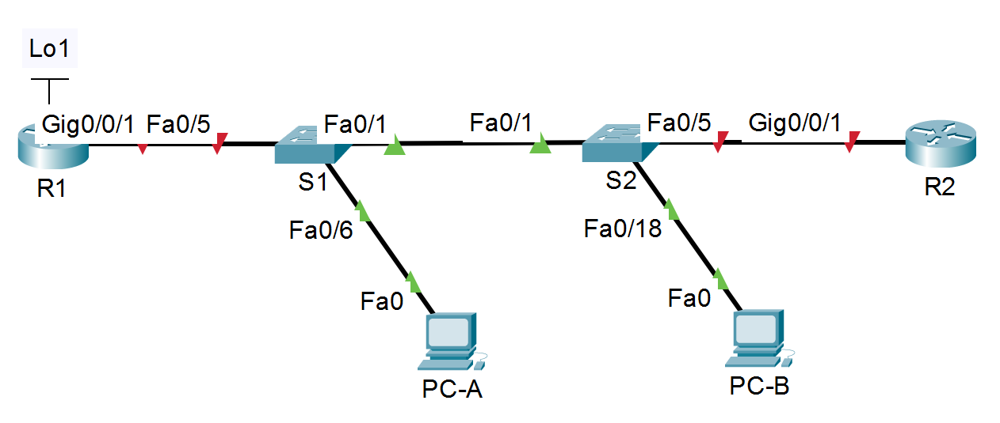

# Лабораторная работа. Настройка и проверка расширенных списков контроля доступа

### Топология


### Таблица адресации

|	Устройство	|	Интерфейс	|	IP-адрес  |	Маска подсети |	Шлюз по умолчанию	|
|	---	|	---	|	---		|	---	|	---	|
|	R1	|	G0/0/1  |	—	|	—	|	—	|
|	R1	|	G0/0/1.20	|	10.20.0.1	|	255.255.255.0	|	—	|
|	R1	|	G0/0/1.30	|	10.30.0.1	|	255.255.255.0	|	—	|
|	R1	|	G0/0/1.40	|	10.40.0.1	|	255.255.255.0	|	—	|
|	R1	|	G0/0/1.1000	|	—	|	—	|	—	|
|	R1	|	Loopback1	|	172.16.1.1	|	255.255.255.0	|	—	|
|	R2	|	G0/0/1	|	10.20.0.4	|	255.255.255.0	|	—	|
|	S1	|	VLAN 20	|	10.20.0.2	|	255.255.255.0	|	10.20.0.1	|
|	S2	|	VLAN 20	|	10.20.0.3	|	255.255.255.0	|	10.20.0.1	|
|	PC-A	|	NIC	|	10.30.0.10	|	255.255.255.0	|	10.30.0.1	|
|	PC-B	|	NIC	|	10.40.0.10	|	255.255.255.0	|	10.40.0.1	|

### Таблица VLAN

|	VLAN	|	Имя	|	Назначенный интерфейс	|
|	---	|	---	|	---	|
|	20	|	Management	|	S2: F0/5	|
|	30	|	Operations	|	S1: F0/6	|
|	40	|	Sales	|	S2: F0/18	|
|	999	|	ParkingLot	|	S1: F0/2-4, F0/7-24, G0/1-2	|
|	1000	|	Собственная	|	S2: F0/2-4, F0/6-17, F0/19-24, G0/1-2	|

### Задачи
## Часть 1. Создание сети и настройка основных параметров устройства
## Часть 2. Настройка и проверка списков расширенного контроля доступа
	Общие сведения и сценарий
Вам было поручено настроить списки контроля доступа в сети небольшой компании. ACL являются одним из самых простых и прямых средств управления трафиком уровня 3. R1 будет размещать интернет-соединение (смоделированное интерфейсом Loopback 1) и предоставлять информацию о маршруте по умолчанию для R2. После завершения первоначальной настройки компания имеет некоторые конкретные требования к безопасности дорожного движения, которые вы несете ответственность за реализацию.
Примечание: Маршрутизаторы, используемые в практических лабораторных работах CCNA, - это Cisco 4221 с Cisco IOS XE Release 16.9.4 (образ universalk9). В лабораторных работах используются коммутаторы Cisco Catalyst 2960 с Cisco IOS версии 15.2(2) (образ lanbasek9). Можно использовать другие маршрутизаторы, коммутаторы и версии Cisco IOS. В зависимости от модели устройства и версии Cisco IOS доступные команды и результаты их выполнения могут отличаться от тех, которые показаны в лабораторных работах. Правильные идентификаторы интерфейса см. в сводной таблице по интерфейсам маршрутизаторов в конце лабораторной работы.
Примечание. Убедитесь, что у всех маршрутизаторов и коммутаторов была удалена начальная конфигурация. Если вы не уверены в этом, обратитесь к инструктору.
 
	Необходимые ресурсы
•	2 маршрутизатора (Cisco 4221 с универсальным образом Cisco IOS XE версии 16.9.4 или аналогичным)
•	2 коммутатора (Cisco 2960 с операционной системой Cisco IOS 15.2(2) (образ lanbasek9) или аналогичная модель)
•	2 ПК (ОС Windows с программой эмуляции терминалов, такой как Tera Term)
•	Консольные кабели для настройки устройств Cisco IOS через консольные порты.
•	Кабели Ethernet, расположенные в соответствии с топологией

Инструкции
## Часть 1. Создание сети и настройка основных параметров устройства
### Шаг 1. Создайте сеть согласно топологии.


### Шаг 2. Произведите базовую настройку маршрутизаторов.
Выполнено
#### a.	Назначьте маршрутизатору имя устройства.
#### b.	Отключите поиск DNS, чтобы предотвратить попытки маршрутизатора неверно преобразовывать введенные команды таким образом, как будто они являются именами узлов.
#### c.	Назначьте class в качестве зашифрованного пароля привилегированного режима EXEC.
#### d.	Назначьте cisco в качестве пароля консоли и включите вход в систему по паролю.
#### e.	Назначьте cisco в качестве пароля VTY и включите вход в систему по паролю.
#### f.	Зашифруйте открытые пароли.
#### g.	Создайте баннер с предупреждением о запрете несанкционированного доступа к устройству.
#### h.	Сохраните текущую конфигурацию в файл загрузочной конфигурации.


### Шаг 3. Настройте базовые параметры каждого коммутатора.
Выполнено
#### a.	Присвойте коммутатору имя устройства.
#### b.	Отключите поиск DNS, чтобы предотвратить попытки маршрутизатора неверно преобразовывать введенные команды таким образом, как будто они являются именами узлов.
#### c.	Назначьте class в качестве зашифрованного пароля привилегированного режима EXEC.
#### d.	Назначьте cisco в качестве пароля консоли и включите вход в систему по паролю.
#### e.	Назначьте cisco в качестве пароля VTY и включите вход в систему по паролю.
#### f.	Зашифруйте открытые пароли.
#### g.	Создайте баннер с предупреждением о запрете несанкционированного доступа к устройству.
#### h.	Сохраните текущую конфигурацию в файл загрузочной конфигурации.


## Часть 2. Настройка сетей VLAN на коммутаторах.
### Шаг 1. Создайте сети VLAN на коммутаторах.
#### a.	Создайте необходимые VLAN и назовите их на каждом коммутаторе из приведенной выше таблицы.
Настройка S2 по аналогии
```
S1(config)#vlan 20
S1(config-vlan)#name Management
S1(config-vlan)#vlan 30
S1(config-vlan)#name Operations
S1(config-vlan)#vlan 40
S1(config-vlan)#name Sales
S1(config-vlan)#vlan 999
S1(config-vlan)#name ParkingLot
S1(config-vlan)#vlan 1000
S1(config-vlan)#name Other
S1(config-vlan)#
```
#### b.	Настройте интерфейс управления и шлюз по умолчанию на каждом коммутаторе, используя информацию об IP-адресе в таблице адресации.
S1
```
S1(config)#int vlan 20
S1(config-if)#
%LINK-5-CHANGED: Interface Vlan20, changed state to up
S1(config-if)#ip address 10.20.0.2 255.255.255.0
S1(config-if)#ex
S1(config)#ip default-gateway 10.20.0.1
```
S2
```
S2(config)#int vlan 20
S2(config-if)#
%LINK-5-CHANGED: Interface Vlan20, changed state to up
S2(config-if)#ip address 10.20.0.3 255.255.255.0
S2(config-if)#ex
S2(config)#ip default-gateway 10.20.0.1
```
#### c.	Назначьте все неиспользуемые порты коммутатора VLAN Parking Lot, настройте их для статического режима доступа и административно деактивируйте их.
S1
```
S1(config)#int range f0/2-4,f0/7-24,g0/1-2
S1(config-if-range)#switchport mode access 
S1(config-if-range)#switchport access vlan 999
S1(config-if-range)#shutdown
```
S2
```
S2(config)#int range f0/2-4,f0/6-17,f0/19-24,g0/1-2
S2(config-if-range)#switchport mode access 
S2(config-if-range)#switchport access vlan 999
S2(config-if-range)#shutdown
```

### Шаг 2. Назначьте сети VLAN соответствующим интерфейсам коммутатора.
#### a.	Назначьте используемые порты соответствующей VLAN (указанной в таблице VLAN выше) и настройте их для режима статического доступа.
S1
```
S1(config)#int f0/6
S1(config-if)#switchport mode access 
S1(config-if)#switchport access vlan 30
```
S2
```
S2(config)#int f0/5
S2(config-if)#switchport mode access 
S2(config-if)#switchport access vlan 20
S2(config-if)#int f0/18
S2(config-if)#switchport mode access 
S2(config-if)#switchport access vlan 40
```
#### b.	Выполните команду show vlan brief, чтобы убедиться, что сети VLAN назначены правильным интерфейсам.
S1
```
S1#show vlan brief

VLAN Name                             Status    Ports
---- -------------------------------- --------- -------------------------------
1    default                          active    Fa0/1, Fa0/5
20   Management                       active    
30   Operations                       active    Fa0/6
40   Sales                            active    
999  ParkingLot                       active    Fa0/2, Fa0/3, Fa0/4, Fa0/7
                                                Fa0/8, Fa0/9, Fa0/10, Fa0/11
                                                Fa0/12, Fa0/13, Fa0/14, Fa0/15
                                                Fa0/16, Fa0/17, Fa0/18, Fa0/19
                                                Fa0/20, Fa0/21, Fa0/22, Fa0/23
                                                Fa0/24, Gig0/1, Gig0/2
1000 Other                            active    
1002 fddi-default                     active    
1003 token-ring-default               active    
1004 fddinet-default                  active    
1005 trnet-default                    active    
```
S2
```
S2#show vlan brief

VLAN Name                             Status    Ports
---- -------------------------------- --------- -------------------------------
1    default                          active    Fa0/1
20   Management                       active    Fa0/5
30   Operations                       active    
40   Sales                            active    Fa0/18
999  ParkingLot                       active    Fa0/2, Fa0/3, Fa0/4, Fa0/6
                                                Fa0/7, Fa0/8, Fa0/9, Fa0/10
                                                Fa0/11, Fa0/12, Fa0/13, Fa0/14
                                                Fa0/15, Fa0/16, Fa0/17, Fa0/19
                                                Fa0/20, Fa0/21, Fa0/22, Fa0/23
                                                Fa0/24, Gig0/1, Gig0/2
1000 Other                            active    
1002 fddi-default                     active    
1003 token-ring-default               active    
1004 fddinet-default                  active    
1005 trnet-default                    active    
```

## Часть 3. ·Настройте транки (магистральные каналы).
### Шаг 1. Вручную настройте магистральный интерфейс F0/1.
#### a.	Измените режим порта коммутатора на интерфейсе F0/1, чтобы принудительно создать магистральную связь. Не забудьте сделать это на обоих коммутаторах.
S1
```
S1(config)#int f0/1
S1(config-if)#switchport mode trunk 
S1(config-if)#
%LINEPROTO-5-UPDOWN: Line protocol on Interface FastEthernet0/1, changed state to down

%LINEPROTO-5-UPDOWN: Line protocol on Interface FastEthernet0/1, changed state to up

%LINEPROTO-5-UPDOWN: Line protocol on Interface Vlan20, changed state to up
```
S2
```
S2(config)#int f0/1
S2(config-if)#switchport mode trunk 
S2(config-if)#
%LINEPROTO-5-UPDOWN: Line protocol on Interface FastEthernet0/1, changed state to down

%LINEPROTO-5-UPDOWN: Line protocol on Interface FastEthernet0/1, changed state to up

%LINEPROTO-5-UPDOWN: Line protocol on Interface Vlan20, changed state to up
```
#### b.	В рамках конфигурации транка установите для native vlan значение 1000 на обоих коммутаторах. При настройке двух интерфейсов для разных собственных VLAN сообщения об ошибках могут отображаться временно.
Настройка S2 по аналогии
```
S1(config-if)#switchport trunk native vlan 1000
```
#### c.	В качестве другой части конфигурации транка укажите, что VLAN 20, 30, 40 и 1000 разрешены в транке.
Настройка S2 по аналогии
```
S1(config-if)#switchport trunk allowed vlan 20,30,40,1000
```
#### d.	Выполните команду show interfaces trunk для проверки портов магистрали, собственной VLAN и разрешенных VLAN через магистраль.
S1
```
S1#sh int trunk 
Port        Mode         Encapsulation  Status        Native vlan
Fa0/1       on           802.1q         trunking      1000

Port        Vlans allowed on trunk
Fa0/1       20,30,40,1000

Port        Vlans allowed and active in management domain
Fa0/1       20,30,40,1000

Port        Vlans in spanning tree forwarding state and not pruned
Fa0/1       20,30,40,1000
```
S2
```
S2#sh int tr
Port        Mode         Encapsulation  Status        Native vlan
Fa0/1       on           802.1q         trunking      1000

Port        Vlans allowed on trunk
Fa0/1       20,30,40,1000

Port        Vlans allowed and active in management domain
Fa0/1       20,30,40,1000

Port        Vlans in spanning tree forwarding state and not pruned
Fa0/1       20,30,40,1000
```

### Шаг 2. Вручную настройте магистральный интерфейс F0/5 на коммутаторе S1.
#### a.	Настройте интерфейс S1 F0/5 с теми же параметрами транка, что и F0/1. Это транк до маршрутизатора.
#### b.	Сохраните текущую конфигурацию в файл загрузочной конфигурации.
#### c.	Используйте команду show interfaces trunk для проверки настроек транка.


## Часть 4. Настройте маршрутизацию.
### Шаг 1. Настройка маршрутизации между сетями VLAN на R1.
Откройте окно конфигурации
#### a.	Активируйте интерфейс G0/0/1 на маршрутизаторе.
#### b.	Настройте подинтерфейсы для каждой VLAN, как указано в таблице IP-адресации. Все подинтерфейсы используют инкапсуляцию 802.1Q. Убедитесь, что подинтерфейс для собственной VLAN не имеет назначенного IP-адреса. Включите описание для каждого подинтерфейса.
#### c.	Настройте интерфейс Loopback 1 на R1 с адресацией из приведенной выше таблицы.
#### d.	С помощью команды show ip interface brief проверьте конфигурацию подынтерфейса.

### Шаг 2. Настройка интерфейса R2 g0/0/1 с использованием адреса из таблицы и маршрута по умолчанию с адресом следующего перехода 10.20.0.1


## Часть 5. Настройте удаленный доступ
### Шаг 1. Настройте все сетевые устройства для базовой поддержки SSH.
Откройте окно конфигурации
#### a.	Создайте локального пользователя с именем пользователя SSHadmin и зашифрованным паролем $cisco123!
#### b.	Используйте ccna-lab.com в качестве доменного имени.
#### c.	Генерируйте криптоключи с помощью 1024 битного модуля.
#### d.	Настройте первые пять линий VTY на каждом устройстве, чтобы поддерживать только SSH-соединения и с локальной аутентификацией.

### Шаг 2. Включите защищенные веб-службы с проверкой подлинности на R1.
#### a.	Включите сервер HTTPS на R1.
R1(config)# ip http secure-server 
#### b.	Настройте R1 для проверки подлинности пользователей, пытающихся подключиться к веб-серверу.
R1(config)# ip http authentication local


## Часть 6. Проверка подключения
### Шаг 1. Настройте узлы ПК.
Адреса ПК можно посмотреть в таблице адресации.

### Шаг 2. Выполните следующие тесты. Эхозапрос должен пройти успешно.
Примечание. Возможно, вам придется отключить брандмауэр ПК для работы ping
От	Протокол	Назначение
PC-A	Pin#### g.	10.40.0.10
PC-A	Pin#### g.	10.20.0.1
PC-B	Pin#### g.	10.30.0.10
PC-B	Pin#### g.	10.20.0.1
PC-B	Pin#### g.	172.16.1.1
PC-B	HTTPS	10.20.0.1
PC-B	HTTPS	172.16.1.1
PC-B	SS#### h	10.20.0.1
PC-B	SS#### h	172.16.1.1

## Часть 7. Настройка и проверка списков контроля доступа (ACL)
При проверке базового подключения компания требует реализации следующих политик безопасности:
Политика1. Сеть Sales не может использовать SSH в сети Management (но в  другие сети SSH разрешен). 
Политика 2. Сеть Sales не имеет доступа к IP-адресам в сети Management с помощью любого веб-протокола (HTTP/HTTPS). Сеть Sales также не имеет доступа к интерфейсам R1 с помощью любого веб-протокола. Разрешён весь другой веб-трафик (обратите внимание — Сеть Sales  может получить доступ к интерфейсу Loopback 1 на R1).
Политика3. Сеть Sales не может отправлять эхо-запросы ICMP в сети Operations или Management. Разрешены эхо-запросы ICMP к другим адресатам. 
Политика 4: Cеть Operations  не может отправлять ICMP эхозапросы в сеть Sales. Разрешены эхо-запросы ICMP к другим адресатам. 
### Шаг 1. Проанализируйте требования к сети и политике безопасности для планирования реализации ACL.
 
### Шаг 2. Разработка и применение расширенных списков доступа, которые будут соответствовать требованиям политики безопасности.
Откройте окно конфигурации
 
Закройте окно настройки.
### Шаг 3. Убедитесь, что политики безопасности применяются развернутыми списками доступа.
Выполните следующие тесты. Ожидаемые результаты показаны в таблице:
От	Протокол	Назначение	Результат
PC-A	Pin#### g.	10.40.0.10	Сбой
PC-A	Pin#### g.	10.20.0.1	Успех
PC-B	Pin#### g.	10.30.0.10	Сбой
PC-B	Pin#### g.	10.20.0.1	Сбой
PC-B	Pin#### g.	172.16.1.1	Успех
PC-B	HTTPS	10.20.0.1	Сбой
PC-B	HTTPS	172.16.1.1	Успех
PC-B	SS#### h	10.20.0.4	Сбой
PC-B	SS#### h	172.16.1.1	Успех
Конец документа
