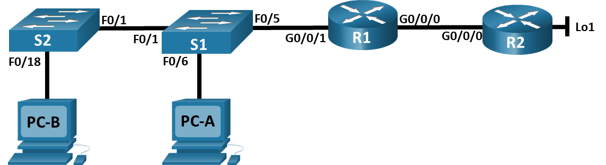
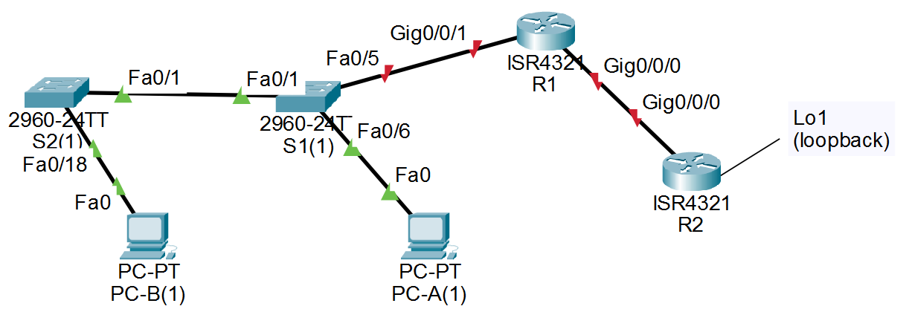

# Лабораторная работа - Настройка NAT для IPv4

###  Топология


###  Таблица адресации

|		Устройство		|		Интерфейс		|		IP-адрес		|		Маска подсети		|	
|  -  |  -  |  -  |  -  |
|		R1		|		G0/0/0		|		209.165.200.230		|		255.255.255.248		|	
|		R1		|		G0/0/1		|		192.168.1.1		|		255.255.255.0		|	
|		R2		|		G0/0/0		|		209.165.200.225		|		255.255.255.248		|	
|		R2		|		Lo1		|		209.165.200.1		|		255.255.255.224		|	
|		S1		|		VLAN 1		|		192.168.1.11		|		255.255.255.0		|	
|		S2		|		VLAN 1		|		192.168.1.12		|		255.255.255.0		|	
|		PC-A		|		NIC		|		192.168.1.2		|		255.255.255.0		|	
|		PC-B		|		NIC		|		192.168.1.3		|		255.255.255.0		|	

### Задание

## Часть 1. Создание сети и настройка основных параметров устройства<br>
## Часть 2. Настройка и проверка NAT для IPv4<br>
## Часть 3. Настройка и проверка PAT для IPv4<br>
## Часть 4. Настройка и проверка статического NAT для IPv4.<br>

### Решение

Сеть состоит из двух Switch (C2960 Software (C2960-LANBASEK9-M), Version 15.0(2)SE4), двух Router (ISR Software (X86_64_LINUX_IOSD-UNIVERSALK9-M), Version 15.5(3)S5), и двух компьютеров PC-А и PC-B.<br>
Устройства соединены кабелем Ethernet (Cooper Straight-Throught) PC-B [FastEthernet0] --> [FastEthernet0/18] Switch S2 [FastEthernet0/1] --> [FastEthernet0/1] Switch S1; PC-A [FastEthernet0/0] --> [FastEthernet0/6] Switch S1 [FastEthernet0/5] --> [GigabitEyhernet0/0/1] Router R1 [GigabitEyhernet0/0/0] --> [GigabitEyhernet0/0/0] Router R2 --> Lo1 (loopback).

## Часть 1. Создание сети и настройка основных параметров устройства

В первой части лабораторной работы вам предстоит создать топологию сети и настроить базовые параметры для узлов ПК и коммутаторов.

### Шаг 1. Подключите кабели сети согласно приведенной топологии.
Подключите устройства в соответствии с топологией и подсоедините соответствующие кабели.


### Шаг 2. Произведите базовую настройку маршрутизаторов.
Откройте окно конфигурации<br>
### a.	Назначьте маршрутизатору имя устройства.
Маршрутизатор R1
```
Router>en
Router#
Router#conf t
Enter configuration commands, one per line.  End with CNTL/Z.
Router(config)#
Router(config)#hostname R1
R1(config)#
```
Маршрутизатор R2
```
Router>en
Router#conf t
Enter configuration commands, one per line.  End with CNTL/Z.
Router(config)#hostname R2
R2(config)#
```
### b.	Отключите поиск DNS, чтобы предотвратить попытки маршрутизатора неверно преобразовывать введенные команды таким образом, как будто они являются именами узлов.
Маршрутизатор R1
```
R1(config)#no ip domain-lookup
```
Маршрутизатор R2
```
R2(config)#no ip domain-lookup 
```
### c.	Назначьте class в качестве зашифрованного пароля привилегированного режима EXEC.
```
R1(config)#enable secret class
R1(config)#
```
Маршрутизатор R2
```
R2(config)#enable secret class
```
### d.	Назначьте cisco в качестве пароля консоли и включите вход в систему по паролю.
Маршрутизатор R1
```
R1(config)#line console 0
R1(config-line)#logging synchronous 
R1(config-line)#pass
R1(config-line)#password cisco
R1(config-line)#login
```
Маршрутизатор R2
```
R2(config)#line con
R2(config)#line console 0
R2(config-line)#pass
R2(config-line)#password cisco
R2(config-line)#login
```
### e.	Назначьте cisco в качестве пароля VTY и включите вход в систему по паролю.
Маршрутизатор R1
```
R1(config-line)#exit
R1(config)#line vty 0 4
R1(config-line)#password cisco
R1(config-line)#login
```
Маршрутизатор R2
```
R2(config-line)#ex
% Ambiguous command: "ex"
R2(config-line)#exit
R2(config)#line vty 0 4
R2(config-line)#pass
R2(config-line)#password cisco
R2(config-line)#login
```
### f.	Зашифруйте открытые пароли.
Маршрутизатор R1
```
R1(config-line)#exit
R1(config)#serv
R1(config)#service pas
R1(config)#service password-encryption 
R1(config)#
```
Маршрутизатор R2
```
R2(config)#serv
R2(config)#service pass
R2(config)#service password-encryption 
```
### g.	Создайте баннер с предупреждением о запрете несанкционированного доступа к устройству.
Маршрутизатор R1
```
R1(config)#banner motd #
Enter TEXT message.  End with the character '#'.
Unauthorized access is stricly phohibited. #

R1(config)#
```
Маршрутизатор R2
```
R2(config)#banner motd #
Enter TEXT message.  End with the character '#'.
Unauthorized access is stricly phohibited. #

R2(config)#
```
### h.	Настройте IP-адресации интерфейса, как указано в таблице выше.
Маршрутизатор R1
```
R1(config)#int g0/0/0
R1(config-if)#ip ad
R1(config-if)#ip address 209.165.200.230 255.255.255.248
R1(config-if)#bo sh
               ^
% Invalid input detected at '^' marker.
	
R1(config-if)#no sh

R1(config-if)#
%LINK-5-CHANGED: Interface GigabitEthernet0/0/0, changed state to up
R1(config-if)#int g0/0/1
R1(config-if)#ip add 192.168.1.1 255.255.255.0
R1(config-if)#no sh

R1(config-if)#
%LINK-5-CHANGED: Interface GigabitEthernet0/0/1, changed state to up

%LINEPROTO-5-UPDOWN: Line protocol on Interface GigabitEthernet0/0/1, changed state to up
```
Маршрутизатор R2
```
R2(config)#int g0/0/0
R2(config-if)#ip add 209.165.200.225 255.255.255.248
R2(config-if)#int ?
% Unrecognized command
R2(config-if)#exit
R2(config)#int
R2(config)#interface ?
  Dialer            Dialer interface
  Dot11Radio        Dot11 interface
  Ethernet          IEEE 802.3
  FastEthernet      FastEthernet IEEE 802.3
  GigabitEthernet   GigabitEthernet IEEE 802.3z
  Loopback          Loopback interface
  Port-channel      Ethernet Channel of interfaces
  Serial            Serial
  Tunnel            Tunnel interface
  Virtual-Template  Virtual Template interface
  Vlan              Catalyst Vlans
  range             interface range command
R2(config)#interface lo
R2(config)#interface loopback ?
  <0-2147483647>  Loopback interface number
R2(config)#interface loopback 1

R2(config-if)#
%LINK-3-UPDOWN: Interface Loopback1, changed state to down

%LINEPROTO-5-UPDOWN: Line protocol on Interface Loopback1, changed state to up

R2(config-if)#ip add 209.165.200.1 255.255.255.224
R2(config)#int g 0/0/0
R2(config-if)#no sh

R2(config-if)#
%LINK-5-CHANGED: Interface GigabitEthernet0/0/0, changed state to up

%LINEPROTO-5-UPDOWN: Line protocol on Interface GigabitEthernet0/0/0, changed state to up
```
### i.	Настройте маршрут по умолчанию. от R2 до  R1.
Маршрутизатор R1 (настройка R1 не указана в задании методички, но без этого не будет работать)
```
R1(config)#ip route 209.165.200.0 255.255.255.248 209.165.200.225
R1(config)#
```
Маршрутизатор R2
```
R2(config)#ip route 192.168.1.0 255.255.255.0 209.165.200.230
R2(config)#
```
### j.	Сохраните текущую конфигурацию в файл загрузочной конфигурации.
Маршрутизатор R1
```
R1#wr
Building configuration...
[OK]
R1#
```
Маршрутизатор R2
```
R2#wr
Building configuration...
[OK]
R2#
```
Закройте окно настройки.


### Шаг 3. Настройте базовые параметры каждого коммутатора.
Откройте окно конфигурации
### a.	Присвойте коммутатору имя устройства.
Коммутатор S1
```
Switch>
Switch>en
Switch#conf t
Enter configuration commands, one per line.  End with CNTL/Z.
Switch(config)#hostname S1
S1(config)#
```
Коммутатор S2
```
Switch>en
Switch#conf t
Enter configuration commands, one per line.  End with CNTL/Z.
Switch(config)#hostname S2
S2(config)#
```
### b.	Отключите поиск DNS, чтобы предотвратить попытки маршрутизатора неверно преобразовывать введенные команды таким образом, как будто они являются именами узлов.
Коммутатор S1
```
S1(config)#
S1(config)#no ip domain0l
S1(config)#no ip domain-l
S1(config)#no ip domain-lookup 
S1(config)#
```
Коммутатор S2
```
S2(config)#no ip domain-lookup 
S2(config)#
```
### c.	Назначьте class в качестве зашифрованного пароля привилегированного режима EXEC.
Коммутатор S1
```
S1(config)#ena
S1(config)#enable pas
S1(config)#enable sec
S1(config)#enable secret class
S1(config)#
```
Коммутатор S2
```
S2(config)#enable secret class
S2(config)#
```
### d.	Назначьте cisco в качестве пароля консоли и включите вход в систему по паролю.
Коммутатор S1
```
S1(config)#line con
S1(config)#line console 0
S1(config-line)#pass
S1(config-line)#password cisco
S1(config-line)#login
S1(config-line)#
```
Коммутатор S2
```
S2(config)#line console 0
S2(config-line)#pas
S2(config-line)#password cisco
S2(config-line)#login
S2(config-line)#
```
### e.	Назначьте cisco в качестве пароля VTY и включите вход в систему по паролю.
Коммутатор S1
```
S1(config-line)#int vty 0 4
                ^
% Invalid input detected at '^' marker.
	
S1(config-line)#ex
% Ambiguous command: "ex"
S1(config-line)#end
S1#
%SYS-5-CONFIG_I: Configured from console by console

S1#conf t
Enter configuration commands, one per line.  End with CNTL/Z.
S1(config)#line vty 0 4
S1(config-line)#pas
S1(config-line)#password cisco
S1(config-line)#login
S1(config-line)#
```
Коммутатор S2
```
S2(config-line)#line vty 0 4
S2(config-line)#pas
S2(config-line)#password cisco
S2(config-line)#login
S2(config-line)#
```
### f.	Зашифруйте открытые пароли.
Коммутатор S1
```
S1(config)#service password-encryption 
S1(config)#
```
Коммутатор S2
```
S2(config-line)#
S2#
%SYS-5-CONFIG_I: Configured from console by console

S2#conf t
Enter configuration commands, one per line.  End with CNTL/Z.
S2(config)#service pas
S2(config)#service password-encryption 
S2(config)#
```
### g.	Создайте баннер с предупреждением о запрете несанкционированного доступа к устройству.
Коммутатор S1
```
S1(config)#motd ?
% Unrecognized command
S1(config)#ban
S1(config)#banner motd #
Enter TEXT message.  End with the character '#'.
Unauthorized access is stricly phohibited. #

S1(config)#
```
Коммутатор S2
```
S2(config)#ban
S2(config)#banner motd #
Enter TEXT message.  End with the character '#'.
Unauthorized access is stricly phohibited. #

S2(config)#
```
### h.	Выключите все интерфейсы, которые не будут использоваться.
Коммутатор S1
```
S1(config)#int rang
S1(config)#int range fa0/2-3, fa0/7-24, g0/1-2
S1(config-if-range)#shutdown

%LINK-5-CHANGED: Interface FastEthernet0/2, changed state to administratively down

%LINK-5-CHANGED: Interface FastEthernet0/3, changed state to administratively down

%LINK-5-CHANGED: Interface FastEthernet0/7, changed state to administratively down

%LINK-5-CHANGED: Interface FastEthernet0/8, changed state to administratively down

%LINK-5-CHANGED: Interface FastEthernet0/9, changed state to administratively down

%LINK-5-CHANGED: Interface FastEthernet0/10, changed state to administratively down

%LINK-5-CHANGED: Interface FastEthernet0/11, changed state to administratively down

%LINK-5-CHANGED: Interface FastEthernet0/12, changed state to administratively down

%LINK-5-CHANGED: Interface FastEthernet0/13, changed state to administratively down

%LINK-5-CHANGED: Interface FastEthernet0/14, changed state to administratively down

%LINK-5-CHANGED: Interface FastEthernet0/15, changed state to administratively down

%LINK-5-CHANGED: Interface FastEthernet0/16, changed state to administratively down

%LINK-5-CHANGED: Interface FastEthernet0/17, changed state to administratively down

%LINK-5-CHANGED: Interface FastEthernet0/18, changed state to administratively down

%LINK-5-CHANGED: Interface FastEthernet0/19, changed state to administratively down

%LINK-5-CHANGED: Interface FastEthernet0/20, changed state to administratively down

%LINK-5-CHANGED: Interface FastEthernet0/21, changed state to administratively down

%LINK-5-CHANGED: Interface FastEthernet0/22, changed state to administratively down

%LINK-5-CHANGED: Interface FastEthernet0/23, changed state to administratively down

%LINK-5-CHANGED: Interface FastEthernet0/24, changed state to administratively down

%LINK-5-CHANGED: Interface GigabitEthernet0/1, changed state to administratively down

%LINK-5-CHANGED: Interface GigabitEthernet0/2, changed state to administratively down
S1(config-if-range)#
```

<details>
  <summary>проверка отключения интерфесов S1</summary>
S1(config-if-range)#do sh run<br>
Building configuration...<br>

Current configuration : 1478 bytes<br>
!<br>
version 15.0<br>
no service timestamps log datetime msec<br>
no service timestamps debug datetime msec<br>
service password-encryption<br>
!<br>
hostname S1<br>
!<br>
enable secret 5 $1$mERr$9cTjUIEqNGurQiFU.ZeCi1<br>
!<br>
!<br>
!<br>
no ip domain-lookup<br>
!<br>
!<br>
!<br>
spanning-tree mode pvst<br>
spanning-tree extend system-id<br>
!<br>
interface FastEthernet0/1<br>
!<br>
interface FastEthernet0/2<br>
 shutdown<br>
!<br>
interface FastEthernet0/3<br>
 shutdown<br>
!<br>
interface FastEthernet0/4<br>
!<br>
interface FastEthernet0/5<br>
!<br>
interface FastEthernet0/6<br>
!<br>
interface FastEthernet0/7<br>
 shutdown<br>
!<br>
interface FastEthernet0/8<br>
 shutdown<br>
!<br>
interface FastEthernet0/9<br>
 shutdown<br>
</details>

```
S1(config-if-range)#int ran
S1(config-if-range)#int ran fa0/2-4
S1(config-if-range)#sh 

%LINK-5-CHANGED: Interface FastEthernet0/4, changed state to administratively down
```

<details>
	<summary>повторная проверка отключения интерфесов S1</summary>
S1(config-if-range)#do sh run<br>
Building configuration...<br>

Current configuration : 1488 bytes<br>
!<br>
version 15.0<br>
no service timestamps log datetime msec<br>
no service timestamps debug datetime msec<br>
service password-encryption<br>
!<br>
hostname S1<br>
!<br>
enable secret 5 $1$mERr$9cTjUIEqNGurQiFU.ZeCi1<br>
!<br>
!<br>
!<br>
no ip domain-lookup<br>
!<br>
!<br>
!<br>
spanning-tree mode pvst<br>
spanning-tree extend system-id<br>
!<br>
interface FastEthernet0/1<br>
!<br>
interface FastEthernet0/2<br>
 shutdown<br>
!<br>
interface FastEthernet0/3<br>
 shutdown<br>
!<br>
interface FastEthernet0/4<br>
 shutdown<br>
!<br>
interface FastEthernet0/5<br>
!<br>
interface FastEthernet0/6<br>
!<br>
interface FastEthernet0/7<br>
 shutdown<br>
!<br>
interface FastEthernet0/8<br>
 shutdown<br>
!<br>
interface FastEthernet0/9<br>
 shutdown<br>
!<br>
interface FastEthernet0/10<br>
 shutdown<br>
!<br>
interface FastEthernet0/11<br>
 shutdown<br>
!<br>
interface FastEthernet0/12<br>
 shutdown<br>
!<br>
interface FastEthernet0/13<br>
 shutdown<br>
!<br>
interface FastEthernet0/14<br>
 shutdown<br>
!<br>
interface FastEthernet0/15<br>
 shutdown<br>
!<br>
interface FastEthernet0/16<br>
 shutdown<br>
!<br>
interface FastEthernet0/17<br>
 shutdown<br>
!<br>
interface FastEthernet0/18<br>
 shutdown<br>
!<br>
interface FastEthernet0/19<br>
 shutdown<br>
!<br>
interface FastEthernet0/20<br>
 shutdown<br>
!<br>
interface FastEthernet0/21<br>
 shutdown<br>
!<br>
interface FastEthernet0/22<br>
 shutdown<br>
!<br>
interface FastEthernet0/23<br>
 shutdown<br>
!<br>
interface FastEthernet0/24<br>
 shutdown<br>
!<br>
interface GigabitEthernet0/1<br>
 shutdown<br>
!<br>
interface GigabitEthernet0/2<br>
 shutdown<br>
!<br>
interface Vlan1<br>
 no ip address<br>
 shutdown<br>
!<br>
banner motd ^C<br>
Unauthorized access is stricly phohibited. ^C<br>
!<br>
!<br>
!<br>
line con 0<br>
 password 7 0822455D0A16<br>
 login<br>
!<br>
line vty 0 4<br>
 password 7 0822455D0A16<br>
 login<br>
line vty 5 15<br>
 login<br>
!<br>
!<br>
!<br>
!<br>
end<br>
</details>

Коммутатор S2
```
S2(config)#int range fa0/2-17, fa0/19-24, g0/1-23
interface range not validated - command rejected
S2(config)#int range fa0/2-17, fa0/19-24, g0/1-2
S2(config-if-range)#sh

%LINK-5-CHANGED: Interface FastEthernet0/2, changed state to administratively down

%LINK-5-CHANGED: Interface FastEthernet0/3, changed state to administratively down

%LINK-5-CHANGED: Interface FastEthernet0/4, changed state to administratively down

%LINK-5-CHANGED: Interface FastEthernet0/5, changed state to administratively down

%LINK-5-CHANGED: Interface FastEthernet0/6, changed state to administratively down

%LINK-5-CHANGED: Interface FastEthernet0/7, changed state to administratively down

%LINK-5-CHANGED: Interface FastEthernet0/8, changed state to administratively down

%LINK-5-CHANGED: Interface FastEthernet0/9, changed state to administratively down

%LINK-5-CHANGED: Interface FastEthernet0/10, changed state to administratively down

%LINK-5-CHANGED: Interface FastEthernet0/11, changed state to administratively down

%LINK-5-CHANGED: Interface FastEthernet0/12, changed state to administratively down

%LINK-5-CHANGED: Interface FastEthernet0/13, changed state to administratively down

%LINK-5-CHANGED: Interface FastEthernet0/14, changed state to administratively down

%LINK-5-CHANGED: Interface FastEthernet0/15, changed state to administratively down

%LINK-5-CHANGED: Interface FastEthernet0/16, changed state to administratively down

%LINK-5-CHANGED: Interface FastEthernet0/17, changed state to administratively down

%LINK-5-CHANGED: Interface FastEthernet0/19, changed state to administratively down

%LINK-5-CHANGED: Interface FastEthernet0/20, changed state to administratively down

%LINK-5-CHANGED: Interface FastEthernet0/21, changed state to administratively down

%LINK-5-CHANGED: Interface FastEthernet0/22, changed state to administratively down

%LINK-5-CHANGED: Interface FastEthernet0/23, changed state to administratively down

%LINK-5-CHANGED: Interface FastEthernet0/24, changed state to administratively down

%LINK-5-CHANGED: Interface GigabitEthernet0/1, changed state to administratively down

%LINK-5-CHANGED: Interface GigabitEthernet0/2, changed state to administratively down
S2(config-if-range)#
```
<details>
<summary>проверка отключения интерфейсов S2</summary>
S2(config-if-range)#do sh run<br>
Building configuration...<br>

Current configuration : 1498 bytes<br>
!<br>
version 15.0<br>
no service timestamps log datetime msec<br>
no service timestamps debug datetime msec<br>
service password-encryption<br>
!<br>
hostname S2<br>
!<br>
enable secret 5 $1$mERr$9cTjUIEqNGurQiFU.ZeCi1<br>
!<br>
!<br>
!<br>
no ip domain-lookup<br>
!<br>
!<br>
!<br>
spanning-tree mode pvst<br>
spanning-tree extend system-id<br>
!<br>
interface FastEthernet0/1<br>
!<br>
interface FastEthernet0/2<br>
shutdown<br>
!<br>
interface FastEthernet0/3<br>
shutdown<br>
!<br>
interface FastEthernet0/4<br>
shutdown<br>
!<br>
interface FastEthernet0/5<br>
shutdown<br>
!<br>
interface FastEthernet0/6<br>
shutdown<br>
!<br>
interface FastEthernet0/7<br>
shutdown<br>
!<br>
interface FastEthernet0/8<br>
shutdown<br>
!<br>
interface FastEthernet0/9<br>
shutdown<br>
!<br>
interface FastEthernet0/10<br>
shutdown<br>
!<br>
interface FastEthernet0/11<br>
shutdown<br>
!<br>
interface FastEthernet0/12<br>
shutdown<br>
!<br>
interface FastEthernet0/13<br>
shutdown<br>
!<br>
interface FastEthernet0/14<br>
shutdown<br>
!<br>
interface FastEthernet0/15<br>
shutdown<br>
!<br>
interface FastEthernet0/16<br>
shutdown<br>
!<br>
interface FastEthernet0/17<br>
shutdown<br>
!<br>
interface FastEthernet0/18<br>
!<br>
interface FastEthernet0/19<br>
shutdown<br>
!<br>
interface FastEthernet0/20<br>
shutdown<br>
!<br>
interface FastEthernet0/21<br>
shutdown<br>
!<br>
interface FastEthernet0/22<br>
shutdown<br>
!<br>
interface FastEthernet0/23<br>
shutdown<br>
!<br>
interface FastEthernet0/24<br>
shutdown<br>
!<br>
interface GigabitEthernet0/1<br>
shutdown<br>
!<br>
interface GigabitEthernet0/2<br>
shutdown<br>
!<br>
interface Vlan1<br>
no ip address<br>
shutdown<br>
!<br>
banner motd ^C<br>
Unauthorized access is stricly phohibited. ^C<br>
!<br>
!<br>
!<br>
line con 0<br>
password 7 0822455D0A16<br>
login<br>
!<br>
line vty 0 4<br>
password 7 0822455D0A16<br>
login<br>
line vty 5 15<br>
login<br>
!<br>
!<br>
!<br>
!<br>
end<br>

S2(config-if-range)#<br>
</details>

### i.	Настройте IP-адресации интерфейса, как указано в таблице выше.
Коммутатор S1
```
S1(config)#int vlan 1
S1(config-if)#ip add 192.168.1.11 255.255.255.0
S1(config-if)#no sh

S1(config-if)#
%LINK-3-UPDOWN: Interface Vlan1, changed state to down

%LINEPROTO-5-UPDOWN: Line protocol on Interface Vlan1, changed state to up
```
Коммутатор S2
```
S2(config-if-range)#exit
S2(config)#int vlan 1
S2(config-if)#ip ad
S2(config-if)#ip address 192.168.1.12 255.255.255.0
S2(config-if)#no sh

S2(config-if)#
%LINK-3-UPDOWN: Interface Vlan1, changed state to down

%LINEPROTO-5-UPDOWN: Line protocol on Interface Vlan1, changed state to up
```
### j.	Сохраните текущую конфигурацию в файл загрузочной конфигурации.
Коммутатор S1
```
S1(config-if)#wr
              ^
% Invalid input detected at '^' marker.
	
S1(config-if)#do wr
Building configuration...
[OK]
S1(config-if)#
```
Коммутатор S2
```
S2(config-if)#do wr
Building configuration...
[OK]
S2(config-if)#
```
Закройте окно настройки.

## Часть 2. Настройка и проверка NAT для IPv4.
В части 2 необходимо настроить и проверить NAT для IPv4.

### Шаг 1. Настройте NAT на R1, используя пул из трех адресов 209.165.200.226-209.165.200.228. 
Откройте окно конфигурации

### a.	Настройте простой список доступа, который определяет, какие хосты будут разрешены для трансляции. В этом случае все устройства в локальной сети R1 имеют право на трансляцию.
```
R1(config)#access-list 1 permit 192.168.1.0 0.0.0.255
```

### b.	Создайте пул NAT и укажите ему имя и диапазон используемых адресов.
```
R1(config)#ip nat pool PUBLIC_ACCESS 209.165.200.226 209.165.200.228 netmask 255.255.255.248
```
Примечание. Параметр маски сети не является разделителем IP-адресов. Это должна быть правильная маска подсети для назначенных адресов, даже если вы используете не все адреса подсети в пуле. 

### c.	Настройте перевод, связывая ACL и пул с процессом преобразования.
```
R1(config)#ip nat inside source list 1 pool PUBLIC_ACCESS
```
Примечание: Три очень важных момента. Во-первых, слово «inside» имеет решающее значение для работы такого рода NAT. Если вы опустить его, NAT не будет работать. Во-вторых, номер списка — это номер ACL, настроенный на предыдущем ### Шаге. В-третьих, имя пула чувствительно к регистру. 

### d.	Задайте внутренний (inside) интерфейс. 
```
R1(config)#int g0/0/1
R1(config-if)#ip nat inside
```

### e.	Определите внешний (outside) интерфейс.
```
R1(config-if)#int g0/0/0
R1(config-if)#ip nat outside
```

### Шаг 2. Проверьте и проверьте конфигурацию. 
### a.	С PC-B,  запустите эхо-запрос интерфейса Lo1 (209.165.200.1) на R2. Если эхо-запрос не прошел, выполните процесс поиска и устранения неполадок. На R1 отобразите таблицу NAT на R1 с помощью команды show ip nat translations.

Эхо-запрос на 209.165.200.1 не проходил. Педполагаю, что это из-за того, что в часть 1, шаг 2, пункт i указано только "Настройте маршрут по умолчанию. от R2 до  R1.". Но не указано на настройку маршрута по умолчанию от R1 к R2. Значит роутер не знает что сеть 209.165.200.0 /29 находится за 209.165.200.230. Прописав этот маршрут пинг пошел, а таблица адресации, после пинга с PC-B, получилась вот такой.<br>
```
R1#show ip nat translations
Pro  Inside global     Inside local       Outside local      Outside global
icmp 209.165.200.227:37192.168.1.3:37     209.165.200.1:37   209.165.200.1:37
icmp 209.165.200.227:38192.168.1.3:38     209.165.200.1:38   209.165.200.1:38
icmp 209.165.200.227:39192.168.1.3:39     209.165.200.1:39   209.165.200.1:39
icmp 209.165.200.227:40192.168.1.3:40     209.165.200.1:40   209.165.200.1:40
```
Вопросы:<br>
Во что был транслирован внутренний локальный адрес PC-B?<br>
Какой тип адреса NAT является переведенным адресом?<br>
Ответ:<br>
Внутренний локальный адрес PC-B был транслирован в **209.165.200.227** с разными портами (37192,38192,39192,40192).<br>
**Inside global**
 
### b.	С PC-A, запустите  эхо-запрос интерфейса Lo1 (209.165.200.1) на R2. Если эхо-запрос не прошел, выполните отладку. На R1 отобразите таблицу NAT на R1 с помощью команды show ip nat translations.
Пинг проходит. Талблица на R1:
```
R1#show ip nat translations
Pro  Inside global     Inside local       Outside local      Outside global
icmp 209.165.200.227:41192.168.1.3:41     209.165.200.1:41   209.165.200.1:41
icmp 209.165.200.227:42192.168.1.3:42     209.165.200.1:42   209.165.200.1:42
icmp 209.165.200.227:43192.168.1.3:43     209.165.200.1:43   209.165.200.1:43
icmp 209.165.200.227:44192.168.1.3:44     209.165.200.1:44   209.165.200.1:44
icmp 209.165.200.228:5 192.168.1.2:5      209.165.200.1:5    209.165.200.1:5
icmp 209.165.200.228:6 192.168.1.2:6      209.165.200.1:6    209.165.200.1:6
icmp 209.165.200.228:7 192.168.1.2:7      209.165.200.1:7    209.165.200.1:7
icmp 209.165.200.228:8 192.168.1.2:8      209.165.200.1:8    209.165.200.1:8
```

### c.	Обратите внимание, что предыдущая трансляция для PC-B все еще находится в таблице. Из S1, эхо-запрос интерфейса Lo1 (209.165.200.1) на R2. Если эхо-запрос не прошел, выполните отладку. На R1 отобразите таблицу NAT на R1 с помощью команды show ip nat translations.

Не идет пинг с S1 на 209.165.200.1. Не пойму почему.
