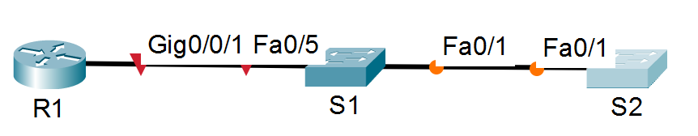

# Лабораторная работа - Настройка протоколов CDP, LLDP и NTP 

### Топология


### Таблица адресации
|  Устройство  |  Интерфейс  |  IP-адрес  |  Маска подсети  |  Шлюз по умолчанию  |
|  -  |  -  |  -  |  -  |  -  |
|  R1  |  Loopback1  |	172.16.1.1	|  255.255.255.0  |  -  |
|  R1  |  G0/0/1  |	10.22.0.1	|  255.255.255.0  |  -  |
|  S1  |  SVI VLAN 1  |  10.22.0.2	|  255.255.255.0  |  10.22.0.1 |
|  S2  |  SVI VLAN 1  |  10.22.0.3	|  255.255.255.0  |  10.22.0.1  |

### Задачи

## Часть 1. Создание сети и настройка основных параметров устройства
## Часть 2. Обнаружение сетевых ресурсов с помощью протокола CDP
## Часть 3. Обнаружение сетевых ресурсов с помощью протокола LLDP
## Часть 4. Настройка и проверка NTP

Общие сведения/сценарий
Протокол Cisco Discovery Protocol (CDP) — собственный протокол Cisco для обнаружения сетевых ресурсов, функционирующий на канальном уровне. Он служит для обмена информацией, например именами устройств и версиями ПО IOS, с другими физически подключенными устройствами Cisco. Протокол Link Layer Discovery Protocol (LLDP) — это не зависящий от производителя протокол для обнаружения сетевых ресурсов, функционирующий на канальном уровне. В основном он используется сетевыми устройствами в локальной сети (LAN). Сетевые устройства сообщают соседям такие данные о себе, как идентификаторы и сведения о функциональных возможностях.
Протокол сетевого времени (NTP) служит для синхронизации времени между распределенными серверами времени и клиентами. В качестве транспортного протокола NTP использует протокол UDP. Все операции обмена данными по протоколу NTP выполняются по времени в формате UTC.
Сервер NTP обычно получает данные о времени из достоверного источника, такого как атомные часы, к которым подключен сервер. Затем он распределяет это время по сети. Протокол NTP чрезвычайно эффективен; для синхронизации времени на двух компьютерах с временной разницей в пределах миллисекунды требуется отправлять не более одного пакета в минуту.
В этой лабораторной работе вам предстоит задокументировать порты, которые используются для подключения к другим коммутаторам по протоколам CDP и LLDP. Полученные результаты следует указать в диаграмме сетевой топологии. 
Примечание: Маршрутизаторы, используемые в практических лабораторных работах CCNA, - это Cisco 4221 с Cisco IOS XE Release 16.9.4 (образ universalk9). В лабораторных работах используются коммутаторы Cisco Catalyst 2960 с Cisco IOS версии 15.2(2) (образ lanbasek9). Можно использовать другие маршрутизаторы, коммутаторы и версии Cisco IOS. В зависимости от модели устройства и версии Cisco IOS доступные команды и результаты их выполнения могут отличаться от тех, которые показаны в лабораторных работах. Правильные идентификаторы интерфейса см. в сводной таблице по интерфейсам маршрутизаторов в конце лабораторной работы.
Примечание. Убедитесь, что у всех маршрутизаторов и коммутаторов была удалена начальная конфигурация. Если вы не уверены в этом, обратитесь к инструктору.
Необходимые ресурсы
•	1 Маршрутизатор (Cisco 4221 с универсальным образом Cisco IOS XE версии 16.9.4 или аналогичным)
•	2 коммутатора (Cisco 2960 с операционной системой Cisco IOS 15.2(2) (образ lanbasek9) или аналогичная модель)
•	1 ПК (под управлением Windows с программой эмуляции терминала, например, Tera Term)
•	Консольные кабели для настройки устройств Cisco IOS через консольные порты.
•	Кабели Ethernet, расположенные в соответствии с топологией.

## Часть 1. Создание сети и настройка основных параметров устройства
В первой части лабораторной работы вам предстоит создать топологию сети и настроить основные параметры для маршрутизатора и коммутаторов.

### Шаг 1. Создайте сеть согласно топологии.


### Шаг 2. Настройте базовые параметры для маршрутизатора.
Выполнено
#### a.	Назначьте маршрутизатору имя устройства.
#### b.	Отключите поиск DNS, чтобы предотвратить попытки маршрутизатора неверно преобразовывать введенные команды таким образом, как будто они являются именами узлов.
#### c.	Назначьте class в качестве зашифрованного пароля привилегированного режима EXEC.
#### d.	Назначьте cisco в качестве пароля консоли и включите вход в систему по паролю.
#### e.	Назначьте cisco в качестве пароля VTY и включите вход в систему по паролю.
#### f.	Зашифруйте открытые пароли.
#### g.	Создайте баннер с предупреждением о запрете несанкционированного доступа к устройству.
#### h.	Настройка интерфейсов, перечисленных в таблице выше
#### i.	Сохраните текущую конфигурацию в файл загрузочной конфигурации.

### Шаг 3. Настройте базовые параметры каждого коммутатора.
Выполнено
#### a.	Присвойте коммутатору имя устройства.
#### b.	Отключите поиск DNS, чтобы предотвратить попытки маршрутизатора неверно преобразовывать введенные команды таким образом, как будто они являются именами узлов.
#### c.	Назначьте class в качестве зашифрованного пароля привилегированного режима EXEC.
#### d.	Назначьте cisco в качестве пароля консоли и включите вход в систему по паролю.
#### e.	Назначьте cisco в качестве пароля VTY и включите вход в систему по паролю.
#### f.	Зашифруйте открытые пароли.
#### g.	Создайте баннер, который предупреждает всех, кто обращается к устройству, видит баннерное сообщение «Только авторизованные пользователи!». 
Настройка S2 по аналогии<br>
S1
```
S1(config)#banner motd #
Enter TEXT message.  End with the character '#'.
Tolko avtorizovanbIe polzovateli #
```
#### h.	Отключите неиспользуемые интерфейсы
S1
```
Switch>en
Switch#conf t
Enter configuration commands, one per line.  End with CNTL/Z.
Switch(config)#hostn S1
S1(config)#int range f0/2-4,f0/6-24,g0/1-2
S1(config-if-range)#shutdown
```
S2
```
Switch>en
Switch#conf t
Enter configuration commands, one per line.  End with CNTL/Z.
Switch(config)#hostn S2
S2(config)#int range f0/2-24,g0/1-2
S2(config-if-range)#shutdown
```
#### i.	Сохраните текущую конфигурацию в файл загрузочной конфигурации.

## Часть 2. Обнаружение сетевых ресурсов с помощью протокола CDP.
На устройствах Cisco протокол CDP включен по умолчанию. Воспользуйтесь CDP, чтобы обнаружить порты, к которым подключены кабели.
Откройте окно конфигурации
#### a.	На R1 используйте соответствующую команду show cdp, чтобы определить, сколько интерфейсов включено CDP, сколько из них включено и сколько отключено.
```
R1#sh cdp
Global CDP information:
    Sending CDP packets every 60 seconds
    Sending a holdtime value of 180 seconds
    Sending CDPv2 advertisements is enabled
```
после включения на R1 int g0/0/1
```
R1#sh cdp interface 
Vlan1 is administratively down, line protocol is down
  Sending CDP packets every 60 seconds
  Holdtime is 180 seconds
GigabitEthernet0/0/0 is administratively down, line protocol is down
  Sending CDP packets every 60 seconds
  Holdtime is 180 seconds
GigabitEthernet0/0/1 is up, line protocol is up
  Sending CDP packets every 60 seconds
  Holdtime is 180 seconds
```
Вопрос:<br>
Сколько интерфейсов участвует в объявлениях CDP? Какие из них активны?<br>
**Ответ: на R1 участвует 3 интерфейса, но два из них не активны. Активен после включения только g0/0/1**
 
#### b.	На R1 используйте соответствующую команду show cdp, чтобы определить версию IOS, используемую на S1.
```
R1#sh cdp entry S1

Device ID: S1
Entry address(es): 
Platform: cisco 2960, Capabilities: Switch
Interface: GigabitEthernet0/0/1, Port ID (outgoing port): FastEthernet0/5
Holdtime: 143

Version :
Cisco IOS Software, C2960 Software (C2960-LANBASEK9-M), Version 15.0(2)SE4, RELEASE SOFTWARE (fc1)
Technical Support: http://www.cisco.com/techsupport
Copyright (c) 1986-2013 by Cisco Systems, Inc.
Compiled Wed 26-Jun-13 02:49 by mnguyen

advertisement version: 2
Duplex: full
```
Вопрос:<br>
Какая версия IOS используется на  S1?<br>
**Ответ: версия 15.0(2)SE4**
 
#### c.	На S1 используйте соответствующую команду show cdp, чтобы определить, сколько пакетов CDP было выданных.
Команда show cdp traffic не доступна на коммутаторе 2960-24TT. Похоже вновь ограничение CPT.
```
S1#sh cdp tr
S1#sh cdp ?
  entry      Information for specific neighbor entry
  interface  CDP interface status and configuration
  neighbors  CDP neighbor entries
  <cr>
```
S1# show cdp traffic<br>
CDP counters : <br>
        Total packets output: 179, Input: 148 <br>
        Hdr syntax: 0, Chksum error: 0, Encaps failed: 0 <br>
        No memory: 0, Invalid packet: 0, <br>
        CDP version 1 advertisements output: 0, Input: 0 <br>
        CDP version 2 advertisements output: 179, Input: 148<br>

Вопрос:<br>
Сколько пакетов имеет выход CDP с момента последнего сброса счетчика?<br>
**Ответа нет из-за ограничений CPT...**
 
#### d.	Настройте SVI для VLAN 1 на S1 и S2, используя IP-адреса, указанные в таблице адресации выше. Настройте шлюз по умолчанию для каждого коммутатора на основе таблицы адресов.
Настройка S2 по аналогии
```
S1(config)#int vlan 1
S1(config-if)#no sh
S1(config-if)#
%LINK-3-UPDOWN: Interface Vlan1, changed state to down
%LINEPROTO-5-UPDOWN: Line protocol on Interface Vlan1, changed state to up
S1(config-if)#ip ad
S1(config-if)#ip address 10.22.0.2 255.255.255.0
S1(config-if)#ex
S1(config)#ip default-gateway 10.22.0.1
```
#### e.	На R1 выполните команду show cdp entry S1.
```
R1#show cdp entry S1

Device ID: S1
Entry address(es): 
  IP address : 10.22.0.2
Platform: cisco 2960, Capabilities: Switch
Interface: GigabitEthernet0/0/1, Port ID (outgoing port): FastEthernet0/5
Holdtime: 128

Version :
Cisco IOS Software, C2960 Software (C2960-LANBASEK9-M), Version 15.0(2)SE4, RELEASE SOFTWARE (fc1)
Technical Support: http://www.cisco.com/techsupport
Copyright (c) 1986-2013 by Cisco Systems, Inc.
Compiled Wed 26-Jun-13 02:49 by mnguyen

advertisement version: 2
Duplex: full
```

Вопрос:<br>
Какие дополнительные сведения доступны теперь?<br>
**Ответ: теперь показывается IP адрес vlan1 на S1: 10.22.0.2**

#### f.	Отключить CDP глобально на всех устройствах.
Настройка S1,S2 по аналогии
```
R1(config)#no cdp run
```

## Часть 3. Обнаружение сетевых ресурсов с помощью протокола LLDP
На устройствах Cisco протокол LLDP может быть включен по умолчанию. Воспользуйтесь LLDP, чтобы обнаружить порты, к которым подключены кабели.
Откройте окно конфигурации
#### a.	Введите соответствующую команду lldp, чтобы включить LLDP на всех устройствах в топологии.
Настройка S1,S2 по аналогии
```
R1(config)#lldp run
```
#### b.	На S1 выполните соответствующую команду lldp, чтобы предоставить подробную информацию о S2.
Команда show lldp entry недоступна из-за ограничений CPT. Интернет говорит есть альтернатива sh lldp neighbors detail.<br>
Блок по S2 выглядит так
```
Chassis id: 0060.3EA4.E201
Port id: Fa0/1
Port Description: FastEthernet0/1
System Name: S2
System Description:
Cisco IOS Software, C2960 Software (C2960-LANBASEK9-M), Version 15.0(2)SE4, RELEASE SOFTWARE (fc1)
Technical Support: http://www.cisco.com/techsupport
Copyright (c) 1986-2013 by Cisco Systems, Inc.
Compiled Wed 26-Jun-13 02:49 by mnguyen
Time remaining: 90 seconds
System Capabilities: B
Enabled Capabilities: B
Management Addresses - not advertised
Auto Negotiation - supported, enabled
Physical media capabilities:
    100baseT(FD)
    100baseT(HD)
    1000baseT(HD)
Media Attachment Unit type: 10
Vlan ID: 1
```

Вопрос:<br>
Что такое chassis ID  для коммутатора S2?<br>
**Ответ: это MAC-адрес S2.**

#### c.	Соединитесь через консоль на всех устройствах и используйте команды LLDP, необходимые для отображения топологии физической сети только из выходных данных команды show.
R1
```
R1#sh lldp neighbors 
Capability codes:
    (R) Router, (B) Bridge, (T) Telephone, (C) DOCSIS Cable Device
    (W) WLAN Access Point, (P) Repeater, (S) Station, (O) Other
Device ID           Local Intf     Hold-time  Capability      Port ID
S1                  Gig0/0/1       120        B               Fa0/5

Total entries displayed: 1
```
S1
```
S1#sh lldp neighbors 
Capability codes:
    (R) Router, (B) Bridge, (T) Telephone, (C) DOCSIS Cable Device
    (W) WLAN Access Point, (P) Repeater, (S) Station, (O) Other
Device ID           Local Intf     Hold-time  Capability      Port ID
S2                  Fa0/1          120        B               Fa0/1
R1                  Fa0/5          120        R               Gig0/0/1

Total entries displayed: 2
```
S2
```
S2#sh lldp neighbors 
Capability codes:
    (R) Router, (B) Bridge, (T) Telephone, (C) DOCSIS Cable Device
    (W) WLAN Access Point, (P) Repeater, (S) Station, (O) Other
Device ID           Local Intf     Hold-time  Capability      Port ID
S1                  Fa0/1          120        B               Fa0/1

Total entries displayed: 1
```

## Часть 4. Настройка NTP
В части 4 необходимо настроить маршрутизатор R1 в качестве сервера NTP, а маршрутизатор R2 в качестве клиента NTP маршрутизатора R1. Необходимо выполнить синхронизацию времени для Syslog и отладочных функций. Если время не синхронизировано, сложно определить, какое сетевое событие стало причиной данного сообщения.

### Шаг 1. Выведите на экран текущее время.
```
R1#show clock
*0:0:27.377 UTC Mon Mar 1 1993
Router#sh clock detail 
*0:0:51.595 UTC Mon Mar 1 1993
Time source is hardware calendar
```
|	Дата	|	Время	|	Часовой пояс	|	Источник времени	|
|	-	|	-	|	-	|	-	|
|	Mon Mar 1 1993	|	0:0:51.595	|	UTC	|	календарь на железе устройства	|

### Шаг 2. Установите время.
С помощью команды clock set установите время на маршрутизаторе R1. Введенное время должно быть в формате UTC.
```
R1#clock set 23:57:00 oct 08 2026
```
 
### Шаг 3. Настройте главный сервер NTP.
Настройте R1 в качестве хозяина NTP с уровнем слоя 4.
```
R1(config)#int g0/0/1
R1(config-if)#ip address 10.22.0.1 255.255.255.0
R1(config-if)#ex
R1(config)#int loopback 1
R1(config-if)#ip address 172.16.1.1 255.255.255.0
R1(config-if)#end
R1#
%SYS-5-CONFIG_I: Configured from console by console
R1#conf t
R1(config)#ntp master 4
```
 
### Шаг 4. Настройте клиент NTP.
#### a.	Выполните соответствующую команду на S1 и S2, чтобы просмотреть настроенное время. Запишите текущее время,  в следующей таблице.
По инерции выставлял время всем сразу. так что время уже настроено.
S1
```
S1#sh clock detail 
*0:24:2.903 UTC Sat Oct 10 2026
Time source is hardware calendar
```
S2
```
S2#sh clock detail 
*0:24:13.946 UTC Sat Oct 10 2026
Time source is hardware calendar
```
#### b.	Настройте S1 и S2 в качестве клиентов NTP. Используйте соответствующие команды NTP для получения времени от интерфейса G0/0/1 R1, а также для периодического обновления календаря или аппаратных часов коммутатора.
В CPT не доступна команда для настройки периодичности обновления каллендаря (ntp update-calendar).<br>
Настройка S2 по аналогии.
```
S1(config)#ntp server 10.22.0.1
S1(config)#ntp ?
  authenticate        Authenticate time sources
  authentication-key  Authentication key for trusted time sources
  master              Act as NTP master clock
  server              Configure NTP server
  trusted-key         Key numbers for trusted time sources
```

### Шаг 5. Проверьте настройку NTP.
#### a.	Используйте соответствующую команду show , чтобы убедиться, что S1 и S2 синхронизированы с R1.
Примечание. Синхронизация метки времени на маршрутизаторе R2 с меткой времени на маршрутизаторе R1 может занять несколько минут.
S1
```
S1#show ntp associations

address         ref clock       st   when     poll    reach  delay          offset            disp
*~10.22.0.1     127.127.1.1     4    19       64      377    0.00           0.00              0.24
 * sys.peer, # selected, + candidate, - outlyer, x falseticker, ~ configured
```
S2
```
S2#show ntp associations

address         ref clock       st   when     poll    reach  delay          offset            disp
*~10.22.0.1     127.127.1.1     4    15       16      377    0.00           0.00              0.12
 * sys.peer, # selected, + candidate, - outlyer, x falseticker, ~ configured
```
#### b.	Выполните соответствующую команду на S1 и S2, чтобы просмотреть настроенное время и сравнить ранее записанное время.
Источник сменился с hardware calendar на NTP<br>

S1
```
S1#sh clock detail 
0:29:9.666 UTC Sat Oct 10 2026
Time source is NTP
```
S2
```
S2#sh clo detail 
0:29:10.368 UTC Sat Oct 10 2026
Time source is NTP
```

Вопрос для повторения<br>
Для каких интерфейсов в пределах сети не следует использовать протоколы обнаружения сетевых ресурсов? Поясните ответ.<br>
**Ответ: для любых которые не на сетевом оборудовании (интеренет, ПК и прочие). По протколам обнаружения пересылается подробная информация об устройствах и злодей может перехватив информацию подобрать способ, чтобы влезть в сеть.**
